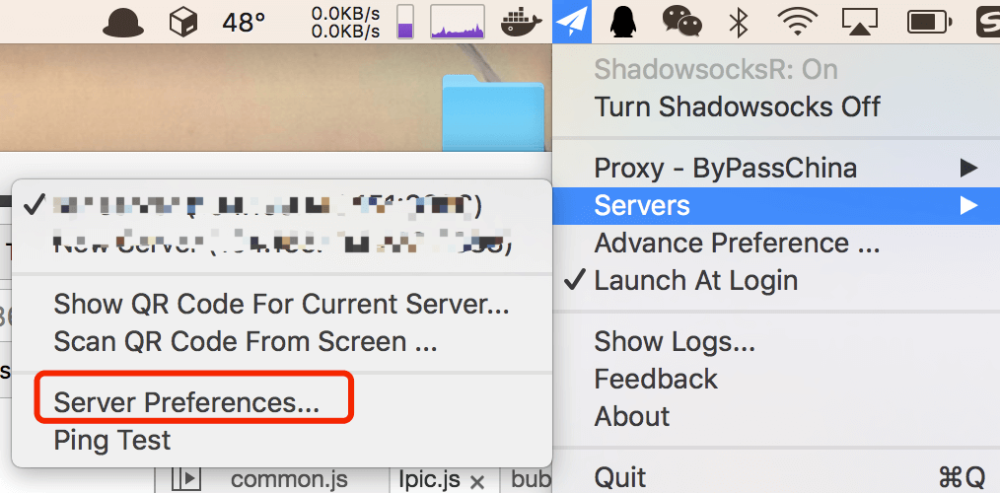
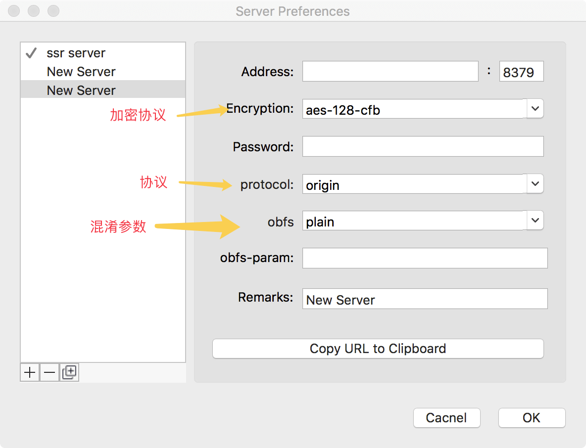

世界那么大，我想去看看，但是被墙了…
以前用的VPN，叫做什么`green vpn`，总体来说，还不错，但是最近老断，于是就搞了个新的法子。申请一台云主机，在上面搭一个Shadowsocks，然后就可以在所有客户端看 YouTube 了，当然，这所有的一切都是免费的。

> Shadowsocks已经河蟹，这里不再说ss，只说ssr：一个基于ss的新分支

### 搭建Shadowsocksr服务器

首先需要搭建一台云主机，首先阿里云或者青云都是挺好的，但是都需要国外的主机，要不然怎么去翻墙，你也可以选择linecode、vultr、aws、azure、GCE（google）。这些大部分都有一年的免费期限，也会有免费赠送不定的体验金的福利。中间会要求绑定信用卡。

主机建议选择Ubuntu或者debian，申请下来了后就可以安装ssr了。

可以从这个[地址](https://github.com/shadowsocksr/shadowsocksr)上找到ssr，然后可以参照这个[wiki](https://github.com/breakwa11/shadowsocks-rss/wiki/Server-Setup)来进行配置安装，在这里记录一下步骤吧：

> 如果你的服务端python版本在2.6以下，那么必须更新python到2.6.x或2.7.x版本。

首先需要有git：

```shell
apt-get update && apt-get install -y git
```

获取源代码：

```shell
git clone -b manyuser https://github.com/shadowsocksr/shadowsocksr.git
```

进入子目录：

```shell
cd ~/shadowsocksr && bash initcfg.sh && cd ~/shadowsocksr/shadowsocks
```

快速运行，当然也可以通过配置文件运行，具体请看[wiki](https://github.com/breakwa11/shadowsocks-rss/wiki/Server-Setup)：

```shell
python server.py -p 443 -k password -m aes-256-cfb -O auth_sha1_v4 -o http
说明：-p 端口 -k 密码  -m 加密方式 -O 协议插件 -o 混淆插件
```

配置文件参考：

```json
{
    "server": "0.0.0.0",
    "server_ipv6": "::",
    "server_port": 8388,
    "local_address": "127.0.0.1",
    "local_port": 1080,
  
  	// pass word
    "password": "XXXXXXXX",
  
    "method": "aes-128-ctr",
    "protocol": "auth_aes128_md5",
    "protocol_param": "",
    "obfs": "tls1.2_ticket_auth",
    "obfs_param": "",
    "speed_limit_per_con": 0,
    "speed_limit_per_user": 0,
    "additional_ports" : {},
    "timeout": 120,
    "udp_timeout": 60,
    "dns_ipv6": false,
    "connect_verbose_info": 0,
    "redirect": "",
    "fast_open": false
}
```

如果要后台运行：

```shell
python server.py -p 443 -k password -m aes-256-cfb -O auth_sha1_v4 -o http
```

如果要停止/重启：

```shell
python server.py -d stop/restart
```

查看日志：

```bash
tail -f /var/log/shadowsocksr.log
```

如果想要更新源代码。可以直接进入目录执行:

```shell
git pull
```

### 客户端

服务器端配置好后，就需要来搞客户端了。这个客户端和常规的ss客户端不一致：ssr客户端可以兼容ss客户端，但是反过来不可以的。基本上全平台都有ssr的客户端。这里OSX的客户端来做一个例子：

可以从这里下载 [ssr OSX 客户端](https://github.com/yichengchen/ShadowsocksX-R/releases)，然后启动ShadowsocksR，客户端配置参照下图:



选择新建服务，然后根据ssr的配置依次填写:



然后可以选择代理方式：


你可以选择 `global mode` 和 `by pass china` 、`gfw list`、`manual mode` 来设置代理方式。

当然也可以导出当前服务器的二维码（其实是一个服务器配置进行base64处理后生成的二维码，也可以为 `ssr://(base64)`，这样把二维码分享给其他人，其他人直接ssr自动的 **通过扫描二维码导入**就可以链接服务了。
