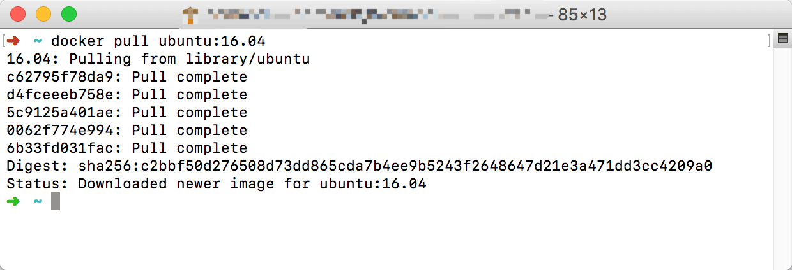
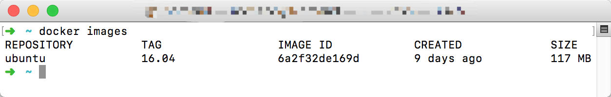

> 本文以构建一个 Node.js Docker 应用 为目标写的一个教程。当前操作系统环境 Mac OSX Sierra 10.12.4

### Docker 介绍

> Docker 是个划时代的开源项目，它彻底释放了计算虚拟化的威力，极大提高了应用的运行效率，降低了云计算资源供应的成本！ 使用 Docker，可以让应用的部署、测试和分发都变得前所未有的高效和轻松！

Docker 引擎的基础是 Linuxring 器(Linux Containers，LXC)技术。这个并不是一个新生的概念，很早前已经出现，比如操作系统上的`chroot`工具、以及`Solaris Containers`和`FreeBSD jail`等等，虽然这个技术非常成熟，然而这些工具使用起来非常不方便。Docker 的出现解决了这些问题。

Docker 容器虚拟化有很多好处：

- 更高效的利用系统资源：由于容器不需要进行硬件虚拟以及运行完整操作系统等额外开销，Docker 对系统资源的利用率更高。
- 更快速的启动时间，Docker 容器应用启动时间很快
- 一致的运行环境和环境隔离
- 持续交付和部署
- 更轻松的迁移服务

既然 Docker 这么好，我们来试试如何跑一个 Node.js Docker 应用。

### 安装 Docker

使用 Docker 之前，我们需要安装。Docker 支持在主流操作平台上使用：包括 Ubuntu、CenterOS、Windows 已经 MacOS 系统。

#### Ubuntu

在 Ubuntu 上安装 Docker 可以直接使用以下 shell script

```shell
 // 最新的Docker安装需要先移除老的Docker
 sudo apt-get remove docker docker-engine
 sudo apt-get update
 sudo curl -sSL https://get.docker.com/ | sh
```

#### Windows

Windows 上我们可以直接下载 [Docker GUI](https://store.docker.com/editions/community/docker-ce-desktop-windows)

#### Mac OSX

Mac OSX 上我们也可以直接下载 [Docker GUI](https://store.docker.com/editions/community/docker-ce-desktop-mac)。

Docker 的主要目标是`Build ship and run any app,any where`.主要生命周期有：封装（Packaging）、分发（Distribution）、部署（Deployment）、运行（Runtime）等。

Docker 具有三大核心概念：

- 仓库（Repository）

* 镜像（Image）
* 容器 （Container）

> 本篇教程会按照这三大核心概念来展开，中间当然会穿插一些其他 Docker 方面的内容：Dockerfile、docker-compose

### 仓库

Docker 仓库类似于代码库，是存放 Docker 镜像文件的统一地方。分为公开仓库和私人仓库。目前最大的国内仓库是 Docker hub。但是这个仓库由于国内墙的原因 pull 一个镜像的时候会很慢，所以可以把 Docker 的仓库地址设置为国内，我们可以打开 `Docker preferences` 来设置 `registry mirrors`，我们这里可以设置为国内的 [daocloud](https://daocloud.io)提供的仓库地址。设置完之后记得重启 Docker，然后我们就可以安装我们需要的镜像了。



### 镜像

Docker 镜像类似于虚拟机镜像，一个镜像可以只包含一个完整的 Ubuntu 操作系统环境。Docker 提供了一套十分简单的机制来进行创建和更新现有镜像，甚至可以从网上下载第三方已经做好的镜像，当然也可以自己 build 一个自定义的镜像发布到仓库当中。

> 再次提醒：我们当前教程最终的目的是创建一个 Node.js 环境的 Docker 容器，当前操作系统环境 Mac OSX Sierra 10.12.4

#### docker pull NAME[:TAG]

Docker 下载镜像的命令格式为：

```shell
docker pull NAME[:TAG]
```

对于 Docker 来说，如果不显式的指定 TAG（也可以理解为镜像版本），则默认会选择`latest`来作为标签：即下载仓库最新版本的镜像。

我们需要先安装一个稳定的`Ubuntu`镜像，在这里我选择了`16.04`版本的镜像：

```shell
docker pull ubuntu:16.04
```

执行结果如下图：


#### docker iamges

接下来我们可以列出本地主机上已经存在的镜像，通过以下命令可以看到我们刚才已经安装过的 Ubuntu 系统：

```shell
docker iamges
```

执行结果如下图：



从列出信息中，我们可以看到很多有用的内容，依次为：

- 来自于哪个仓库（REPOSITORY）
- 镜像的标签信息（TAG）
- 镜像的唯一 id 号（IMAGE ID）
- 创建时间（REACTED）
- 镜像大小（SIZE）

> 其中镜像的唯一 id 号（IMAGE ID）十分重要，它唯一标识了该镜像。

#### docker inspect IMAGE_ID

我们可以通过以下命令来查看指定 IMAGE_ID 镜像的详细信息，这里不再列出执行结果。

```shell
docker inspect IMAGE_ID
```

#### docker search NAME

如果我们准备获取镜像的时候并不知道这个镜像是否在远程仓库当中是否存在，我们可以通过下面命令来搜索，该条支持很多参数，这里不再列出，请自行[查看文档](https://docs.docker.com/engine/reference/commandline/search/)，默认输出结果安装星级评价排序。

```shell
docker search NAME
```

#### docker rmi IMAGE[IMAGE...]

我们可以使用镜像的唯一标签来删除镜像，常用的参数是`--force, -f`来指定是否强制删除镜像。其他参数这里不再列出，请自行[查看文档](https://docs.docker.com/engine/reference/commandline/rmi/)：

```shell
docker rmi IMAGE[IMAGE...]
```

#### 创建镜像

至此，Docker Image 常用的命令已经罗列完毕，其他更多命令请自行[参阅文档](https://docs.docker.com/edge/engine/reference/commandline/docker/)。

接下来我们需要来创建我们需要的 Node.js 镜像。常用创建镜像的方式有三种：

- 基于已有镜像创建

该方法使用下面命令创建，由于这个方法是在已有镜像的基础上创建的镜像，但是我们这里需要**自定义创建镜像**，所以不采用该方式创建，请自行[查看文档](https://docs.docker.com/engine/reference/commandline/commit/)：

```shell
docker commit [OPTIONS] CONTAINER [REPOSITORY[:TAG]]
```

- 基于本地模板导入

可以直接通过一个操作系统模板来创建镜像。我们依旧不采用，请自行[查看文档](https://docs.docker.com/engine/reference/commandline/import/)

- 基于 Dockerfile 创建

Dockerfile 是一个文本格式的配置文件，用户可以使用它来快速创建自定义的镜像，刚好符合我们的要求。在下面有详细介绍和使用教程。

### 容器

### Dockerfile

> Dockerfile 是一个文本格式的配置文件，用户可以使用它来快速创建自定义的镜像。

Dockerfile 由一条条命令语句组成，并且支持以**#**开头的注释行。

一般来说，Dockerfile 分为四个部分：

- 基础镜像信息
- 维护者信息
- 镜像操作指令
- 容器启动时的执行命令

接下来介绍一下 Dockerfile 的执行指令，一般格式为 INSTRUCTION arguments。

这些指令在我们来完成我们的目标：Node.js Docker 应用 都会用到，更多的请自行[查看文档](https://docs.docker.com/engine/reference/builder/)。我们需要用到的执行指令包括以下内容:

#### FROM

格式为：FROM <image> 或者 FROM <image>:<tag>。

第一条指令必须为 FROM 指令，如果在一个 Dockerfile 当中创建多个镜像，可以使用多个 FROM。ßß

#### MAINTAINER

格式为：MAINTAINER <name>，指定维护者信息。

#### RUN

格式为：RUN <command> 或者 Run ["executable","param1","param2"]

区别是：前者将在 shell 终端中执行，也就是`/bin/sh -c`；后者则使用`exec`执行。

当命令过长的时候可以使用`\`来换行。

#### CMD

格式为：CMD command param1 param2 或者 CMD ["executable","param1","param2"]

区别是：前者将在 shell 终端中执行，也就是`/bin/sh -c`；后者则使用`exec`执行。

每个 Dockerfile 只能有一条 CMD 命令，如果指定多个，只有最后一个执行。

#### EXPOSE

格式为：EXPOSE <port> [<port>…]。

告诉 Docker 服务器容器暴露的端口号来进行容器和本地主机端口映射。启动容器的时候通过`-p`可以具体指定端口

#### ENV

格式为：ENV <key> <value> 指定一个环境变量，并且在容器当中保持

#### ADD

格式为：ADD <src> <dest>

该命令指定复制本地主机当中的**src**到容器当中的**dest**。其中 src 可以是相对路径、url、tar。

#### COPY

格式为：COPY <src> <dest>

该命令指定复制本地主机当中的**src**到容器当中的**dest**。目标路径不存在的时候自动创建

#### VOLUME

格式为：VOLUME ["/data"]

创建一个可以从本地主机或者其他容器挂载的挂载点，一般来存储数据库或者需要保持链接的数据等。

#### WORKDIR

格式为：WORKDIR <path>

定义当前容器的工作目录。

使用多次 WORKDIR 命令，如果参数是相对路径，则会何必每次的相对路径。

> 接下来我们正式创建 Node.js container

### Node.js Dockerfile

终于到了我们来编写 Dockerfile 来创建 Node.js container 的时候了！

在正式开始之前，我们先梳理一下任务要点：

- 安装最新版本的 Node.js（这里不选择 stable 版本）
- 从 GitHub 上下载我们的服务器代码（这里的例子采用本地服务器 server.js，当然也会有 GitHub 的例子）
- 启动服务器并抛出端口

下面正式开始，开始之前需要自行创建一个 Dockerfile 文件并且在相同文件目录下写入一个`server.js`来作为我们的本地例子，`server.js`可以参考：

```javascript
'use strict'
const http = require('http')
const port = 3000
const server = http.createServer((req, res) => {
  res.end('hello world')
})
server.listen(3000, () => {
  process.stdout.write(`server start success on port ${port}`)
})
```

> 上面 server 只是做一个简单的 hello world 例子 :smile:

首先指定我们的基础镜像信息，这里我们选择`ubuntu:16.04`来作为基础镜像，并写好维护者信息。

```dockerfile
# Docker file 文件头
FROM ubuntu:16.04
MAINTAINER Nomand <iamnomand@gmail.com>
```

然后设置本地语言，这个不是必要操作：

```dockerfile
# 非必须操作
RUN locale-gen en_US.UTF-8
ENV LANG       en_US.UTF-8
ENV LC_ALL     en_US.UTF-8
```

由于国内的原因，我们需要设定阿里云的镜像来作为 Ubuntu 的更新镜像：

```dockerfile
# 设置 Ubuntu 镜像源地址
RUN sed -i 's/http:\/\/archive\.ubuntu\.com\/ubuntu\//http:\/\/mirrors\.aliyun\.com\/ubuntu\//g' /etc/apt/sources.list
```

而且你也有可能需要设置一下代理：

```dockerfile
# RUN export http_proxy=xxxxx
# RUN export https_proxy=$http_proxy
```

接下来更新系统内核：

```dockerfile
RUN apt-get update
```

上面一些步骤都是为了接下来安装`Node.js`做的必要操作，做完这些之后方可继续下一步。

接下来继续安装一些需要用到的包：

```dockerfile
# 更新系统并且安装需要的包
RUN apt-get install -y -q --no-install-recommends \
    apt-transport-https \
    build-essential \
    ca-certificates \
    curl \
    g++ \
    gcc \
    git \
    make \
    sudo \
    wget \
    vim \
    && rm -rf /var/lib/apt/lists/* \
    && apt-get -y autoclean
```

正式开始安装`Node.js`，我们选择安装`7.X`版本。

我们选择官方的[Binary Distributions](https://github.com/nodesource/distributions)提供的 bash 文件来进行安装，这样可以省下来很多不必要的操作：

```dockerfile
# 可以通过 echo 来输出当前信息
RUN echo '正在安装 nodejs'

ENV NODE_VERSION=7

RUN curl -o- https://deb.nodesource.com/setup_$NODE_VERSION.x | bash -

RUN sudo apt-get install -y nodejs
```

安装好了依赖和主程序，我们接下来需要配置我们的容器工作目录了，也就是`WORKDIR`

```dockerfile
# 这里我们先简单指定 /home/hello 为我们的工作目录
ENV WORK_DIR=/home/hello
RUN mkdir -p $WORK_DIR
WORKDIR $WORK_DIR
```

然后接下来我们需要把`server.js`拷贝到容器当中，如果是从 GitHub 上的例子，直接可以`git clone xxx`:

```dockerfile
# 复制 server.js
COPY ./server.js $WORK_DIR/server.js
```

在启动服务器之前， 我们可以选择安装`pm2`来管理我们的 node 程序：

```dockerfile
# 国内环境可以带上 registry
RUN sudo npm install pm2 -g -d --registry https://registry.npm.taobao.org
```

最后直接启动我们的服务，这里请注意，Docker 不支持以`daemon`方式启动的任何服务:

```dockerfile
# 启动服务
# RUN unset http_proxy
# RUN unset https_proxy
CMD ["pm2","start","server.js"]
EXPOSE 3000
```

然后执行 shell script：

```shell
docker build - < Dockerfile
```

下面附上完整的 Dockerfile:

```dockerfile
# Docker file 文件头
FROM ubuntu:16.04
MAINTAINER Nomand <iamnomand@gmail.com>
# 非必须操作
RUN locale-gen en_US.UTF-8
ENV LANG       en_US.UTF-8
ENV LC_ALL     en_US.UTF-8
# 设置 Ubuntu 镜像源地址
RUN sed -i 's/http:\/\/archive\.ubuntu\.com\/ubuntu\//http:\/\/mirrors\.aliyun\.com\/ubuntu\//g' /etc/apt/sources.list

# RUN export http_proxy=xxxxx
# RUN export https_proxy=$http_proxy

# 更新系统并且安装需要的包
RUN apt-get install -y -q --no-install-recommends \
    apt-transport-https \
    build-essential \
    ca-certificates \
    curl \
    g++ \
    gcc \
    git \
    make \
    sudo \
    wget \
    vim \
    && rm -rf /var/lib/apt/lists/* \
    && apt-get -y autoclean
# 可以通过 echo 来输出当前信息
RUN echo '正在安装 nodejs'
ENV NODE_VERSION=7
RUN curl -o- https://deb.nodesource.com/setup_$NODE_VERSION.x | bash -
RUN sudo apt-get install -y nodejs
# 这里我们先简单指定 /home/hello 为我们的工作目录
ENV WORK_DIR=/home/hello
RUN mkdir -p $WORK_DIR
WORKDIR $WORK_DIR
# 复制 server.js
COPY ./server.js $WORK_DIR/server.js
# 国内环境可以带上 registry
RUN sudo npm install pm2 -g -d --registry https://registry.npm.taobao.org
# 启动服务
# RUN unset http_proxy
# RUN unset https_proxy
CMD ["pm2","start","server.js"]
EXPOSE 3000
```

### Docker-compose

`Docker-compose`是一个非常有用的官方项目，它的作用是：**负责快速在集群中部署分布式应用**

我们知道使用一个 Dockerfile 模板文件，可以让用户很方便的定义一个单独的应用容器。然而，在日常工作中，经常会碰到需要多个容器相互配合来完成某项任务的情况。例如要实现一个 Web 项目，除了 Web 服务容器本身，往往还需要再加上后端的数据库服务容器，甚至还包括负载均衡容器等。

它允许用户通过一个单独的 `docker-compose.yml` 模板文件（YAML 格式）来定义一组相关联的应用容器为一个项目（project）。

Compose 项目由 Python 编写，实现上调用了 Docker 服务提供的 API 来对容器进行管理

#### 安装 Docker-compose

在 Mac OSX 系统上安装完 Docker 以后默认自带了 Compose，在 Linux 系统上需要手动安装：

```shell
sudo curl -o /usr/local/bin/docker-compose -L "https://github.com/docker/compose/releases/download/1.11.2/docker-compose-$(uname -s)-$(uname -m)"
sudo chmod +x /usr/local/bin/docker-compose
```

> 安装的过程当中有可能会安装所需的其他依赖，比如 Python

#### 编写 yml

安装完后，我们就可以来以上面的简单的 Node.js 应用为例，去编写`docker-compose.yml`，更方面的编排我们的 Docker 应用了。

首先在原来的目录下面新建一个命名为`docker-compose.yml`的文件。

开始编写之前，有两个关于`docker-compose`的术语需要了解：

- service：一个应用容器，实际上可以运行多个相同镜像的实例。
- project：由一组关联的应用容器组成的一个完整业务单元。

刚开始的`docker-compose`像下面这样：

```yaml
version: '2'
```

我们在这里指定 compose file 的版本为 2，来告诉解析器如何解析。

> 版本这里不深入，对应的版本信息可以在这里找到：[版本信息](https://docs.docker.com/compose/compose-file/compose-versioning/)

接下来就要开始配置我们的`services`：

```yaml
services:
  workspace:
    build:
      context: .
    container_name: docker_work_space
    ports:
      - '3000:3000'
    tty: true
```

然后执行下面命令就可以跑起我们第一个 docker 集群了。

```shell
docker-compose up --build
```
