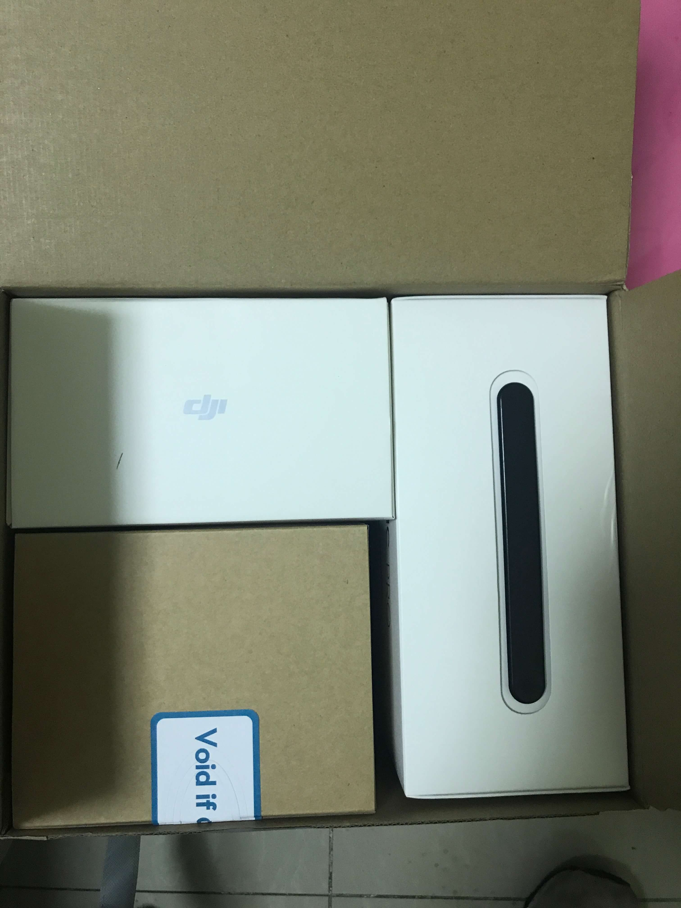
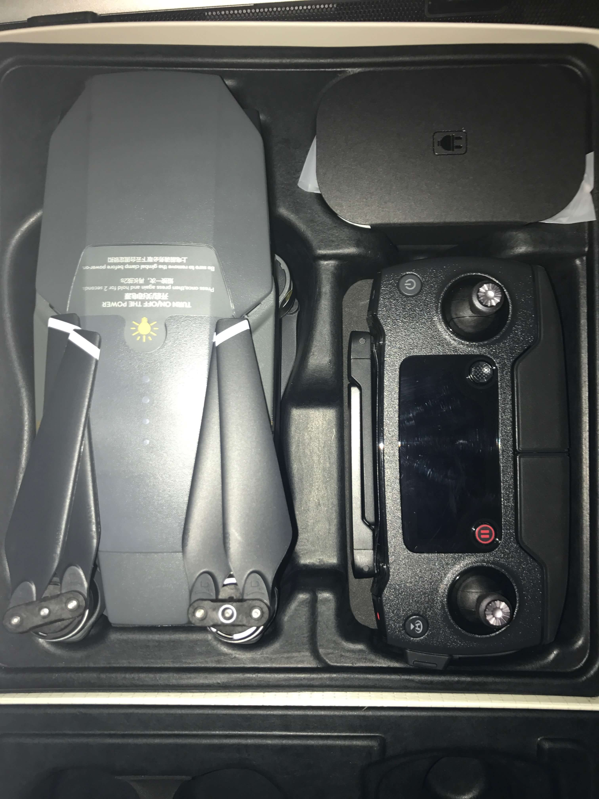
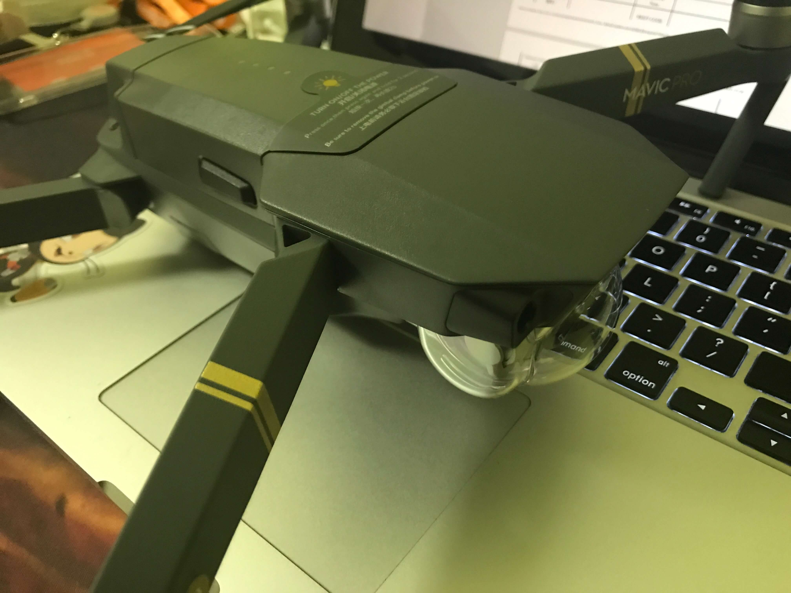
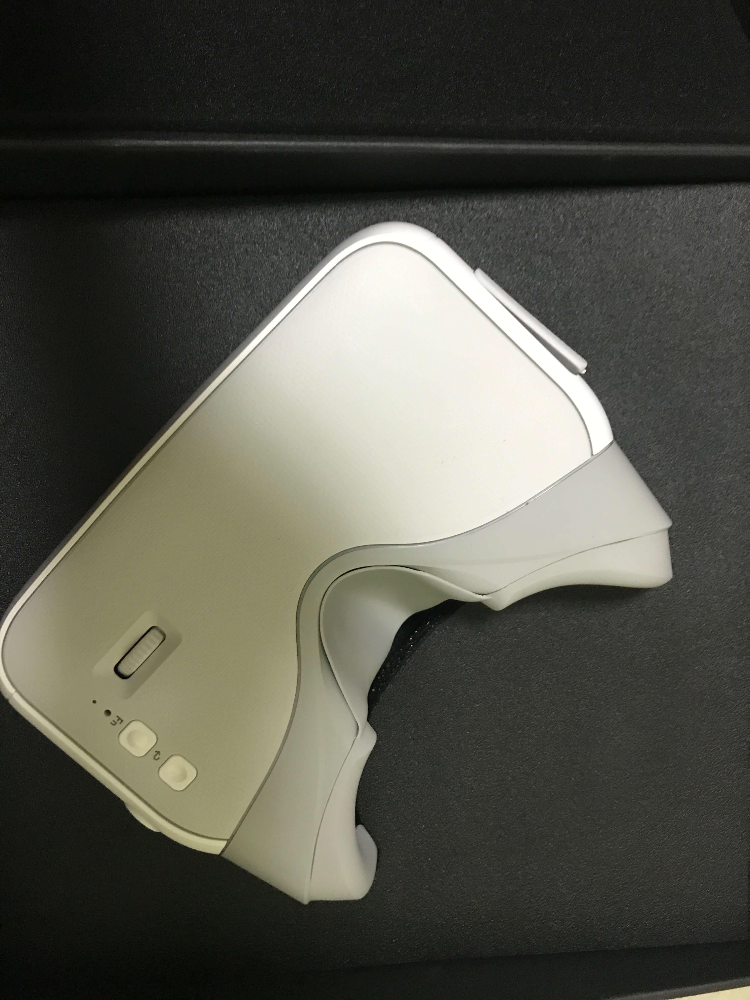

> 早在今年2、3月份的时候，我就已经知道御姐Mavic Pro的存在了，当然是通过（万恶）的微信朋友圈，被安利、洗脑了一波，当时就很感兴趣，想买一个自己玩玩:haha:。

### 下定决心要买

为什么会买呢，我也不知道，感觉是脑子一热吧

最近刚换了一份新的工作，压力有点大，中午的时候无聊看了一下[官网](https://www.dji.com/cn/mavic)，晚上就直接叫着女朋友去了新天地的专卖店看了下，然后就直接剁手了。。。

感觉最近不单单要吃土，还要吃灰了。。

### 初见

刚拿回来的时候好大的一个箱子，现在就只剩下一点东西（东西太多，放不下就直接把无用的盒子扔掉了），还好我提前拍了一张整体开箱图：

另附一张机箱开箱图：

机身和Mac大小对比图：

Mavic pro 装上防撞翼：

### 为什么选择Mavic

> 无人机目前主要市面上的分为**多旋翼、固定翼、直升机**，Mavic Pro就属于四轴的固定翼

就拿大疆目前的产品线来说，几款主流品类为**精灵3、精灵4、悟1、御**，价格从2k+到2W+不等，最早入手的基友们应该买的是精灵3或者4。

~~精灵3有几种款型，Standard相对来说比较初级因为图传距离理论可以1km实际也就六七百米，很容易失去图传对于新手而言看不见图像就会非常的慌乱，所以我自己不太推荐精灵3S及之前的款型作为入门机型。~~

大家购买的时候可以从**Phantom 3 Adavanced**及之后开始考虑，图传距离可以达到5km且比较稳定，上升高度也可以达到500m。

然而如果你看过价格和开箱对比图的话，最好的还是**御姐**，适合经常需要轻装旅行的朋友，因为足够小巧加上高性能的传感器、相机，非常便于携带（把妹神器。

按照官方的性能数据：

- 重量：743克
- 飞行速度：最大18m/s（65km/h
- 飞行时间：27分钟（实际有折扣
- 图传距离：国内4km国外7km（详见[FCC与CE与SRRC](http://www.wetouchsky.com/are-you-still-confused-in-fcc-ce-srrc-in-uav/)
- 高度：500m
- 相机：4k@30fps/1080p@96fps
- 云台角度：78°

这已经很强了好不好！4k，27分钟，4km图传，500m高度（可以自己改装飞到1.5km

### 装备清单

默认是自带一节电池、遥控器和2套机翼，我买了全能套装加上dji care，整体下来：

- 电池：3块
- 遥控器：1部
- 机身：1部
- 机翼：8套
- 随身包，电池管家（管家的意义在于可以同时把四块电池放入其中，但是每次都是单独给一块电池进行充电，这样可以保持充电电压稳定），充电宝转换器

> 切记，一定要买dji care（都是泪

后来在群里人的安利下，又买了一个[DJI 飞行眼镜](https://store.dji.com/cn/product/dji-goggles)，双1920×1080高分辨率显示屏。这玩意在飞行的时候确实很爽，一个人操控，一个人可以以上帝视角看风景，当然云台角度是可以根据体感控制的。

> 感觉有点鸡肋，1080p只有30fps，720p才有60fps，但是这种体感眼睛120fps才完全没有晕的感觉，不过为了情怀，还是剁了，闲来没事接上HDMI来看冰与火。

### 最后的话

想有情怀，当然要 give me money，总体算了一下：

- 7999+2999=10998

不说了，我去吃土了

参考：

- [Mavic Pro 从入门到精通](http://zhongce.sina.com.cn/report/view/1657/?preview=1)