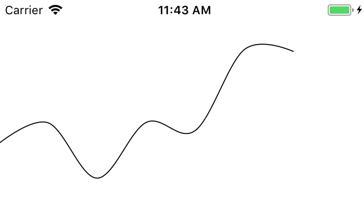

### React Native ART 由来

[React-Art ](https://github.com/reactjs/react-art) 是 `Reactjs` 团队基于 [Art](https://github.com/sebmarkbage/art)（一个兼容各个浏览器SVG绘制的API封装）开发的模块，让 `React` 开发者能使用 `jsx` 语法绘制 `svg`。

`React Native` 团队分别在0.10.0和0.18.0也添加了iOS和Android平台对 `react-art` 的支持，官网文档至今对其只字未提。本文旨在介绍安静躺在 [react-native/Libraries/](https://github.com/facebook/react-native/blob/master/Libraries/ART/ReactNativeART.js) 里的`ART`，并展示一些实践结果。

在React Native中ART是个非常重要的库，它让非常酷炫的绘图及动画变成了可能。但是可能是知道的人真的不多导致文档及少中文更少。很多都是把英文的参数列表翻译过来，也没有案例。

### 为什么用 ART

`React Native` 本身自带的 `<Image>` 有很多缺陷：

首先是不支持 SVG 格式的资源，目前的解决方案有通过 [ReactNative-SVG](https://github.com/react-native-community/react-native-svg) 进行实现，但是这个库需要更改客户端bundle文件，带来一定的风险。

其次是 [Image decoding can take more than a frame-worth of time](https://facebook.github.io/react-native/docs/images.html#off-thread-decoding)，图片的解码由于不在主线程中进行，所以不能确保所有图片和内容在同一帧内出现，使用 `<Image> `标签的制作的组件里的图（比如icon）可能是三三两两“闪现”出来的，让人怀疑是个`webview`，体验远不如原生，尤其是在开发环境下最为明显。

其次就是不能支持矢量图形，必须放置 `@2x` 或者 `@3x` 对应的图片。

### ART能干什么

俗话说，**库如其名**，背负着如此具有“艺术感”名字的ART生来就是为了绘制矢量图的，或者说是 **画UI的**，ART可以解决上诉的所有缺陷。

在我看来，或者说我目前业务需求用到的功能：

- ART 可以解决上诉 `<Image> ` 的缺陷：解码和矢量图形
- ART 可以实现 UI 上的一些渐变，比如渐变按钮，渐变背景或者底色。以及一些交互性较强的动画——**画UI**
- ART 另外一个场景就是简单数据可视化。

### 使用 ART

> 本文使用的 RN版本为0.50.1

> 本文一些英语词汇出于编写角度进行了简写，RN是 `React Native` 的简写

> Android默认就包含ART库，IOS需要单独添加依赖库。

- ART在iOS上使用需要事先导入ART的链接库，找到 `node_modules/react-native/Libraries/ART/ART.xcdoeproj` 拖入Xcode对应项目的 `Libraries`
- 打开 `General Settings `添加 `libART.a` 到 `Linked Frameworks and Libraries` 列表
- `cmd+b `重新构建项目

#### 基本 API

[RN ART 文档 (非官方)](https://github.com/react-native-china/react-native-ART-doc/blob/master/doc.md) 在github上有这样比较全一篇文档，可以选择直接看它了解使用。

`ART` 目前的API有：

- `Surface` 标签对应svg中的`SVG`标签，所有ART的jsx内容需要被其包含
- `Group` 标签对应 `g` 标签
- `Shape` 标签对应 `path` 标签
- `Text` 标签对应 `text` 标签
- `Transform` 做图形变换的API
- `Path` 绘制路径API
- `LinearGradient` 创建线性渐变API
- `RadialGradient` 创建径向渐变API

> 本文不介绍 SVG ，读者可以自行线下学习。

可以看到 ART 和 SVG 还是有不同的，有点像是阉割后的 SVG，当然已经有开发者做了实现，可以方便地使用 SVG 标签写 [ReactNative-SVG](https://github.com/react-native-community/react-native-svg) ，这种方式的缺点上文已经说过。

在本文例子当中，我们使用原原本本的ART实践。

#### 基础例子：

下面是一个绘制线段的 ART demo：

```javascript
import React, { Component } from 'react'
import {
  View,
  Dimensions,
  ART
} from 'react-native'

export default class Line extends Component {
  render() {
    return (
      <View
      >
        <ART.Surface
          width={Dimensions.get('window').width}
          height={100}
        >
          <ART.Shape
            d={new ART.Path().moveTo(50, 50).lineTo(100, 100)}
            stroke="#000000"
            strokeWidth={1}
          />
        </ART.Surface>
      </View>
    )
  }
}
```

`Surface ` 必须是ART内容的父层，并且其中不能包含非ART标签（否则直接闪退…），需要指定宽高，很多时候绘制无效或者缺角有可能是 `Path` 超过了 `Shape` 的绘制区域。

`Group ` 可有可无，当绘制内容较多时可以用其统一管理，可以把它当做 `View`标签使用，可制定内容在画布绘制的起点。

`Shape ` 是目前ART绘制的首要入口，`d` 属性对标svg的 `path` 标签上的 `d` 属性。

所有的ART标签都可以使用 `transform` 属性做变换。

`Shape` 当中的 `d` 类似于 svg 的 path，可以通过 `ART.Path` 生成，比如下面这些是绘制的一些简单图形：

- 圆形

```javascript
// 绘制圆形
function circlePathRender() {
  
  const path = Path()
  	.moveTo(0,50)
    .arc(0, radius * 2, radius)
    .arc(0, radius * -2, radius)
    .close(); // 闭合路径
  
  // path 可以直接作为 props 传给 shape
  return <ART.Shape 
           d={path} 
           fill={'#2ba'}
          />
}
```

- 绘制多边形：

```javascript
// 绘制多边形
function polygonPathRender() {
  var path = Path()
  	.moveTo(10, 10)
    .lineTo(20, 30)
    .lineTo(30, 40)
    .close(); // 闭合路径
  
  return <ART.Shape 
           d={path} 
           fill={'#00a'} 
           stroke="yellow" 
           strokeWidth={4}
          />
}
```

`Path` 还有一些API来满足日常绘图要求：`arcTo`/`curve`/`line`/`Text`

- 文字

```javascript
// 绘制文字
function textRender() {
  return (
    <ART.Text
      font={`bold 13px "Helvetica Neue", "Helvetica", Arial`}
      fill="#749"
      x={0}
      y={0}
    >
      Lorem ipsum dolor sit amet
    </ART.Text>
  );
}
```

- 渐变

```javascript
// linearGradient 可赋值给Path或者Text标签的fill属性

function linearGradientRender() {
  const linearGradient = new ART.LinearGradient({
    "0": "#2ba",
    ".5": "#f90",
    "0.7": "#aa4422",
    "1": "rgba(255,255,255,0.5)"
  }, 0, 0, 100, 200);
  
  // 这里的 d props(Path) 简略
  return <ART.Shape 
           d={...} 
           fill={linearGradient} 
          />
}

```

`LinearGradient` 构造函数第一个参数是设定渐变色的对象。

使用诸如`0.3`/`.52`/`1`这样的属性表示`30%`/`52%`/`100%`，值为颜色值，不符合要求的键值对会被忽略。
后面四个参数分别表示：起点x，起点y，终点x，终点y.

```javascript
// radialGradient 可赋值给Path或者Text标签的fill属性

function radialGradientRender() {
  const radialGradient = new ART.RadialGradient({
    "0": "#2ba",
    ".5": "#f90",
    "0.7": "#aa4422",
    "1": "rgba(255,255,255,0.5)"
  }, 0, 0, 100, 200);
  
  // 这里的 d props(Path) 简略
  return <ART.Shape 
           d={...} 
           fill={radialGradient} 
          />
}

```

`RadialGradient `构造函数第一个参数是和线性渐变相同的，后续六个分别表示：焦点x，焦点y，x半轴长，y半轴长，原点x，原点y。

### ART 动画 

大多数情况下，在 React Native 中创建动画是推荐使用 [Animated API](https://facebook.github.io/react-native/docs/animated.html) 的，其提供了三个主要的方法用于创建动画：

### ART 简单数据可视化

> 本文采用 d3-shapes 生成 Path 来通过 ART.Shape 进行绘制可视化数据。
>
> 注意：这个 Path 和 SVG 的 Path 基本上一样，但是请注意 ART 只是 阉割版的 SVG，以下针对 D3 文档的描述和解释是个人对 D3 的理解

通过上面对 ART 提供的一些 API 简单介绍可以发现，我们可以指定一个特殊的 `Path` 给 `Shape` 组件（d props），可以实现一些曲线线段，比如下面代码：

```javascript
import React, { Component } from 'react'
import {
  ART,
  View,
} from 'react-native';

const {
  Surface,
  Group,
  Shape,
} = ART;

export default class ARTSimpleLine extends Component{
    render(){
        return (
            <View>
              <Surface width={500} height={500}>
                <Group>
                  <Shape
                    d="M0,100L60,160L120,60L180,140L240,100L300,120"
                    stroke="#000"
                    strokeWidth={1}
                    // 设置 shape X 偏移值
                    x={50}
                    />
                </Group>
              </Surface>
            </View>
          )
    }
}
```

可以得到如下的一个简单图形：


实际上我们可以通过一些工具生成 Path 来做简单的数据可视化。

而path data由一系列的命令组成，比如上面代码当中的：

> SVG 的 path 这里不详细介绍，可以参考 [SVG path tutorial](https://developer.mozilla.org/zh-CN/docs/Web/SVG/Tutorial/Paths)

```text
M0,100L60,160L120,60L180,140L240,100L300,120
```

实际上，我们可以自己通过书写代码来创建这些 path 命令集，但是你会发现，写出这些代码虽然并不难，但是一定是很繁琐的，所以我们需要一个工具来自动生成这些命令集。

我们这里采用 `D3.js` path generator 的路径生成器，下面列出了一些常见的路径生成器：

- [Arcs](https://github.com/d3/d3-shape#arcs)
- [Pies](https://github.com/d3/d3-shape#pies)
- [Lines](https://github.com/d3/d3-shape#lines)
- [Areas](https://github.com/d3/d3-shape#areas)
- [Curves](https://github.com/d3/d3-shape#curves)
- [Symbols](https://github.com/d3/d3-shape#symbols)


> 这里推荐一个在线查看 [D3 shape demo](https://www.pshrmn.com/tutorials/d3/shapes/)

我们暂时只简单的用到了 `Lines` 生成器。

首先生明一个 `line generator`：

```javascript
const lineGenerator = d3.line();
```

我们来定义一个坐标数组：

```javascript
const points = [
  [0, 100],
  [60, 160],
  [120, 60],
  [180, 140],
  [240, 100],
  [300, 120]
];
```

接着我们传入points参数来调用lineGenerator：

```javascript
const pathData = lineGenerator(points);
// pathData is "M0,100L60,160L120,60L180,140L240,100L300,120"
```

lineGenerator完成的工作就是创建了一个M(move to)和L（line to）命令的字符串，这样我们就得到了Path Data。

这是我们想要的 Path Data吗？

显然不是，我们需要 Path Data 尽量具有以下特征：

- 线条扁平，曲线化
- Data Driven

查阅文档，发现 [line.curve](https://github.com/d3/d3-shape#line_curve) 方法可以实现特征一，至于 [Curve](https://github.com/d3/d3-shape#curves) ，D3 当中有做了详细的解释：

>While [lines](https://github.com/d3/d3-shape#lines) are defined as a sequence of two-dimensional [*x*, *y*] points, and [areas](https://github.com/d3/d3-shape#areas) are similarly defined by a topline and a baseline, there remains the task of transforming this discrete representation into a continuous shape: *i.e.*, how to interpolate between the points. A variety of curves are provided for this purpose.

> 简单翻译一下：线被定义为二维[x,y]点序列，为了将离散转换为连续形状的任务，D3 提供了各种曲线（ps：曲线实现是一个黑盒，使用者无需关心如何实现，可以查看 [splines](https://people.cs.clemson.edu/~dhouse/courses/405/notes/splines.pdf)

D3 提供了 `line.curve` 方法。

curve 通常情况下不会直接构建或者生成，只会在调用 `line.curve` 方法的时候生成，很多方法来辅助生成 Curve：

- **curveBasis**
- **curveCardinal**


- **curveBasisClosed**
- **...**

这里只简单列出一些方法，而且我们这里只用到一种方法：**curveCardinal**

按照 D3 给出的例子，代码是下面这样的：

```javascript
const line = d3.line()
    .curve(d3.curveCardinal);
```

**curveCardinal** 的作用官方是这样介绍的：

> Produces a cubic [cardinal spline](https://en.wikipedia.org/wiki/Cubic_Hermite_spline#Cardinal_spline) using the specified control points, with one-sided differences used for the first and last piece. The default [tension](https://github.com/d3/d3-shape#curveCardinal_tension) is 0.

官方介绍太学术化，简单理解为：使用用户传入的控制点坐标来生成曲线。

简单和其他的方法比较一下，没有产生一个闭环，而且使用了第一个和最后一个控制点坐标，而且张力默认为0。

然后我们就可以生成这样一个 Path Data

```text
M0,100C0,100,40,166.66666666666666,60,160C80,153.33333333333334,100,63.333333333333336,120,60C140,56.666666666666664,160,133.33333333333334,180,140C200,146.66666666666666,220,103.33333333333333,240,100C260,96.66666666666667,300,120,300,120
```

实际得到的图形如下：



> 当然 `D3.curve` 传入不同的辅助方法会生成不同的 Path Data 以及曲线，读者可以自行线下尝试

这样看下来似乎已经很完美了，但是注意，这个 Path Data 是根据我们自定义的数据（**预先设定完毕的二维坐标数组**）生成的，实际业务当中，数据只会是数据，比如：

```javascript
// 一周内的降雨流量数据(伪造)
const data = [820, 932, 631, 934, 890, 1330, 1320]
```

具体图表上的二维坐标我们是无法确定或者无法及时变动的，所以，似乎我们需要一个方法来自定义二维坐标的生成？

当然可以，上诉代码可以修改为：

```javascript
const line = d3.line()
    .x(function(d) { return x(d.date); })
    .y(function(d) { return y(d.value); })
    .curve(d3.curveCardinal);
```

你可能会说这个 `line.x` 和 `line.y` 是个什么鬼？

关于 `line.x` 官方是这样解释：

> If *x* is specified, sets the x accessor to the specified function or number and returns this line generator. If *x* is not specified, returns the current x accessor, which defaults to:
>
> ```javascript
> function x(d) {
>   return d[0];
> }
> ```

简单来说就是：如果指定 `x` ，则将 x accessor 设置为指定的函数或编号并返回此行 generator，什么意思呢？

这个可以理解为一个辅助函数，参照上面例子我们自定义的一个坐标数组，默认情况下每一个数组元素都代表了一个二维的数组，比如 `[0,100]` ，然而我们也可以告诉 `line generator ` 来如何自定义解读传入的数据，而这就要使用对应的 `accessor functions` 了。

至于 `line.y` 当然基本也是一样的概念，但是默认的 Y accessor为：

```javascript
function y(d) {
  return d[1];
}
```

这也是为什么之前我们构造的坐标为什么是一个二维数组。

按照上面伪造的一周内降雨流量数据：（这里复制一次，便于阅读

```javascript
// 一周内的降雨流量数据(伪造)
const data = [820, 932, 631, 934, 890, 1330, 1320]
```

我们来一步步解析一下 line 图表的生成方法：

- Y Axis 上需要设置最小值和最大值（最大值可能会动态变化），根据数据实际情况计算出来 Y 轴坐标
- x Axis 上需要设置一周内的日期或者周一至周日，这 7 天的 x 轴坐标为了美观必须是等分的，所以计算出来对应 X 轴坐标

通过简单的上诉两个步骤，我们就能得到数据实际对应的二维坐标，这样才能生成 Path Data，绘制 line chart。

```javascript
import React, { Component } from 'react'
import * as d3 from 'd3-shape'
import {
  ART,
  View,
} from 'react-native';

const {
  Surface,
  Group,
  Shape,
} = ART;

const data = [
  { "data": "Mon", "value": 820 },
  { "data": "Tue", "value": 932 },
  { "data": "Wed", "value": 631 },
  { "data": "Thu", "value": 934 },
  { "data": "Fri", "value": 890 },
  { "data": "Sat", "value": 1330 },
  { "data": "Sun", "value": 1320 }
]

const CHART_WIDTH = 375
const CHART_HEIGHT = 300

const X_AXIS_OFFSET = 50
const MAX_Y_AXIS = 1600
const MIN_Y_AXIS = 0

const lineGenerator = d3.line()
  .x((d, i) => i * X_AXIS_OFFSET)
  .y(d => CHART_HEIGHT - CHART_HEIGHT * Math.min(1, (d.value / MAX_Y_AXIS)))
  .curve(d3.curveCardinal);

const path = lineGenerator(data)

export default class ReactNativeART extends Component {
  render() {

    return (
      <View>
        <Surface width={CHART_WIDTH} height={CHART_HEIGHT}>
          <Group>
            <Shape
              d={path}
              stroke="#000"
              strokeWidth={1}
            />
          </Group>
        </Surface>
      </View>
    )
  }
}
```

上述代码当中，我们定义了一些常用的常量：

- 图表的高度：`CHART_HEIGHT`
- Y 轴最大值：`MAX_Y_AXIS`
- X 轴每一项的等分距离：`X_AXIS_OFFSET`

实际生产的二维坐标为：

```javascript
[[0,146.25],[50,125.25],[100,131.0625],[150,124.875],[200,58.125],[250,50.625],[300,52.5]]
```

根据坐标生成 Path Data 绘制出来的图表为：


一个基本的 line 图表就这样生成了，接下来我们做一些美化操作：

- 添加 Point
- 添加 X 和 Y 轴的坐标和label

我们可以通过 `ART.Path` 来绘制圆形来模拟 Point：

```javascript
  renderPoints(data) {

    const pointArc = 3
    return data.map((d, i) => {

      if (i === 0) return null
      
      return (
        <Shape
          key={i}
          d={new Path()
            .moveTo(X_AXIS_OFFSET * i, CHART_HEIGHT - pointArc - CHART_HEIGHT * Math.min(1, (d.value / MAX_Y_AXIS)))
            .arc(0, 2 * pointArc, pointArc)
            .arc(0, -2 * pointArc, pointArc)
            .close()
          }
          strokeWidth={0}
          stroke={'#9573D4'}
          fill={'#f00'}
        />
      )
    })
  }
```

绘制结果如下：


接下来实现 X 轴和 Y 轴。

> 注意这个 Y 轴需要固定在左侧，所以 Y 轴 需要使用 RN 的 Text 绝对定位在 ScrollView 的左侧

```javascript
 renderYAxis(data) {
    const split = 6
    return new Array(split).fill(null).map((d, i) => {
      if (i === 0) return null
      return <Text
        key={i}
        style={{
          position: 'absolute',
          fontSize: 12,
          color: '#000',
          left: '3%',
          backgroundColor: 'transparent',
          top: CHART_HEIGHT - (i / split) * CHART_HEIGHT
        }}
        alignment={'center'}
      >
        {String((i / split) * MAX_Y_AXIS)}
      </Text>
    })
  }

  renderXAxis(data) {

    return data.map((d, i) => {
      return <ART.Text
        key={i}
        fill={'#000'}
        font={`normal 12px Heiti SC`}
        x={i * X_AXIS_OFFSET + 12}
        y={CHART_HEIGHT - 12}
        alignment={'center'}
      >
        {d.data}
      </ART.Text>
    })
  }
  render() {

    return (
      <View
        style={{
          position: 'relative',
          width: Dimensions.get('window').width,
          height: CHART_HEIGHT
        }}
      >
        <ScrollView
          bounces={false}
          showsHorizontalScrollIndicator={false}
          horizontal
        >
          <Surface
            width={CHART_REAL_WIDTH}
            height={CHART_HEIGHT}
          >
            <Group>
              {this.renderLine(data)}
              {this.renderPoints(data)}
              {this.renderXAxis(data)}
            </Group>
          </Surface>
        </ScrollView>
        {this.renderYAxis(data)}
      </View>
    )
  }
```


这个图表看起来似乎很单调，我们添加一些 area fill 效果。

这里采用 D3 area 生成 area fill 图形，并且以 `ART.LinearGradient` 来 fill 渐变色。

```javascript
renderPath(data) {
    const areaGenerator = d3.area()
      .x((d, i) => i * X_AXIS_OFFSET)
      .y0(CHART_HEIGHT)
      .y1(d => CHART_HEIGHT - CHART_HEIGHT * Math.min(1, (d.value / MAX_Y_AXIS)))
      .curve(d3.curveMonotoneX);

    return <Shape
      d={areaGenerator(data)}
      fill={new LinearGradient({
          '0': '#875CD5',
          '.88': '#A084D4'
        }, 0, 0, 0, CHART_HEIGHT
      )}
      strokeWidth={1}
    />
  }
```

得到效果如下：


同样的道理，我们可以添加 背景色渐变，更改 X、Y 轴的字体颜色来进一步美化图表，最终效果如下图：


完整代码可以再 [GitHub gist](https://gist.github.com/V-Tom/5e441cba9d3a8ef1366997fff6a64606) 上找到

> 似乎这个 chart 有点单调，生硬，我们需要添加一些动画、过渡效果

> TODO

### Reference

- [sebmarkbage ART](https://github.com/sebmarkbage/art)
- [React-Art ](https://github.com/reactjs/react-art)
- [react-native-svg](https://github.com/react-native-community/react-native-svg) 让ART支持所有svg标签。
- [react-native-svg-uri](https://github.com/matc4/react-native-svg-uri) 依赖上面的`react-native-svg`让`<Image>`标签的source可使用svg的uri。
- [react-native-progress](https://github.com/oblador/react-native-progress) ART做的进度条组件。
- [Animated Charts in React Native using D3 and ART](https://medium.com/the-react-native-log/animated-charts-in-react-native-using-d3-and-art-21cd9ccf6c58)