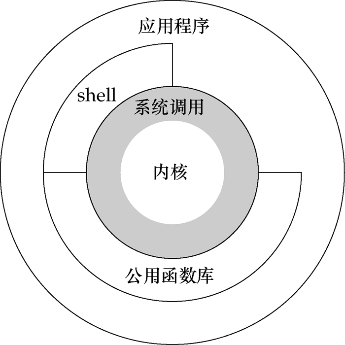
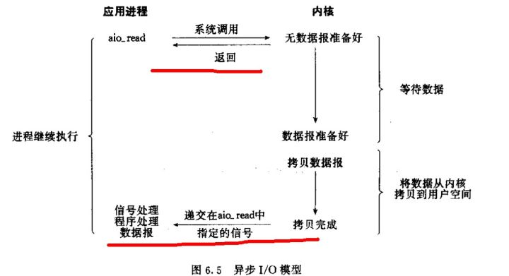
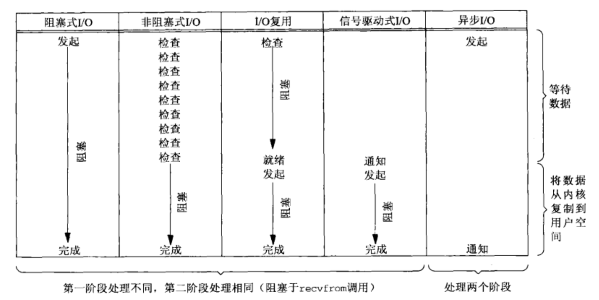
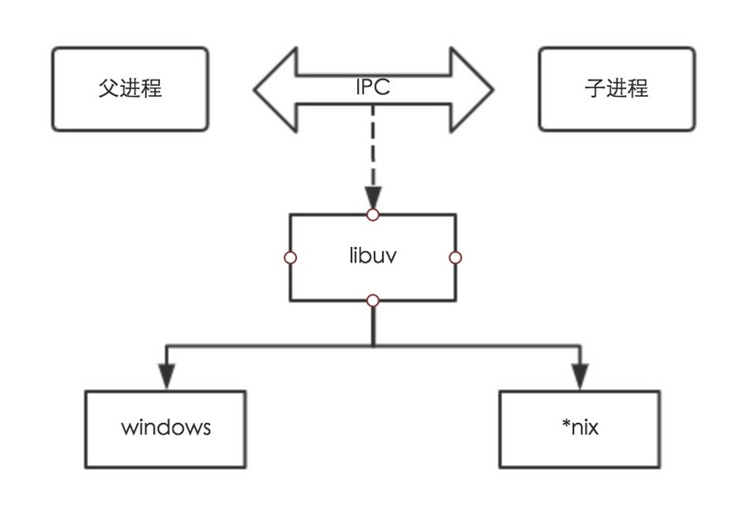
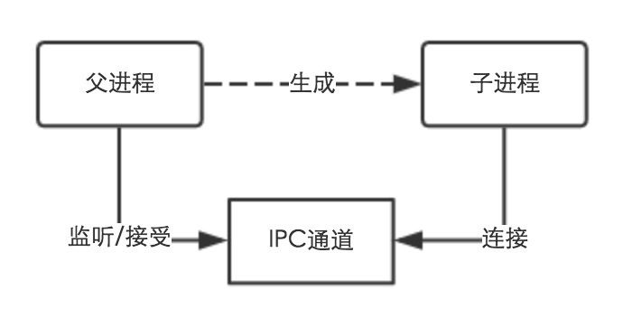
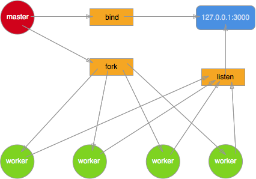
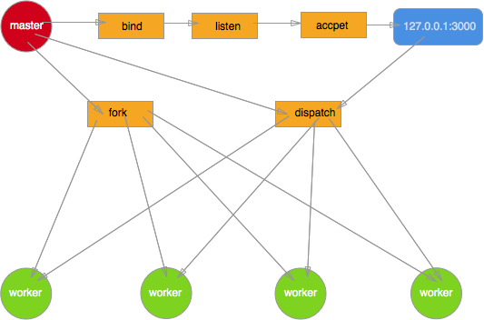
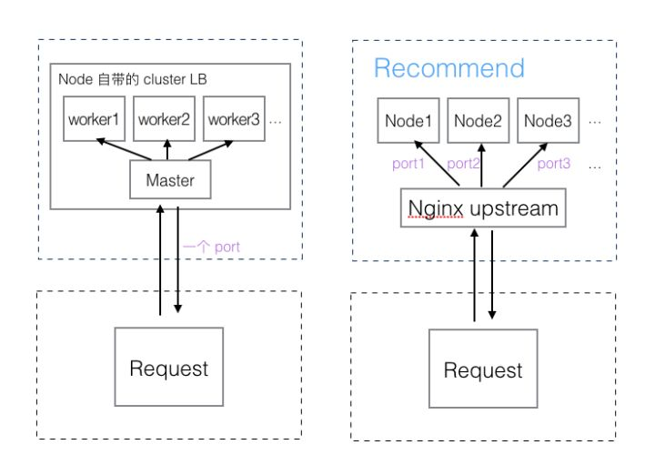
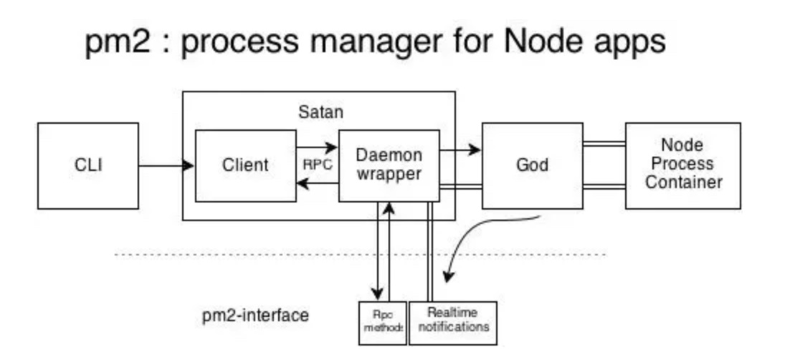

> 本文较长，内容较广，涉及内容也比较多，可能存在一些纰漏，希望读者读到本篇时如果遇到错误请指出，感激不尽。

### 前言

从 Node.js 进入人们的视野时，我们所知道的它就由这些关键字组成 **事件驱动、非阻塞 I/O、高效、轻量**，它在官网中也是这么描述自己的。

> Node.js® is a JavaScript runtime built on Chrome’s V8 JavaScript engine. Node.js uses an **event-driven**, **non-blocking I/O model** that makes it **lightweight** and **efficient**.

### Node.js 结构


我们可以看到，Node.js 的结构大致分为三个层次：

- Node.js 标准库，这部分是由 Javascript 编写的，即我们使用过程中直接能调用的 API。在源码中的 [lib](https://github.com/nodejs/node/tree/master/lib) 目录下可以看到。
- Node bindings，这一层是 Javascript 与底层 C/C++ 能够沟通的关键，前者通过 bindings 调用后者，相互交换数据。实现在 [node.cc](https://github.com/nodejs/node/blob/master/src/node.cc)
- 这一层是支撑 Node.js 运行的关键，由 C/C++ 实现。
- V8：Google 推出的 Javascript VM，也是 Node.js 为什么使用的是 Javascript 的关键，它为 Javascript 提供了在非浏览器端运行的环境，它的高效是 Node.js 之所以高效的原因之一。
- Libuv：它为 Node.js 提供了跨平台，线程池，事件池，异步 I/O 等能力，是 Node.js 如此强大的关键。
- C-ares：提供了异步处理 DNS 相关的能力。
- http_parser、OpenSSL、zlib 等：提供包括 http 解析、SSL、数据压缩等其他的能力。

所以，由此可以看出 `Node.js` 并不是一门语言，只是一个平台。

### 用户态和内核态

对 32 位操作系统而言，它的寻址空间（虚拟地址空间，或叫线性地址空间）为 4G（2 的 32 次方）。也就是说一个进程的最大地址空间为 4G。

内核从本质上看是一种软件——控制计算机的硬件资源，并提供上层应用程序运行的环境，它独立于普通的应用程序，可以访问受保护的内存空间，也有访问底层硬件设备的所有权限。

用户态即上层应用程序的活动空间，应用程序的执行必须依托于内核提供的资源，包括 CPU 资源、存储资源、I/O 资源等。为了使上层应用能够访问到这些资源，内核必须为上层应用提供访问的接口。

针对 Linux 操作系统而言，最高的 1G 字节(从虚拟地址 0xC0000000 到 0xFFFFFFFF)由内核使用，称为内核空间。而较低的 3G 字节(从虚拟地址 0x00000000 到 0xBFFFFFFF)由各个进程使用，称为用户空间。



上图可以看到，系统调用是操作系统的最小功能单位，用户态的应用程序可以通过三种方式来访问内核态的资源，分别是：

- 系统调用
- 库函数
- shell

下图是对上图的一个细分结构，从这个图上可以更进一步对内核所做的事有一个“全景式”的印象。


为了保证内核的安全，现在的操作系统一般都强制用户进程不能直接操作内核，具体的实现方式基本都是由操作系统将虚拟地址空间划分为两部分，一部分为内核空间，另一部分为用户空间。

CPU 将指令分为特权指令和非特权指令，对于那些危险的指令，只允许操作系统及其相关模块使用，普通应用程序只能使用那些不会造成灾难的指令。比如 Intel 的 CPU 将特权等级分为 4 个级别：Ring0~Ring3。

> 其实 Linux 系统只使用了 Ring0 和 Ring3 两个运行级别(Windows 系统也是一样的)。当进程运行在 Ring3 级别时被称为运行在用户态，而运行在 Ring0 级别时被称为运行在内核态。

到了这里我们可以总结：

**当进程运行在内核空间时就处于内核态，而进程运行在用户空间时则处于用户态。**

运行于用户态的进程可以执行的操作和访问的资源都会受到极大的限制，而运行在内核态的进程则可以执行任何操作并且在资源的使用上没有限制。

很多程序开始时运行于用户态，但在执行的过程中，一些操作需要在内核权限下才能执行，这就涉及到一个从用户态切换到内核态的过程。

> 比如应用程序要读取磁盘上的一个文件，它可以向内核发送一个系统调用（system call），告诉内核我要读取文件，其实就是通过一个特殊的指令让进程从用户态进入到内核态(到了内核空间)，在内核空间中，CPU 可以执行任何的指令，当然也包括从磁盘上读取数据。具体过程是先把数据读取到内核空间中，然后再把数据拷贝到用户空间并从内核态切换到用户态。此时应用程序已经从系统调用中返回并且拿到了想要的数据，就可以往下执行了。

从用户态进入到内核态，概括来讲有三种方式：系统调用、软中断和硬件中断

#### 上下文切换技术

当我们说“上下文”的时候，指的是程序在执行中的一个状态。通常我们会用调用栈来表示这个状态——栈记载了每个调用层级执行到哪里，还有执行时的环境情况等所有有关的信息。

> 由于单核 CPU 无法被平行使用(多个程序同时运行在一个 CPU 上)。为了创造*共享 CPU*的假象，设计人员就搞出了一个叫做时间片的概念，将时间分割成为连续的时间片段，让多个程序在这些连续的时间片中交叉获得 CPU 使用权限，这样看起来就好像多个程序在同时运行一样。后来，给任务分配时间片并进行调度的调度器成为了操作系统的核心组件;
>
> **摘自《深入理解计算机操作系统》**

根据任务的不同，CPU 的上下文切换可以分为几个不同的场景，也就是：进程上下文切换、线程上下文切换、中断上下文切换。

#### FD

文件描述符（File descriptor）是计算机科学中的一个术语，是一个用于表述指向文件的引用的抽象化概念。

文件描述符在形式上是一个非负整数。实际上，它是一个索引值，指向内核为每一个进程所维护的该进程打开文件的记录表。当程序打开一个现有文件或者创建一个新文件时，内核向进程返回一个文件描述符。在程序设计中，一些涉及底层的程序编写往往会围绕着文件描述符展开。但是文件描述符这一概念往往只适用于 UNIX、Linux 这样的操作系统。

### 什么是线程

我们来先说说什么是进程、线程。

#### 进程

进程是一种古老而典型的上下文系统，每个进程有独立的地址空间，资源句柄，他们互相之间不发生干扰。

每个进程在内核中会有一个数据结构进行描述，我们称其为进程描述符。这些描述符包含了系统管理进程所需的信息，并且放在一个叫做任务队列的队列里面。

很显然，当新建进程时，我们需要分配新的进程描述符，并且分配新的地址空间(和父地址空间的映射保持一致，但是两者同时进入 COW 状态)。这些过程需要一定的开销。

进程是计算机中的程序关于某数据集合上的一次运行活动，是系统进行资源分配和调度的基本单位，是操作系统结构的基础。

**进程的出现是为了更好的利用 CPU 资源使到并发成为可能**

#### 线程

> 线程是一种轻量进程，实际上在 linux 内核中，两者几乎没有差别，除了一点——线程并不产生新的地址空间和资源描述符表，而是复用父进程的。

**线程的出现是为了降低上下文切换的消耗，提高系统的并发性，并突破一个进程只能干一样事的缺陷，使到进程内并发成为可能**

进程和线程的关系：

- 一个线程只能属于一个进程，而一个进程可以有多个线程，但至少有一个线程
- 线程在进程内部，处理并发的逻辑，拥有独立的栈，却共享线程的资源
- 处理机分给线程，即真正在处理机上运行的是线程
- 线程在执行过程中，需要协作同步。不同进程的线程间要利用消息通信的办法实现同步

由于线程是操作系统直接支持的执行单元，很多高级语言都基本上内置了对 `thread` 的操作。

### 服务端历史

传统网络服务模型总体来说分为：（没有先后顺序之分

- 同步模型（单线程
- 进程模型（多进程
- 线程模型（多线程
- 协程模型（超线程
- CPS 模型（个人能力有限，针对该模型没有找到具体的描述和内容，所以就不详细介绍
- 非阻塞式 I/O

#### 同步模型

这类服务器是最早出现的，其执行模型是同步的（`基于read或select I/O模型`），编写自然，每个上下文可以当作其他上下文不存在一样的操作，每次读取数据可以当作必然能读取到。

它的服务模式是一次只能处理一个请求，其他的请求都需要按照顺序依次等待接受处理。

任何一个略慢的任务都会导致后续代码被阻塞，所以，它的处理能力特别的低下。

#### 进程模型

进程模型自然的隔离了连接。即使程序复杂且易崩溃，也只影响一个连接而不是在整个系统，当然服务器的进程数量是有上限的。

```
cat /proc/sys/kernel/pid_max
// Ubuntu 16.04 上结果为 32768
```

进程是一个比较重的概念，拥有自己的堆和栈，占用内存较多，一台服务器能运行的进程数量有上限，大约也就在几千或者几万左右，频繁的生成和释放开销很大，需要考虑复用，相同的状态会在内存中存在很多份，造成浪费，数据共享也是一个问题。

```python
from multiprocessing import Pool


def fib(n):
    if n <= 2:
        return 1
    return fib(n - 1) + fib(n - 2)


if __name__ == "__main__":
    p = Pool(processes=5)
    data = p.map(fib, [35] * 2)
    p.close()
    print(data)

```

> 早期的 `Apache` 服务器就是进程模型，以及后面提出的优化 `fastCGI` 属于进程池。

在前端 browser 当中可以通过创建 `webworkers` 来创建额外的进程。

#### 线程模型

**线程，是 cpu 调度的基本单位，是最小的执行单元**

线程模型的优点是更轻量，建立和释放速度更快，而且多个上下文间的通讯速度非常快，当然服务器的线程数量也是有上限的。

线程上下文由系统来切换控制，调度是由操作系统负责，线程的睡眠、等待、唤醒的时机是由操作系统控制，开发者无法精确的控制它们。

线程虽然比进程轻量，但也是相对的。[有人测试过](http://www.cnblogs.com/PurpleTide/archive/2010/11/12/1875763.html)，每个线程独享的栈的大小是 1M，依然不够高效。除此以外，多线程编程会带来各种麻烦，一个线程出现问题容易将整个系统搞崩溃，也面临锁的问题。

```python
import threading
import time

globals_num = 0

lock = threading.RLock()


def Func():
    lock.acquire()  # 获得锁
    global globals_num
    globals_num += 1
    time.sleep(1)
    print(globals_num)
    lock.release()  # 释放锁


for i in range(10):
    t = threading.Thread(target=Func)
    t.start()
```

> 现在的 `java` 我理解的就是线程模型，而且是深入内核态的线程。

早期的 C10K 问题就是讨论如何利用单台服务器支持 10K 并发数。当然随着软硬件性能的提高，目前 C10K 已经不再是问题，我们开始尝试解决 C10M 问题，即单台服务器如何处理百万级的并发。如果不使用进程或者线程，还有两种解决方案，分别是使用协程(coroutine)和非阻塞 I/O。

为了在寄存器当中快速的上下文切换，不牵扯到内核，其实还有一个叫做 `协程` 的解决方案。

#### 协程模型

历史上先有协程再有的线程。

> 实际上线程确实比协程性能更好，协程比较适合 I/O 密集型任务。线程和进程的操作是由程序触发系统接口，最后的执行者是系统；协程的操作则是程序员。

协程属于非抢占式任务，也可以叫做**用户态线程**

> 用户态线程就是程序自己控制状态切换，进程不用陷入内核态，开发者可以按照程序的特性来选择更适合的调度算法，

协程属于语言级别的调度算法实现，通过在线程中实现调度，避免了陷入内核级别的上下文切换造成的性能损失，协程所能调度的，只有在同一进程中的不同上下文而已。可以看做用户控件下的进程，进而突破了线程在 IO 上的性能瓶颈。

协程也可以说是一种编程组件，减少 callback 的使用，以看是同步的方式来编程，把这些异步伪装成同步，让写代码的人爽一些。

> 在事件驱动的编程里面 callback 可能更加合适。

```python
import asyncio


async def cor1():
    print("COR1 start")
    await cor2()
    print("COR1 end")


async def cor2():
    print("COR2")


loop = asyncio.get_event_loop()
loop.run_until_complete(cor1())
loop.close()

```

> 协程模型这种技术在 `Go` 语言中被广泛使用。

Node 作者视乎 [不愿加入 coroutine，](https://news.ycombinator.com/item?id=1549168)理由是一种哲学、信仰的问题。对协程感兴趣可以看一下 [fib.js](http://fibjs.org/)，以及 TJ 的 [co](https://github.com/tj/co) 语法糖。

ES6 当中已经加入 `yield/Generator/GeneratorFunction` 来支持协程，不过是半协程（semi-coroutine），而且我觉得 async 应该不单单只是 `generator` 的升级语法糖。

### I/O

> 什么是 I/O ?

这里所说的 I/O 可以分为:

- 网络 I/O
- 文件 I/O
- 磁盘 I/O
- ...

实际上两者高度类似。 I/O 可以分为两个步骤，**首先把文件(网络)中的内容拷贝到缓冲区，这个缓冲区位于操作系统独占的内存区域中。随后再把缓冲区中的内容拷贝到用户程序的内存区域中**。

I/O 的处理方式分为：

- 阻塞式
- 非阻塞式。

对于阻塞 I/O 来说，从发起读请求，到缓冲区就绪，再到用户进程获取数据，这两个步骤都是阻塞的。

非阻塞 I/O 实际上是向内核轮询，缓冲区是否就绪，如果没有则继续执行其他操作。当缓冲区就绪时，讲缓冲区内容拷贝到用户进程，这一步实际上还是阻塞的。

为了让 CPU 的处理能力得到充分利用，减少 I/O 浪费时间，避免陷入内核态，提高性能，内核提供了非阻塞式 I/O、I/O 多路复用，后来演变成异步编程。

### 同步、异步、阻塞、非阻塞、异步

到底什么是同步、异步、阻塞、非阻塞、异步？根据 《UNIX 网络编程：卷一》，书中向我们提及了 5 种类 UNIX 下可用的 I/O 模型：

- 阻塞式 I/O
- 非阻塞式 I/O
- I/O 复用（select，poll，epoll...）这里下面会说到
- 信号驱动式 I/O（SIGIO）这里不做介绍
- 异步 I/O（POSIX 的 aio\_系列函数）

下面我们调出一些常见的来做些简单介绍

#### 阻塞式 I/O 模型

默认情况下，所有套接字都是阻塞的。怎么理解？先理解这么个流程，一个输入操作通常包括两个不同阶段：

- 1、等待数据准备好；
- 2、从内核向进程复制数据。

对于一个套接字上的输入操作，第一步通常涉及等待数据从网络中到达。当所有等待分组到达时，它被复制到内核中的某个缓冲区。第二步就是把数据从内核缓冲区复制到应用程序缓冲区。 好，下面我们以阻塞套接字的 recvfrom 的的调用图来说明阻塞


标红的这部分过程就是阻塞，直到阻塞结束 recvfrom 才能返回。blocking IO 的特点就是在 IO 执行的两个阶段都被 block 了。

#### 非阻塞式 I/O

以下这句话很重要：进程把一个套接字设置成非阻塞是在通知内核，当所请求的 I/O 操作非得把本进程投入睡眠才能完成时，不要把进程投入睡眠，而是返回一个错误。看看非阻塞的套接字的 recvfrom 操作如何进行：


可以看出 recvfrom 总是立即返回，设置描述符为非阻塞，但是要进程自己一直询问 kernal 是否可读，**下面会详细介绍这个 非阻塞式 I/O**

#### 异步 I/O

这类函数的工作机制是告知内核启动某个操作，并让内核在整个操作（包括将数据从内核拷贝到用户空间）完成后通知我们。如图：



注意红线标记处说明在调用时就可以立马返回，等函数操作完成会通知我们。

#### I/O 模型比较

现在做一个大致的比较：



可以看到前四种模型都是阻塞式模型，真正的 I/O 操作（recvfrom），也就是最后一个阶段 **将数据从内核复制到用户空间**将阻塞进程，只有异步 I/O 模型和 POSIX 定义的异步 I/O 相匹配。

下面可以简单总结一下：

- 阻塞，非阻塞

> 简单来说是：请求的进程/线程要访问的数据是否就绪、进程/线程是否需要等待

根据上图，阻塞（blocking IO）和非阻塞（non-blocking IO）的区别就在于第一个阶段，如果数据没有就绪，在查看数据是否就绪的过程中是一直等待，还是直接返回一个标志信息。

- 同步，异步

> 主要通过消息通信机制（(synchronous communication/ asynchronous communication)来完成。

同步 I/O 和异步 I/O 的关键区别反映在数据拷贝阶段是由用户线程完成还是内核完成。同步需要主动读写数据，在读写数据的过程中还是会阻塞；异步只需要 I/O 操作完成的通知，并不主动读写数据，由操作系统内核完成数据的读写。

所以说异步 I/O 必须要有操作系统的底层支持。

> 似乎 异步 I/O 模型当中，按理说不存在阻塞与非阻塞的说法了，不知道为什么还有异步阻塞，异步非阻塞

### 非阻塞式 I/O 详细介绍

> 前面简单说了以下 非阻塞式 I/O ，这里详细解释一下：

Linux 提出了[3 种解决方案](http://www.cs.huji.ac.il/course/2004/com1/Exercises/Ex4/I.O.models.pdf) 来实现 I/O 多路复用：

- `select`
- `poll`
- `epoll`

除此之外其他平台也有对应的实现：

- `kqueue` FreeBSD
- `Event ports` Solaris

这些方案有好有坏，其实这些从根本上讲还是算是一种同步，应用程序仍然需要等待 I/O 完全返回。他们都需要在读写事件就绪后自己负责进行读写，也就是说这个读写过程是阻塞的。

比如 `Apache` 采用了前者，而 `Nginx` 和 `Node.js` 使用了后者，区别在于后者[效率更高](http://stackoverflow.com/questions/17355593/why-is-epoll-faster-than-select)

当然异步 I/O 是最理想的 I/O 模型，异步 I/O 的实现会负责把数据从内核拷贝到用户空间。

然而可惜的是真正的异步 I/O 并不存在。 Linux 上的 AIO 通过信号和回调来传递数据，但是存在缺陷。现有的 libeio 以及 Windows 上的 IOCP，本质上都是利用线程池与阻塞 I/O 来模拟异步 I/O。

Node 本身有自己的事件模型—— `event loop`：

```
   ┌───────────────────────┐
┌─>│        timers         │
│  └──────────┬────────────┘
│  ┌──────────┴────────────┐
│  │     I/O callbacks     │
│  └──────────┬────────────┘
│  ┌──────────┴────────────┐
│  │     idle, prepare     │
│  └──────────┬────────────┘      ┌───────────────┐
│  ┌──────────┴────────────┐      │   incoming:   │
│  │         poll          │<─────┤  connections, │
│  └──────────┬────────────┘      │   data, etc.  │
│  ┌──────────┴────────────┐      └───────────────┘
│  │        check          │
│  └──────────┬────────────┘
│  ┌──────────┴────────────┐
└──┤    close callbacks    │
   └───────────────────────┘

```

`event loop` 作为一个 Node 开发者是必须了解并熟悉的内容，读者可以线下自行学习。

### 单线程的 Node

从严格意义上来讲， `Node.js` 本身并不是单线程的。

因为 Node 自身还有 I/O 线程存在（网络 I/O、磁盘 I/O），这些 I/O 线程是由更底层的 `libuv` 处理，这些实际上还是多线程，当然这些对于 `JavaScript` 开发者来说是透明的。

Node 的异步 I/O 并非首创，但是是第一个成功的平台。

#### libuv

Node 的底层关键结构有一个[libuv](https://github.com/libuv/libuv) ，在它的介绍当中提到：

- Full-featured event loop backed by epoll, kqueue, IOCP, event ports.
- ….

一张图来提现它大概的所有功能：


Node 正是通过它来和**底层操作系统打交道**，来实现：事件驱动、非阻塞 I/O、高效。

下面是一张简化的调用流程图(以 fs 为例)：


> 在 Linux 当中是通过 AIO(epoll) 实现异步 io，Windows 当中则是 IOCP，libuv 作为抽象封装层，使得所有平台差异有这一层完成，并且在 Node 编译期间会判断平台条件选择性编译。

Node 当中 javascript 的执行线程是单线程，把需要做的 `I/O` 交给 `libuv`，并设定好回调。

自己马上返回做别的事情，然后 `libuv` 有一个事件循环(`event loop`)的机制。

大致会执行一个相当于 `while true` 的无限循环，不断的检查各个 `watcher` 上面是否有需要处理的 `pending` 状态事件，然后来指定执行事件回调。

#### 存在的优势

Node.js 的单线程具有它的优势：

- 状态单一
- 不存在竞态，没有锁
- 不需要线程间同步
- 减少系统上下文的切换
- 有效提高单核 CPU 的使用率

但也并非十全十美：

- 单线程是可以被阻塞的
- 无法充分调用 CPU 的资源
- CPU 密集型任务显得无力，需要多进程或者拓展模块来优化
- 单线程的脆弱性，如果单线程出现未捕获的异常，就会造成这个进程 crash

#### 非 I/O 的异步 API

介绍 Node 的时候，多数情况下都会提到异步 I/O，Node 当中也存在一些与 I/O 无关的异步 API：

- `setTimeout`
- `setInterval`
- `setImmediate`
- `process.nextTick`

> 从上面这些 API 当中也引发出一个常见的问题 macrotask 和 microtask 的区别，其实还是 event loop

#### setTimeout 和 setInterval

这两个 API 和浏览器当中的行为是一致的。它们的实现原理和异步 I/O 比较相似，只是不需要进程池的参与。

调用的时候创建的定时器会被插入到观察者内部的一个红黑树当中。每次一个 Tick 执行的时候，会从红黑树当中迭代取出定时器对象，检查是否超过定时时间，如果超过，就形成一个事件，立即执行回调函数。

问题在于：定时器并非是精准的。尽管 event loop 循环的很快，如果某一次循环占用时间过多，下次循环的时候，或许已经超时很久了。比如一些 CPU 任务占用时间过长。

#### process.nextTick

由于事件循环自身的特点，定时器的精确度不够，好多人采用过这样的方法来实现异步执行一个任务（延迟执行：

```javascript
setTimeout(() => {
  // do something
}, 0)
```

实际上这样写不但浪费性能，而且根据 event loop 顺序，setTimeout 的优先级也不高。实际上 `process.nextTick` 方法操作较为轻量、高效，功能实现上也较为符合需求。

根据 event loop，**process.nextTick()不在 event loop 的任何阶段执行，而是在各个阶段切换的中间执行**,即从一个阶段切换到下个阶段前执行。

#### setImmediate

这个 `setImmediate` 方法和 `process.nextTick` 十分相似，都是回调函数延迟执行，两者的差别是：

```javascript
process.nextTick(function() {
  console.log('nextTick')
})

setImmediate(function() {
  console.log('setImmediate')
})

console.log('runtime')
```

执行结果是：

```
runtime
nextTick
setImmediate
```

从这里可以看出，`process.nextTick`中的回调函数优先级高级 `setImmediate`，这是因为前者属于 `idle` 阶段，后者属于 `check` 阶段，每一次事件循环当中，`idle` 优先级大于 `check` 阶段。

### 多进程的 Node

如果你运行 Node.js 的机器是像 i5，i7 这样多核 cpu，那么将无法充分利用多核 cpu 的性能来为 Node.js 服务。

在 C++、C#、python 等其他语言都有与之对应的多线程编程，能够充分的利用多核 CPU。

我们可以通过以下方式实现多进程：

- fork
- cluster
- 第三方库 `tagg`、`tagg2`（对 v8，libuv 进行拓展

#### fork

说到多进程当然少不了 [fork](http://man7.org/linux/man-pages/man2/fork.2.html) ,在 un\*x 系统中，fork 函数为用户提供最底层的多进程实现。

多个子进程便是通过在 master 进程中不断的调用 cluster.fork 方法构造出来:


Node 有以下几种创建进程的方式：

- `spawn` 创建一个子进程来执行命令，结果以 stream 的形式返回
- `exec` 创建一个子进程来执行命令，和 spawn()不同的是方法参数不同，它可以传入回调函数来获取子进程的状态，结果立即返回
- `execFile` 启动一个子进程来执行指定文件。注意，该文件的顶部必须声明 [SHEBANG](<https://en.wikipedia.org/wiki/Shebang_(Unix)>)符号(#!)用来指定进程类型。
- `fork` 这个和 `spawn` 类似，不同点在于它创建 Node 的子进程只需要执定要执行的 JavaScript 文件模块即可。

对于这些创建进程的方式一般有以下问题：

> 1、child_process.fork 与 POSIX 的 fork 有什么区别?

Node 的 `child_process.fork()` 在 Unix 上的实现最终调用了 POSIX [fork(2)](http://man7.org/linux/man-pages/man2/fork.2.html)

而 POSIX 的 fork 需要手动管理子进程的资源释放 (waitpid)

`child_process.fork` 则不用关心这个问题, Node.js 会自动释放, 并且可以在 option 中选择父进程死后是否允许子进程存活.

> 2、父进程或子进程的死亡是否会影响对方? 什么是孤儿进程?

子进程死亡不会影响父进程, 不过子进程死亡时（线程组的最后一个线程，通常是“领头”线程死亡时），会向它的父进程发送死亡信号。

父进程死亡, 一般情况下子进程也会随之死亡, 但如果此时子进程处于可运行态、僵死状态等等的话, 子进程将被 [init 进程](https://zh.wikipedia.org/wiki/Init收养，从而成为孤儿进程。

另外, 子进程死亡的时候（处于“终止状态”），父进程没有及时调用 `wait()` 或 `waitpid()` 来返回死亡进程的相关信息，此时子进程还有一个 `PCB` 残留在进程表中，被称作僵尸进程。

> 3、有兴趣的话可以看一下守护进程（daemon）以及实现。

在这里值得一提的是：`fork` 出来的应用程序如果都监听相同的端口会出现常见的 `EADDRINNUSE` 错误，早期的解决办法是 `进程间发送句柄，共享 fd` 。

#### Cluster

官方的介绍的作用是，通过 cluster 模块可以帮助应用程序在多核的系统上轻松创建共享服务器端口的子进程。

> A single instance of Node.js runs in a single thread. To take advantage of multi-core systems, the user will sometimes want to launch a cluster of Node.js processes to handle the load.
>
> The cluster module allows easy creation of child processes that all share server ports.

cluster 模块对 child_process 模块提供了一层封装，简单的一个 fork，不需要开发者修改任何的应用代码便能够实现多进程部署。

cluster 通过加入 `cluster.isMaster` 这个标识, 来区分父进程以及子进程，父进程起到了协调,调度的作用,他把客户端过来的请求分发给子进程.

下面是采用 `cluster` 来创建一个简单的集群：

```javascript
const cluster = require('cluster') // | |
const http = require('http') // | |
const numCPUs = require('os').cpus().length // | |    都执行了
// | |
if (cluster.isMaster) {
  // |-|-----------------
  // Fork workers.                             //   |
  for (var i = 0; i < numCPUs; i++) {
    //   |
    cluster.fork() //   |
  } //   | 仅父进程执行 (a.js)
  cluster.on('exit', worker => {
    //   |
    console.log(`${worker.process.pid} died`) //   |
  }) //   |
} else {
  // |-------------------
  // Workers can share any TCP connection      // |
  // In this case it is an HTTP server         // |
  http
    .createServer((req, res) => {
      // |
      res.writeHead(200) // |   仅子进程执行 (b.js)
      res.end('hello world\n') // |
    })
    .listen(8000) // |
} // |-------------------
// | |
console.log('hello') // | |    都执行了
```

真实的工作进程是通过使用 `child_process.fork` 方法实现并派送的,他们可以通过 IPC （Inter-Process Communication）进行进程间的通信。

> Node.js 中的 IPC 通信是由 `libuv` 通过管道技术实现的, 在 windows 下由命名管道（named pipe）实现也就是上表中的最后第二个, \*nix 系统则采用 UDS (Unix Domain Socket) 实现。

IPC 的创建和实现示意图：



父进程在实际创建子进程之前，会先创建 IPC 通道并监听它，然后才真正创建出子进程。子进程在启动的过程中会去链接这个已存在的 IPC 通道，从而完成了父子进程之间的连接。



通过 `fork()` 复制的进程都是一个`独立`的进程，这个进程中有着独立而全新的 V8 实例。

### 负载均衡

为了保证多个进程工作量公平，Node 必然会遇到负载均衡的问题。

首先，Node 默认提供的机制采用操作系统的抢占式策略：一堆工作进程中，闲着的进程对到来的请求进行争抢，谁抢到谁服务，一般而言这个对大家都是公平的。但是这在高并发、大客户端链接的时候会产生[惊群问题](https://en.wikipedia.org/wiki/Thundering_herd_problem)：



> 多线程/多进程等待同一个 socket 事件，当这个事件发生时，这些线程/进程被同时唤醒，就是惊群现象。

感兴趣的话可以看一下 `C10K problem` 以及 `c10M problem`

这种模式有着明显的问题：

- 多个进程之间会竞争，产生惊群现象，效率比较低，许多进程被内核重新调度唤醒，同时去响应这一个事件，只有一个进程能处理事件成功，其他的进程在处理该事件失败后重新休眠。
- 由于无法控制一个新的连接由哪个进程来处理，Node 的繁忙分为 CPU 和 I/O 繁忙，影响抢占的是 CPU 的繁忙度，必然导致各 worker 进程之间的负载非常不均衡。

其次，后来 Node 提供了新的策略使得负载均衡更合理，这种策略叫做 `Round-Robin` ，又叫轮叫调度。

> Windows 上是采用 句柄共享 ，\*nix 是 Round-Robin

如何传递以及传递给哪个 worker 完全是可控的，参照下图的 `dispatch`



在 Cluster 模块当中启用的方式如下：

```bash
// 启用 Round-Robin
cluster.schedulingPolicy = cluster.SCHED_RR

// 不启用 Round-Robin
cluster.schedulingPolicy = cluster.SCHED_NONE
```

或者在环境变量当中这种 `NODE_CLUSTER_SCHED_POLICY`：

```bash
# 启用 Round-Robin
export NODE_CLUSTER_SCHED_POLICY=rr

# 不启用 Round-Robin
export NODE_CLUSTER_SCHED_POLICY=none
```

当然负载均衡策略也可以通过代理服务器 `nginx` 配置 `upstream` 实现：

```nginx
http {
  upstream cluster {
      server 127.0.0.1:3000;
      server 127.0.0.1:3001;
      server 127.0.0.1:3002;
      server 127.0.0.1:3003;
  }
  server {
       listen 80;
       server_name www.domain.com;
       location / {
            proxy_pass http://cluster;
       }
  }
}
```

可以简单理解为：



### 进程守护

master 进程除了负责接收新的连接，分发给各 `worker` 进程处理之外，还得守护每一个 worker 进程，保证整个应用的稳定性，一旦某个 `worker` 异常退出就需要 `fork` 一个新的进程上去。

我们可以给 `process` 对象 添加 `uncaughtException` 事件绑定来避免异常发生时直接退出，可以在回调当中停止任务，告诉 `master` 进程该进程已经 `died`：

```javascript
process.on('uncaughtException', err => {
  // 记录日志
  logger.error(err)

  // 发送自杀信号
  process.send({ act: 'suicide' })

  // 停止接收新的连接
  worker.close(function() {
    process.exit(1)
  })

  // 5秒后自动退出
  setTimeout(function() {
    process.exit(1)
  }, 5e3)
})
```

在 `cluster` 模块当中我们可以这样进行处理：

```javascript
cluster.on('exit', function() {
  clsuter.fork()
})

cluster.on('disconnect', function() {
  clsuter.fork()
})
```

整个应用的稳定性就落在了 master 身上，要百分百保证它的健壮性。

当然也可以采用 [PM2](https://pm2.keymetrics.io/)（偷懒的办法），这个基于 Cluster 模块 进行了一些封装，它能自动监控进程状态（守护进程）、重启进程、停止不稳定进程、日志存储等。

利用 PM2 时，可以在不修改代码的情况下实现负载均衡集群。



### 个人看法

Node.js 非常适合为 I/O 密集型应用提供服务。但这种方式的缺陷就是不擅长处理 CPU 密集型任务。

对于高并发的长连接，事件驱动模型比线程轻量得多，Node 虽然隐藏了 `event loop` 和 `async io` 的细节，但是它的特点是易于上手，非常容易编写，开发效率高，同时写出来性能还不差。

问题在于，到了一定的复杂程度之后，代码维护、提高性能瓶颈就比较困难了，开发者需要深入了解它大部分甚至所有隐藏的细节才有保障构建复杂、大型的应用。

### Reference

- [Python 中的进程、线程、协程、同步、异步、回调](https://segmentfault.com/a/1190000001813992)
- [上下文切换技术](http://blog.shell909090.org/blog/archives/2703/)
- [深入理解 Linux 的 CPU 上下文切换](https://www.linuxblogs.cn/articles/18120200.html)
- [Linux 内核架构这本书的笔记](https://github.com/GuoJing/linux-kernel-architecture)
- [c10k](https://en.wikipedia.org/wiki/C10k_problem)
- [`event loop` 官方解释](https://nodejs.org/en/docs/guides/event-loop-timers-and-nexttick/)
- [Python 当中的多线程，多进程，协程](http://www.cnblogs.com/aylin/p/5601969.html)
- [协程(Coroutine)-ES 中关于 Generator/async/await 的学习思考](https://blog.csdn.net/shenlei19911210/article/details/61194617)
- [为什么协程是趋势](https://www.zhihu.com/question/32218874/answer/56255707)
- [Node 的协程](http://shiningray.cn/node-js-coroutine.html)
- [Node.js cluster 踩坑小结](https://zhuanlan.zhihu.com/p/27069865)
- [理解事件驱动 select,poll,epoll 三种模型](http://www.cnblogs.com/lizheng19822003/p/5337792.html)
- [并发之痛 Thread，Goroutine，Actor](http://jolestar.com/parallel-programming-model-thread-goroutine-actor/)
- [通过源码解析 Node.js 中进程间通信中的 socket 句柄传递](https://github.com/DavidCai1993/my-blog/issues/31)
- [linux 下进程的进程最大数、最大线程数、进程打开的文件数和 ulimit 命令修改硬件资源限制](https://blog.csdn.net/gatieme/article/details/51058797)
- [一个进程(Process)最多可以生成多少个线程(Thread)](https://blog.csdn.net/great3779/article/details/5930190)
- [既然 nodejs 是单线程的，那么它怎么处理并发，难道要排队么](https://segmentfault.com/q/1010000000190024)
- [当我们谈论 cluster 时我们在谈论什么](https://github.com/hustxiaoc/node.js/issues/11)
- [taobao fed 当我们谈论 cluster 时我们在谈论什么(上)](http://taobaofed.org/blog/2015/11/03/nodejs-cluster/)
- [tabao fed 当我们谈论 cluster 时我们在谈论什么（下）](http://taobaofed.org/blog/2015/11/10/nodejs-cluster-2/)
- [怎样理解阻塞非阻塞与同步异步的区别？](https://www.zhihu.com/question/19732473)
- [Linux 内核空间与用户空间](https://www.cnblogs.com/sparkdev/p/8410350.html)
- [进程/线程上下文切换会用掉你多少 CPU？](https://zhuanlan.zhihu.com/p/79772089)
