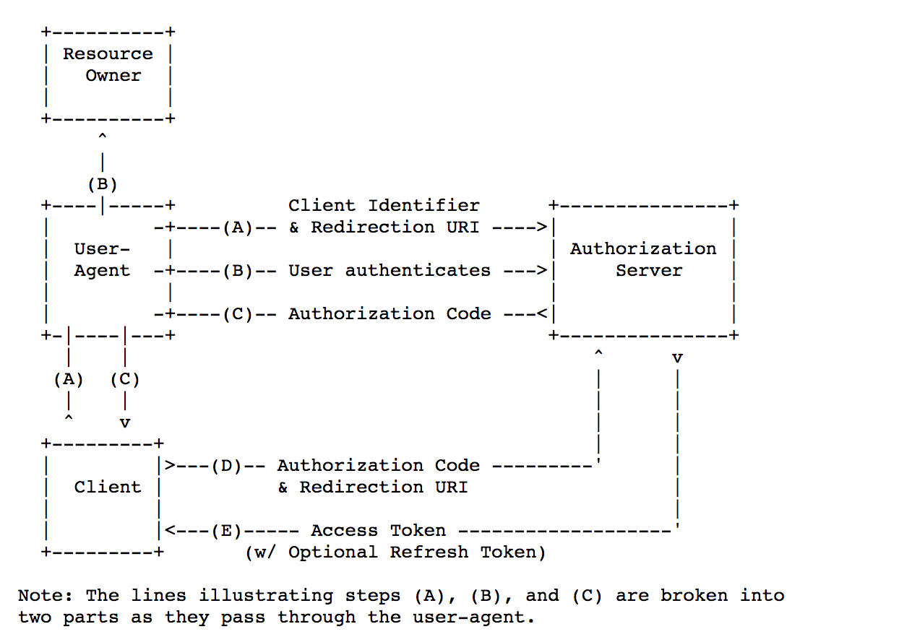
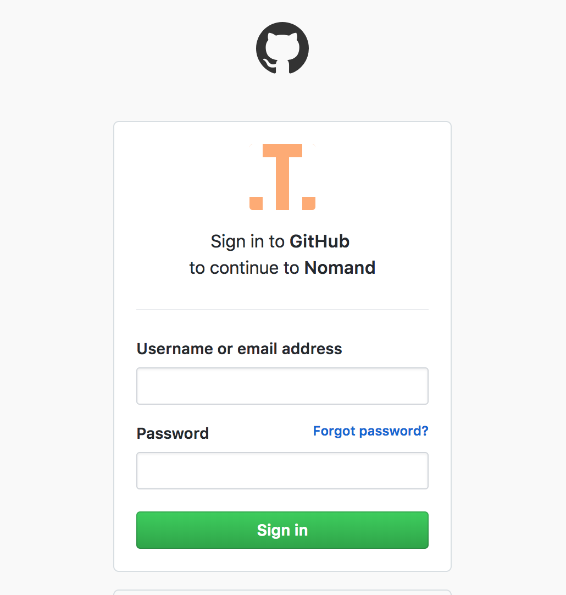
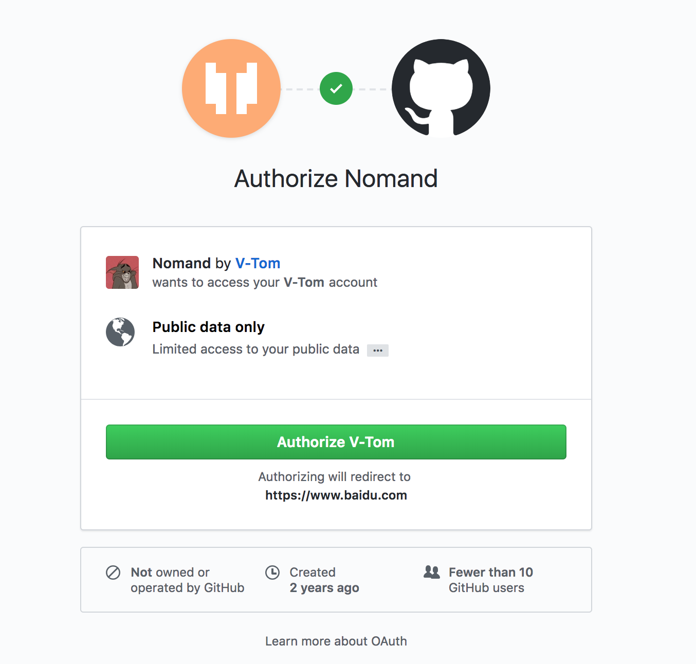

### JWT

`JWT` 是 `JSON Web Token` 的缩写，可以简单理解为生产者颁发给消费者一个令牌。参照 [JWT 规范](https://tools.ietf.org/html/rfc7519) 对其所做的描述是：

> JSON Web令牌（JWT）是一种紧凑的、URL安全的方式，用来表示要在双方之间传递的“声明”。JWT中的声明被编码为JSON对象，用作JSON Web签名（JWS）结构的有效内容或JSON Web加密（JWE）结构的明文，使得声明能够被：数字签名、或利用消息认证码（MAC）保护完整性、加密。

这个规范允许我们使用JWT在用户和服务器之间传递安全可靠的信息。

#### JWT的构成

`JWT` 由三部分构成：

- `Header`  ：头部，即 `JOSE Header`
- `Claims` ：声明，即 `JWT Payload`
- `Signature` ：签名，即 `JWT Signature`

JWT由这三部分组成，每一部分都是使用base64url编码的，并使用句点（`.`）连接起来

> 这里使用[base64url](https://tools.ietf.org/html/rfc4648#section-5)编码而不是普通的base64，是因为base64编码会产生+和/，这两个字符在URL中是有特殊意义的，会导致JWT不是URL安全的。

##### 头部(JOSE Header)

`JSOE` 是 `JSON Object Signing and Encryption`，即`JSON对象签名与加密`的缩写。

``` json
{
  "typ": "JWT",
  "alg": "HS256"
}
```

示例中给出了两个声明：

- `typ`：类型，在JOSE Header中这是个可选参数，但这里我们需要指明类型是`JWT`。
- `alg`：算法，必须是 `jwt` 支持的算法，算法列表可以在jwt 规范当中找到。

简单示例：

``` go
package main

import "bytes"
import (
	"encoding/json"
	"encoding/base64"
	"fmt"
)

func header() string {

	header := struct {
		Alg string `json:"alg"`
		Typ string `json:"typ"`
	}{
		Alg: "HS256",
		Typ: "JWT",
	}

	data, _ := json.Marshal(header)

	// base64
	jwtHeader := base64.URLEncoding.EncodeToString([]byte(data))

	return jwtHeader

}

func main(){
    fmt.println(header())
}

```

上述代码片段会输出 `eyJhbGciOiJIUzI1NiIsInR5cCI6IkpXVCJ9`，这就是编码后的JWT头部。

##### 声明（JWT Claims）

声明包括：

- `Registered Claim Names` 
- `Public Claim Names`
- `Private Claim Names`

在一个 `Registered Claim Names` 声明集当中，一般会有如下注册的声明名字：

- `iss`: （Issuer）签发者
- `iat`: （Issued At）签发时间，用Unix时间戳表示
- `exp`: （Expiration Time）过期时间，用Unix时间戳表示
- `aud`: （Audience）接收该JWT的一方
- `sub`: （Subject）该JWT的主题
- `nbf`: （Not Before）不要早于这个时间
- `jti`: （JWT ID）用于标识JWT的唯一ID

> 注意：上面的声明都是可选的，但是一般都达成共识。注册的声明是在 [IANA](https://tools.ietf.org/html/rfc7519#section-10.1) 中注册的。

至于 `Public Claim Names` ，公开的声明可以由使用 `JWT` 的人员来定义，名称或值的定义者都需要采取合理的预防措施，以确保他们能够控制它们用来定义声明名称的部分名称空间，并且要求保证和已经注册的声明发生命名冲突。

接下来就是`Private Claim Names` ，`JWT` 的生产者和消费者都可以使用的声明名称，可能会发生冲突，我们一般用来定义 token 的详细内容。

上面详细的介绍和解释可以在  [JWT 规范](https://tools.ietf.org/html/rfc7519) 当中找到。

示例代码：

``` go
// ......

type Claims struct {
	Iss    string `json:"iss"`
	Exp    int64  `json:"exp"`
	Public string `json:"public"`
}
func claims() string {

	claims := Claims{
		Iss:    "TOM",
		Exp:    time.Now().Unix() + 1000*60,
		Public: "this is user public information",
	}

	data, _ := json.Marshal(claims)

	// base64
	jwtClaims := base64.URLEncoding.EncodeToString([]byte(data))

	return jwtClaims

}

func main(){
    fmt.println(claims())
}
```

上述代码片段会输出 `eyJpc3MiOiJUT00iLCJleHAiOjE1MjI3MTUzMzEsInB1YmxpYyI6InRoaXMgaXMgdXNlciBwdWJsaWMgaW5mb3JtYXRpb24ifQ==`，这就是编码后的 `JWT` 声明。

##### 签名（Signature）

按照头部中指定的，我们要使用 `HS256` 算法对上面的编码后的字符串进行签名，头部和声明用`.`号连接起来：

``` 
eyJhbGciOiJIUzI1NiIsInR5cCI6IkpXVCJ9.eyJpc3MiOiJUT00iLCJleHAiOjE1MjI3MTUzMzEsInB1YmxpYyI6InRoaXMgaXMgdXNlciBwdWJsaWMgaW5mb3JtYXRpb24ifQ==.EVxVgfx1mU9CWqW-UmAte60LCdrqKPmERKcrKCkG30E
```

我们要做的就是对这个字符串进行签名。

``` go
func sign() string {
    
	header := header()
	claims := claims()

	s := strings.Join([]string{header, claims}, ".")

	// HS256算法，key是 private secret key
	mac := hmac.New(sha256.New, []byte("secret"))
	mac.Write([]byte(s))
	expectedMAC := mac.Sum(nil)
    
    // signature
	signature := strings.TrimRight(base64.URLEncoding.EncodeToString(expectedMAC), "=")

	return signature
}
```

上诉代码输出 `oItJnEd5o5soC6RzlySQnjX4c7hIBh_N4-Me9k5ZcQs` ，这就是 `JWT` 的签名。

接下来，将头部、声明、签名用`.`号连在一起就得到了我们要的 `JWT`。

``` go
fmt.Println(strings.Join([]string{header(), claims(), sign()}, "."))
```

最后的结果为：

```
eyJ0eXAiOiJKV1QiLCJhbGciOiJIUzI1NiJ9.eyJpYXQiOjE0OTMwOTAwMDEsIm5hbWUiOiLlvKDkuIkifQ==.oItJnEd5o5soC6RzlySQnjX4c7hIBh_N4-Me9k5ZcQs
```

#### 签名的目的

最后一步签名的过程，实际上是对 `header` 以及 `claims` 内容进行签名。一般而言，加密算法对于不同的输入产生的输出总是不一样的。对于两个不同的输入，产生同样的输出的概率极其地小

所以，如果有人对头部以及载荷的内容解码之后进行修改，再进行编码的话，那么新的头部和载荷的签名和之前的签名就将是不一样的。

如果不知道服务器加密的时候用的**private 密钥**的话，得出来的签名也一定会是不一样的。

服务器应用在接受到JWT后，会首先对头部和载荷的内容用同一算法再次签名（我们在JWT的头部中已经用 `alg` 字段指明了我们的加密算法了。

如果服务器应用对头部和载荷再次以同样方法签名之后发现，自己计算出来的签名和接受到的签名不一样，那么就说明这个 `Token` 的内容被别人动过的，我们应该拒绝这个 `Token`，返回一个 `HTTP 401 Unauthorized` 响应。

当然也包括 jwt 格式是否合法，数据内容是否过期等其他验证内容。

#### 信息会暴露？

Base64是一种编码，是可逆的。

所以，在 `JWT` 中，不应该在载荷里面加入任何敏感的数据。在上面的例子中，我们传输的是用户的`User ID`。这个值实际上不是什么敏感内容，一般情况下被知道也是安全的。

但是像密码这样的内容就不能被放在 `JWT` 中了。如果将用户的密码放在了 `JWT` 中，那么怀有恶意的第三方通过Base64解码就能很快地知道你的密码了。

所以 `JWT` 适合用于向Web应用传递一些非敏感信息

#### 解码

下述代码简单实现了 `JWT` 的解码：

```go

// hmac256
func hmac256(src string, secret string) string {
	key := []byte(secret)
	h := hmac.New(sha256.New, key)
	h.Write([]byte(src))
	return base64.URLEncoding.EncodeToString(h.Sum(nil))
}

// compareHmac
func compareHmac(message string, messageHmac string, secret string) bool {
	return messageHmac == hmac256(message, secret)
}

// main decode
func Decode(jwt string, secret string) (interface{}, error) {
    
    // 按照 JWT 规范，我们可以得到：
    // token[0] 是 header
    // token[1] 是 claims
    // token[2] 是 Signature
	token := strings.Split(jwt, ".")

    // 简单判断是会否合法
	if len(token) != 3 {
		splitErr := errors.New("token不合法")
		return nil, splitErr
	}

	// decode payload
	decodedPayload, PayloadErr := Base64Decode(token[1])
	if PayloadErr != nil {
        return nil, fmt.Errorf("Base64Decode failed: %s", PayloadErr.Error())
	}
    
	payload := Claims{}

	// parse
	ParseErr := json.Unmarshal([]byte(decodedPayload), &Claims)
	if ParseErr != nil {
		return nil, fmt.Errorf("Invalid payload: %s", ParseErr.Error())
	}

	// 是否过期
	if payload.Exp != 0 && time.Now().Unix() > payload.Exp {
		return nil, errors.New("Expired token: token has expired")
	}

    // 我们知道 签名是 头部和声明用 . 号连接起来加密生成的
	signatureValue := token[0] + "." + token[1]

	// 是否是生产者本身提供的签名
	if compareHmac(signatureValue, token[2], secret) == false {
		return nil, errors.New("Invalid token")
	}

    // JWT 解码通过
	return payload, nil
}
```

#### JWT 和 session 的区别

session需要在服务器中存储标记用户的信息，比如 `session_id`，而JWT则需要服务器端需要一定量的计算来确定用户身份。

在分布式系统中，使用Session的方式，需要在多台服务器之间 `session id`，增加了服务器的内存和IO压力。

而JWT方式则免去了同步的麻烦。因为用户的状态已经存储在客户端中了，虽然增加了一些计算开销，但是与IO开销比起来，还是要好很多的。

#### 应用 JWT 的案例

- 更适合RESTful方案
- 验证用户，客户端持久化登录
- 单点登录
- 免登录退订邮件

#### 实际开发当中需要注意的安全问题：

- 使用随机复杂的密钥 (`JWT Secret`) ，甚至加密，加盐，采用慢哈希，以增加暴力破解的难度.
- 不要在请求体中直接提取数据, 要对数据进行加密 (`HS256` 或 `RS256`).
- 使 `token` 的过期时间尽量的短 (`TTL`, `RTTL`).
- 不要在 `JWT` 的请求体中存放敏感数据, 它是[可破解的](https://link.zhihu.com/?target=https%3A//jwt.io/%23debugger-io).

### OAuth

很多网站、APP 弱化甚至没有搭建自己的账号体系，而是直接使用社会化登录的方式，这样不仅免去了用户注册账号的麻烦、还可以获取用户的好友关系来增强自身的社交功能。

传统的办法是用户在第三方应用程序那里登录自己的账号，但是这样会有很多严重的缺点。

为了解决以上的问题，OAuth 协议应运而生。

按照 [OAuth RFC 6749](https://www.ietf.org/rfc/rfc6749.txt) 的定义：

> OAuth通过引入授权层并将客户端的角色与资源所有者的角色分开来解决这些问题。
>
> 在OAuth中，客户端请求访问由资源所有者控制并由资源服务器托管的资源，并发出与资源所有者不同的凭据集。

具体流程可以大致理解为：

> 客户端获取访问令牌：一个表示特定范围，生命周期和其他访问属性的字符串。
>
> 授权服务器在获得资源所有者（也就是用户本身）的同意后向第三方客户端颁发访问令牌。 客户端使用访问令牌访问资源服务器托管的受保护资源。

#### Roles（角色

OAuth 定义了一些角色：

- `resource owner` 资源所有者，也可以理解为用户
- `resource server` 资源服务器，即服务提供商存放用户生成的资源的服务器。它与认证服务器，可以是同一台服务器，也可以是不同的服务器
- `client` 官方翻译是：资源所有者及其授权的应用程序进行受保护的资源请求，个人觉得可以理解为 第三方的应用程序
- `authorization server` 认证服务器，即服务提供商专门用来处理认证的服务器。

#### Protocol Flow（协议流程

下图摘自 [OAuth RFC 6749](https://www.ietf.org/rfc/rfc6749.txt)：


流程可以理解为：

- （A）用户打开客户端以后，客户端要求用户给予授权。
- （B）用户同意给予客户端授权。
- （C）客户端使用上一步获得的授权，向认证服务器申请令牌。
- （D）认证服务器对客户端进行认证以后，确认无误，同意发放令牌，这一步也可以叫做 renewToken。
- （E）客户端使用令牌，向资源服务器申请获取资源。
- （F）资源服务器确认令牌无误，同意向客户端开放受保护的资源。

#### Authorization Grant（授权方式

上面授权流程的关键点在于 B ，用户怎样才能给于客户端授权。

OAuth 2.0定义了四种授权方式以及对应的可拓展性，定义了一些附加类型：

- 授权码模式（authorization code）
- 简化模式（implicit）
- 密码模式（resource owner password credentials）
- 客户端模式（client credentials）

本文当中只简单实现一下 授权码模式。

#### 授权码模式

授权码授权类型用于获取访问令牌和刷新令牌，并针对机密客户端进行了优化。

参照 RFC 6749，是这样定义：



> 流程解释的过程中会参考 GitHub OAuth 的例子来进行更好的理解，你也可以通过 GitHub 官方的 [OAuth App](https://github.com/settings/developers) 来实践，以及 [GitHub OAuth develop doc](https://developer.github.com/apps/building-oauth-apps/authorization-options-for-oauth-apps/)

流程可以理解为：

**流程A）**用户访问客户端，然后被导向认证服务器（有可能需要在认证服务器进行登录。

按照官方定义，这个流程，客户端申请认证的 URI 包含以下参数：

> 每个流程对应的规范以及响应、返回参数可以在标准文档当中找到，下文不再一一介绍

- `response_type` 默认必须设置为 `code`
- `client_id` 表示客户端的ID，必选项
- `redirect_uri` 重定向的uri，可选项
- `scope` 申请的权限范围，可选项
- `state` 客户端的当前状态，可以指定任意值，认证服务器会原封不动地返回这个值

在进行第三方登录的时候，用户被主动导向这个页面：

> [GitHub 文档](https://developer.github.com/apps/building-oauth-apps/authorization-options-for-oauth-apps/#1-users-are-redirected-to-request-their-github-identity)

```
GET https://github.com/login/oauth/authorize?client_id=${client_id}&state=${state}&redirect_uri=${redirect_uri}
```

如果用户没有登录，GitHub 会要求用户登录：




**流程B）**用户选择是否给予客户端授权。

用户选择是否愿意授权：



**流程C）**假设用户给予授权，`authorize` 认证服务器将用户导向客户端事先指定的"重定向URI"（redirection URI），同时附上一个授权码 `code`。

如果授权后，GitHub 会重定向到到 `Authorization callback URL` 或者 `redirect uri`，并且会附带一个 `code` 授权码。


**流程D）**客户端收到授权码，附上早先的重定向URI，向认证服务器申请令牌：`access_token` 这一步是在客户端的后台的服务器上完成的，对用户不可见。

第三方应用在得到这个授权码后，会拿刚才得到的 `code` 和 `client_id` 以及私有的 `client_secret` 和 GitHub 进行通信，这对用户是不可见的

> [GitHub 文档](https://developer.github.com/apps/building-oauth-apps/authorization-options-for-oauth-apps/#2-users-are-redirected-back-to-your-site-by-github)

```
POST https://github.com/login/oauth/access_token
```

结果会响应 `access_token`


**流程E）**认证服务器核对了授权码和重定向URI，确认无误后，向客户端再次发送访问令牌（access token）和更新令牌（refresh token）

根据刚才拿到的 `access_token`，第三方应用去调用 GitHub 的 API 根据 `sope` 来拿到 登录用户的一些信息。

> [GitHub 文档](https://developer.github.com/apps/building-oauth-apps/authorization-options-for-oauth-apps/#3-use-the-access-token-to-access-the-api)

```
GET https://api.github.com/user?access_token=...
```

至此，OAuth 流程完毕。

关于 授权码模式，这里通过 GitHub 的例子详细说明了一下，还有其他一些授权方式，这里不再一一介绍。

#### 简单实现：

我们这里采用 echo 来做 http server 来简单实现一下 OAuth 当中的 授权码模式：

> 我们通过定义不同的路由 prefix 的形式来定义不同的 server

首先定义一些路由，其中：

- `third_part`  代表第三方应用程序
- `auth_server` 代表验证服务器
- `resource_server` 代表资源服务器

代码简单如下：

```go
func main() {

	App := echo.New()
	App.Debug = true

	// index route
	App.GET("/", IndexRoute)

	// 第三方服务 callback
	App.GET("/third_part/callback", Callback)
	App.GET("/third_part/show_user_info", ShowUserInfo)

	// auth server
	App.GET("/auth_server/authorize", Authorize)

	//App.POST("/auth_server/access_token", AccessToken)

	// resource server
	//App.POST("/resource_server/get_user_info", GetUser)

	App.Logger.Fatal(App.Start("0.0.0.0:8000"))

}
```

按照 授权码模式 ，我们可以再次理解一下流程：

- 用户访问 `\` ，这个已经是步骤 A ，用户可以选择是否授权
- 如果授权，跳向 `/auth_server/authorize` 来验证第三方应用，并在重定向的 URI 上带上 `code` 
- 接下来访问 `/third_part/callback` ，第三方服务通过和授权服务器路由  `/auth_server/access_token` 通信来验证 `code`，获取新的 `token` 或者 `refresh token`
- 然后 第三方服务器 `/resource_server/get_user_info`可以根据拿到的新的 `token` 去资源服务器 
- 为了显示出来 `OAuth` 的结果，我添加了额外一个路由 `/third_part/show_user_info` ，在和资源服务器通信成功后，第三方服务器重定向到这个路由上来显示结果

准备工作：

```go

// 模拟 token
type Token struct {
	Exp int64 `json:"exp"`
}

// 模拟用户信息
type User struct {
	Name string `json:"name"`
}

func ParseToken(token string) Token {
	var raw Token
	err := json.Unmarshal([]byte(token), &raw)

	if err != nil {
		panic(err)
	}
	return raw
}

func base64Encode(src string) string {
	return base64.StdEncoding.EncodeToString([]byte(src))
}

func base64Decode(src string) (string, error) {
	decoded, err := base64.StdEncoding.DecodeString(src)

	if err != nil {
		errMsg := fmt.Errorf("Decoding Error %s", err)
		return "", errMsg
	}

	return string(decoded), nil
}

// 模拟第三方应用的 id
// uuidgen
const ThirdClientUUID = "F83F583C-16A0-4B3C-9E73-4B0FF2842B21"

// 模拟从资源服务器拿到的用户信息
var userInfo string
```

剩下的 路由 handler 代码如下：

```go
func IndexRoute(Context echo.Context) error {
	return Context.HTML(http.StatusOK,
		fmt.Sprintf(`
			<h4>登录应用</h4>
			<a href="http://0.0.0.0:8000/auth_server/authorize?client_id=%s&redirect_uri=http://0.0.0.0:8000/third_part/callback">登录验证服务器</a>
	`, ThirdClientUUID))
}

func Callback(Context echo.Context) error {

	code, _ := base64Decode(Context.QueryParam("code"))

	// 和验证服务器通信生成新的 token 
    // 为了方便，我这里直接调用方法来代替验证服务器通信
	reNewToken, err := AccessToken(code)

    // access token 失败
	if err != nil {
		return Context.Redirect(http.StatusOK, "/authorize_failed_route")
	}

	// 和资源服务器通信
    // 为了方便，我这里直接调用方法来代替资源服务器通信
	user, err := GetUser(reNewToken)

	if err != nil {
		return Context.Redirect(http.StatusOK, "/show_user_failed_route")
	}

	// set global user info
	userInfo = user

    // 返回 user info
	return Context.Redirect(http.StatusFound, "/third_part/show_user_info")

}
func ShowUserInfo(Context echo.Context) error {
	return Context.String(http.StatusOK, userInfo)
}

func Authorize(Context echo.Context) error {

	clientId := Context.QueryParam("client_id")
	redirectUri := Context.QueryParam("redirect_uri")

	code, _ := json.Marshal(Token{
		Exp: time.Now().Add(time.Second * 10).Unix(),
	})
	
    // 判断 client id 是否符合
	if clientId == ThirdClientUUID {
		Context.Redirect(http.StatusFound, redirectUri+"?code="+base64Encode(string(code)))
	}

	return nil
}

func AccessToken(code string) (string, error) {

	token := ParseToken(code)

    // 我这里通过验证 token 是否过期来判断是否符合要求
	if token.Exp > time.Now().Unix() {

		reNewToken, _ := json.Marshal(Token{
			Exp: time.Now().Add(time.Second * 10).Unix(),
		})

		return string(reNewToken), nil
	}
	return "", errors.New("code access failed")

}
func GetUser(code string) (string, error) {

	token := ParseToken(code)
    
    // 我这里通过验证 token 是否过期来判断是否符合要求
	if token.Exp > time.Now().Unix() {
		// 返回构造的 user info
		user, _ := json.Marshal(User{
			Name: "TOM",
		})

		return string(user), nil
	}

	return "", errors.New("show user failed")
}
```

web 端配合 OAuth， 可以通过 `postmessage`、`storage change event` 来实现跨 `iframe` 或者跨 tab 通信来刷新 `window.opener` 来刷新用户登录状态。

#### 应用 OAuth 的场景

`OAuth` 的适用场合很多：

- 第三方应用接入，比如 GitHub，Facebook。

### Reference：

- [jwt.io](http://jwt.io)
- [Base64 encoding vs Base64url encoding](http://websecurityinfo.blogspot.com/2017/06/base64-encoding-vs-base64url-encoding.html)
- [jwt RFC 7519](https://tools.ietf.org/html/rfc7519)
- [OAuth RFC 6749](https://www.ietf.org/rfc/rfc6749.txt)