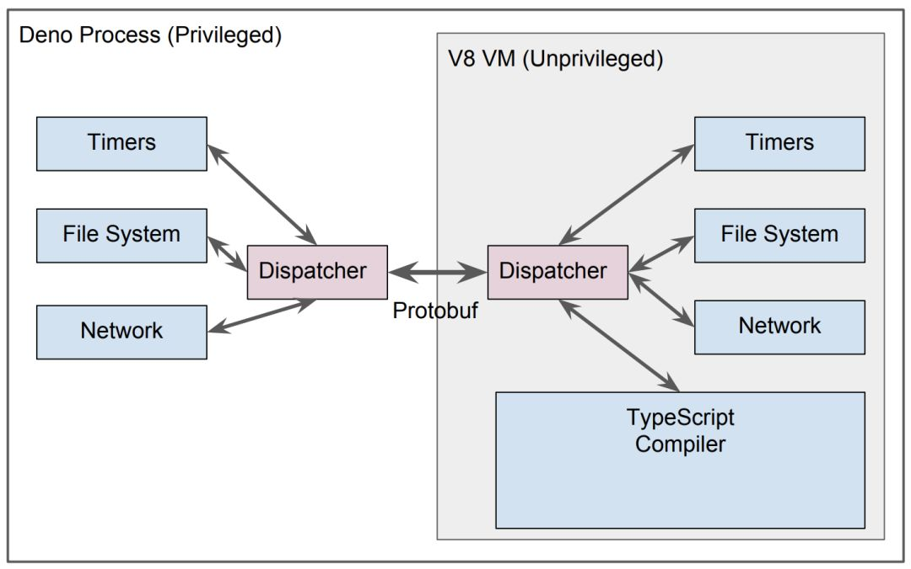

在一些业务场景当中，我们提供给用户插入自定义逻辑的能力，类似于沙盒、沙箱，允许执行自定义代码，产生的变化可以随后随时删除。

无论是客户端上的沙箱还是服务器端上的沙箱，我们都要确保安全性，用户自定义的脚本必须收到限制和隔离，不能影响到当前宿主程序。

javascript 本身有很多种方式可以实现沙箱，各有千秋，各有使用的地方。

- `eval`
- `new Function`
- `with`
- `proxy`
- `Node VM`
- `Deno`

### eval

最简单的方式就是直接使用 `eval` 执行：

```javascript
eval('console.log("a simple script");') // a simple script
```

eval 只是一个普通的函数，只不过他有一个快速通道通向编译器，可以将 string 变成可执行的代码。

> eval 的特性是如果当前域里面没有，则会向上遍历，一直到最顶层的 global scope：比如 window global ，他还可以访问 closure 内的变量。

使用 eval 也带来了安全隐患，首先它可以访问和修改它外部作用域中的变量，其次被执行的代码（例如从网络来）可能已被篡改。

```javascript
global.name = 'TOM'

eval('console.log("i am " + name + " from eval");')
// i am TOM from eval
```

并且 eval 可读性较差，调试难度较高，也会轻微增加性能消耗。

对于 eval 开发者是贬褒不一，[eval 是魔鬼](http://www.nowamagic.net/librarys/veda/detail/1627) 以及 [eval 不是魔鬼](https://www.nczonline.net/blog/2013/06/25/eval-isnt-evil-just-misunderstood/)

### function

Function 构造函数会创建一个新的函数对象，它可以作为  `eval`  的替代品，如果你绝对必须使用 eval ，我们可以考虑使用 new Function() 代替。

`new Function` 中作代码评估是在局部函数作用域中运行，所以代码中任何被评估的通过 var 定义的变量都不会自动变成全局变量。最常用的使用场景就是模板，可以参照 [javascript-micro-templating](https://johnresig.com/blog/javascript-micro-templating/)

```javascript
global.name = 'TOM'

function runNewFunction() {
  const script = 'console.log("i am " + name + " from new function");'
  new Function(script)() // i am TOM from new function
}

runNewFunction()
```

我们注意到 new Function 还是可以访问到全局作用域，如何阻止？

### with

`with`  是阻止程序访问上一级作用域的一道防火墙：

```javascript
global.name = 'TOM'

function runWith() {
  function compileCode(code) {
    var name = 'jerry'
    code = 'with (sandbox) {' + code + '}'
    return new Function('sandbox', code)
  }

  const sandBox = {
    sex: 'female',
  }

  compileCode(
    'console.log("i am " + name + " and my sex is " + sandbox.sex + " from with" );',
  )(sandBox)

  // i am TOM and my sex is female from with
}

runWith()
```

如上代码，`code`  被执行时，首先会寻找  `sandbox`  中的变量，如果不存在，会往上追溯`global`  对象，虽然有一道防火墙，但是依然不能阻止 fn 访问全局作用域。

### iframe

浏览器当中我们可以通过 `iframe` 标签来添加一个 `sandbox` attribute 来实现真正的沙箱。

```html
<iframe sandbox src="”...”"></iframe>
```

参照 [MDN Iframe](https://developer.mozilla.org/zh-CN/docs/Web/HTML/Element/iframe)，关于 attribute `sandbox` 如果指定了空字符串，该属性对呈现在 iframe 框架中的内容启用一些额外的限制条件。属性值可以是用空格分隔的一系列指定的字符串

下面简单列出一些常用的配置项，更详细的内容我们可以参考 mdn。

| 配置              | 效果                                                       |
| :---------------- | :--------------------------------------------------------- |
| allow-forms       | 允许进行提交表单                                           |
| allow-scripts     | 运行执行脚本                                               |
| allow-same-origin | 允许同域请求,比如 ajax,storage                             |
| allow-popups      | 允许 iframe 中弹出新窗口,比如,window.open,target="\_blank" |
| ...               | ...                                                        |

可以通过添加自定义的 value 来实现不同的权限：

```html
<iframe
  sandbox="”allow-forms"
  allow-same-origin
  allow-scripts”
  src="”...”"
></iframe>
```

只需要添加一个 `allow-scripts` 的 sandbox attribute value，我们就可以使用 eval 或者 new function 在 iframe 当中执行自定义代码。

然后主 window 当中和 iframe 通过 `postmessage` 通信来传递结果，在下面的例子当中，我们通过 `sandbox.html` 主 window 和 iframe `sandboxeval.html` 进行通信。

> 读者可以自行线下学习 [postmessage API](https://developer.mozilla.org/en-US/docs/Web/API/Window/postMessage)

下面是 `sandbox.html`

```html
<!--sandbox.html-->

<button id="eval">eval() in a sandboxed frame.</button>
<textarea>
    "a simple script from " + name + " by use iframe"
</textarea>
<iframe src="./sandboxeval.html"></iframe>
<script>
  const iframe = document.querySelector('iframe')
  const textarea = document.querySelector('textarea')

  // 执行 eval command
  document.querySelector('#eval').addEventListener('click', _ => {
    iframe.contentWindow.postMessage(textarea.textContent, '/')
  })

  // 接受 iframe eval result
  window.addEventListener('message', e => {
    // 进行信息来源的验证
    if (e.source === iframe.contentWindow) alert('Result: ' + e.data)
  })
</script>
```

下面是 `sandboxeval.html`

```html
<!--sandboxeval.html-->
<script>
  window.name = 'iframe TOM'

  window.addEventListener('message', function(e) {
    // 相当于window.top.currentWindow.
    const mainWindow = e.source
    let result = ''
    try {
      result = eval(e.data)
    } catch (e) {
      result = 'eval() threw an exception.'
    }

    // e.origin 就是原来window的url
    mainWindow.postMessage(result, e.origin)
  })
</script>
```

可以查看在线 HTML5 rock 的一个 [例子](https://www.html5rocks.com/static/demos/evalbox/index.html)。

看了 iframe 的例子会发现这种实现方式过于臃肿、麻烦，有些时候也要考虑浏览器的兼容性，似乎也不是完美的解决方案

### proxy

ES6 中提供了一个 Proxy 函数，它是访问对象前的一个拦截器，在目标对象之前架设一层“拦截”，外界对该对象的访问，都必须先通过这层拦截，因此提供了一种机制，可以对外界的访问进行过滤和改写，配合 Reflect 来用十分强大，下面举一个简单的例子：

```javascript
;(_ => {
  const p = new Proxy(
    {},
    {
      get(target, key) {
        if (key === 'name') {
          return 'TOM'
        }
        Reflect.get(target, key)
      },
    },
  )

  console.log(p.name) // 'TOM'
  console.log(p.sex) // undefined
})()
```

上诉例子当中我们使用  `proxy`  对访问做拦截处理，`p`  本不存在的属性不会追溯到全局变量上访问，改进版本的 sandbox 看起来如下：

```javascript
function runProxy() {
  function compileCode(src) {
    const code = new Function('sandbox', src)
    return function(sandbox) {
      const sandboxProxy = new Proxy(sandbox, { has, get })
      return code(sandboxProxy)
    }
  }

  function has() {
    return true
  }

  function get(target, key) {
    const value = Reflect.get(target, key)
    if (value) return value
    // 获取不到 value 就返回 'undefined_from_Reflect'
    return 'undefined_from_Reflect'
  }

  const script =
    'with (sandbox) { log("i am " + name + " and my age is " + age + " by use Proxy "); } '

  const sandbox = Object.create(null)
  sandbox.log = console.log
  sandbox.name = 'TOM'

  compileCode(script)(sandbox) // i am TOM and my age is undefined_from_Reflect by use Proxy
}

runProxy()
```

另外在 es6 当中有些方法是不会被 with scope 所影响，主要是通过 Symbol.unscopables 这个特性来检测，比如：

```javascript
Object.keys(Array.prototype[Symbol.unscopables])
//  ["copyWithin", "entries", "fill", "find", "findIndex", "includes", "keys", "values"]
```

所以更改为：

```javascript
function get(target, key) {
  // Symbol.unscopables
  if (key === Symbol.unscopables) return undefined

  const value = Reflect.get(target, key)
  if (value) return value
  // 获取不到 value 就返回 'undefined_from_Reflect'
  return 'undefined_from_Reflect'
}
```

不过这里还是存在一些漏洞：

- `code`  中可以提前关闭  `sandbox`  的  `with`  语境，如  `'} alert(this); {'`
- `code` 中可以使用 `eval` 和 `new Function` 直接逃逸

### Node VM

Node.js 当中默认提供了一个 `vm` 内建模块，提供了一些 API 用于在 V8 虚拟机环境中编译和运行代码。JavaScript 代码可以被编译并立即运行，或编译、保存然后再运行。

```javascript
function runVM() {
  const vm = require('vm')
  const script = new vm.Script('m + n')
  const sandbox = { m: 1, n: 2 }
  const context = new vm.createContext(sandbox)
  console.log(script.runInContext(context))
}

runVM() // 3
```

#### Node require 的实现

我们 `require` 一个 `.js` 文件的时候，Node 本身对一些特定 extension 文件有内建的处理，比如 [.js](https://github.com/nodejs/node/blob/master/lib/internal/modules/cjs/loader.js#L711-L714)、[.json](https://github.com/nodejs/node/blob/master/lib/internal/modules/cjs/loader.js#L718-L726) 等等，其实也就是 Node.js 本身对[common.js 的实现](https://github.com/nodejs/node/blob/master/lib/internal/modules/cjs/loader.js#L698-L701)。

```javascript
var wrapper = Module.wrap(content)

var compiledWrapper = vm.runInThisContext(wrapper, {
  filename: filename,
  lineOffset: 0,
  displayErrors: true,
})

// ...

var result = compiledWrapper.call(
  this.exports,
  this.exports,
  require,
  this,
  filename,
  dirname,
)
```

让我们来一步步进行解释。

1、content 可以理解为你的 .js 文件，例如：

```javascript
'console.log(module)'
```

`Module.wrap(content)` 后生成一串字符串：

```javascript
'(function (exports, require, module, __filename, __dirname) { console.log(module)\n});'
```

2、通过 `VM.runInThisContext` 来执行，将上面的字符串输出变成了可执行的 JS 函数，实际上这个函数就是：

```javascript
function(exports, require, module, __filename, __dirname) {
  console.log(module)
});
```

3、最后执行这个函数，也就是 `compiledWrapper.call(this.exports, this.exports, require, this, filename, dirname)` 就是执行了这个模块。

#### VM 用法

我们也可以参照 API 添加[各种参数](https://nodejs.org/api/vm.html#vm_new_vm_script_code_options)来配置这个 vm script，比如 `timeout`：如果执行 code 时间大于 timeout 将终止执行并抛出一个异常：

```javascript
try {
  const script = new vm.Script('while(true){}',{ timeout: 50 });
  ....
} catch (err){
  //打印超时的 log
  console.log(err.message);
}
```

但同时需要注意的是  `vm.Script`  的  `timeout`  选项「只针对同步代有效」，而不包括是异步调用的时间：

```javascript
const script = new vm.Script('setTimeout(()=>{},2000)', { timeout: 50 })
```

`vm`  模块没有办法对异步代码直接限制执行时间。我们也不能额外通过一个  `timer`  去检查超时，因为检查了执行中的 vm 也没有方法去中止掉

另外，在 Node.js 通过  `vm.runInContext`  看起来似乎隔离了代码执行环境，但实际上却很容易「逃逸」出去：

```javascript
const vm = require('vm')
const sandbox = {}
const script = new vm.Script(
  'this.constructor.constructor("return process")().exit()',
)
const context = vm.createContext(sandbox)
script.runInContext(context)
```

执行上边的代码，宿主程序立即就会退出。除了退出进程序之外，实际上还能干更多的事情

> 由于 JavaScript 本身的动态的特点，各种黑魔法防不胜防。事实 Node.js 的官方文档中也提到**不要把  `VM`  当做一个安全的沙箱**，去执行任意非信任的代码

在社区中有一些开源的模块用于运行不信任代码，例如  `sandbox`、`vm2`、`jailed`  等。相比较而言  `vm2`  对各方面做了更多的安全工作，相对安全些

用同样的测试代码来试试  `vm2` ：

```javascript
const { VM } = require('vm2')
new VM().run('this.constructor.constructor("return process")().exit()')
```

如上代码，并没有成功结束掉宿主程序。vm2 官方 REAME 中说 **vm2 是一个沙盒，可以在 Node.js 中按全的执行不受信任的代码**

然而实际上还是可以干一些坏的事情：

```javascript
const { VM } = require('vm2')
const vm = new VM({ timeout: 1000, sandbox: {} })
vm.run('new Promise(()=>{})')
```

你会发现上边的代码永远不会结束，和 Node.js 内建 VM 模块一样， vm2 的  `timeout`  对异步操作是无效的

或许是否我们提供一个假的 Promise 从而禁用掉 Promise 呢？

```javascript
const { VM } = require('vm2')
const vm = new VM({
  timeout: 1000,
  sandbox: { Promise: function() {} },
})
vm.run('Promise = (async function(){})().constructor;new Promise(()=>{});')
```

事实上发现我们是提供了一个假的 Promise，但是通过 `Promise = (async function(){})().constructor` 再次又拿到了真正的 Promise

而且某些场景，或许我们本身希望用到 Promise

### Deno

> **注意:**目前 deno 的最新进展是已经移除 Golang，主要原因是 双重 GC（ Go 和 TS ）。以后甚至会考虑把目前的 C++ 改写成 Rust

[deno](https://github.com/ry/deno) 属于 Node 之父 Ryan Dahl 发布新的开源项目，从官方介绍来看，可以认为它是下一代 Node，使用 Go 语言代替 C++ 重新编写跨平台底层内核驱动，上层仍然使用 V8 引擎，最终提供一个安全的 TypeScript runtime

> 浏览器端的 js 运行不受信的代码，本身就是一个沙盒，但是服务器端运行受信的代码

它有很多新特性，有一点非常符合 sanbodx 的特性：可以控制文件系统和网络访问权限以运行沙盒代码，默认访问只读文件系统可访问，无网络权限。V8 和 Golang 之间的访问只能通过 `protobuf` 中定义的序列化消息完成

- 在默认情况下，脚本应在不产生任何网络或文件系统写入访问的前提下运行
- 用户可通过标记介入访问: --allow-net --allow-write 等等
- 这种方式允许用户运行各类不受信实用程序（例如 linter）


