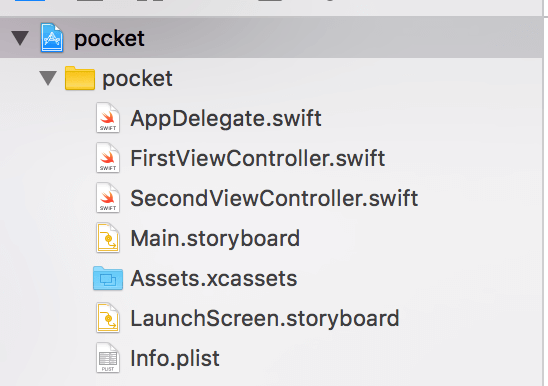
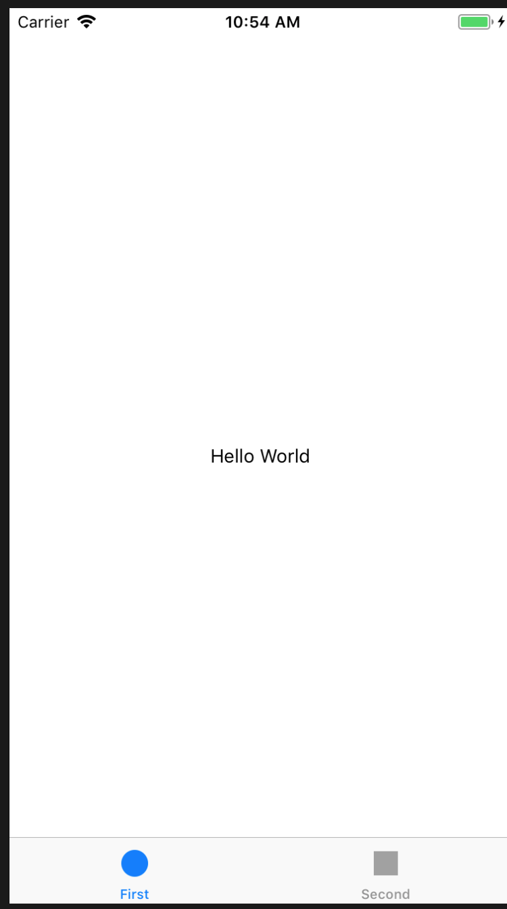

> 本人只是一个前端，偶尔写一点其他语言来拓展开发技能。
>
> 因业务当中使用到 RN，所以对如何实现 RN custom module 也比较感兴趣并简单学习实现了一些功能。本文可能有些地方可能比较浅显或者有错误，还望读者海涵并指正。

### 环境准备

因为 swift 的断崖式升级以及 RN 不同版本，所以下面的例子可能会存在一些误差。本机环境为：

- RN：0.45.1
- swift：4.1
- Xcode：9.3
- OS：high sierra 10.13.4

### CocoaPods

CocoaPods是专门为 iOS 工程提供对第三方库的依赖的管理工具，通过 CocoaPods ，我们可以更方便地管理每个第三方库的版本，而且不需要我们做太多的配置。直观、集中和自动化地管理我们项目的第三方库。

我们都有这样的经历，当我们添加第三方库的时候，需要导入一堆相关依赖库，更新的时候也要删掉重新导入然后再配置。当我们需要更新某个第三方库的时候，我们又要手动移除该库，导入新的库，然后再配置。这些是很麻烦且没有意义的工作。

安装 CocoaPods 需要用到 gem 。gem 是 [RubyGems](http://rubygems.org/) 的缩写，属于 ruby 上的包管理工具。

这里建议切换国内镜像源地址，当然你也可以加上 `-p` 参数来配置 proxy

```bash
gem sources --remove https://rubygems.org/ && gem sources -a https://gems.ruby-china.org/
```

将 RubyGems 升级到最新版本，不然有可能导致配置 CocoaPods 失败。

```bash
sudo gem update --system
```

可以使用下面命令来查看替换镜像位置是否成功：

```bash
gem sources -l
```

结果应该是：

```
*** CURRENT SOURCES ***

https://gems.ruby-china.org/
```

接下来就可以放心的安装 CocoaPods了：

```bash
sudo gem install cocoapods
```

然后继续进行 setUp：

```bash
pod setup
```

这一步是将Github上的开源库都托管都安装Podspec索引安装到到本地，这一步会很慢，建议添加本地 proxy。

我使用 ShadowsocksR 代理，默认代理端口为1080，配置好代理之后去终端输入git配置命令。

如果你同事电脑上有安装好,你其实可以从你同事电脑上拷贝过来。也可以直接访问 [https://github.com/CocoaPods/Specs](https://link.jianshu.com/?t=https://github.com/CocoaPods/Specs) 这个源地址直接 download 下来。

> 如何恢复 git config proxy 可以采用 `git config --global --unset http.proxy`

```bash
# gloabl proxy
git config --global http.proxy socks5://127.0.0.1:1080

# only github proxy
git config --global http.https://github.com.proxy socks5://127.0.0.1:1080
```

下载安装完毕后会是如下图：


然后检测版本：`pod --version`，我这里显示是 1.5.0，至此 CocoaPods 安装完毕。

接下来 `pod install` 的时候也会遇到速度较慢的问题，可以切换为[国内镜像](https://mirror.tuna.tsinghua.edu.cn/help/CocoaPods/)，我这里直接添加 proxy了。

### 创建项目

在下面的例子当中我们会创建一个简单的 demo 来实现 custom React Native module。

#### 创建基础模板

我们先通 xcode 来创建一个 swift 项目，姑且命令为 `pocket` ，为了方便测试，我们选择 `Tabbed App` 来作为模板，并且 language 我们当然选择 swift。并且不选择单元测试功能，这样项目目录看起来会比较简洁一点：


#### 创建前端工作区

在项目根目录下创建一个名为 RNComponent 的文件夹来放置官方 React Native module 以及前端代码，然后创建一个 `package.json` 来写入依赖：

```bash
# 在当前目录下执行操作
mkdir RNComponent && cd RNComponent && touch package.json
```

`package.json` 文件内容大致如下：

> 当然也可以自定义 React 和 RN 版本，自然少不了需要解决版本兼容性的问题。

```json
{
    "name": "RNComponent",
    "version": "0.0.0",
    "private": true,
    "scripts": {
        "start": "node node_modules/react-native/local-cli/cli.js start --reset-cache"
    },
    "dependencies": {
        "react": "16.0.0-alpha.12",
        "react-native": "0.45.1"
    }
}

```

接下来安装依赖：`npm i -d ` 。

接下来的步骤大家都很熟悉了，我们需要创建一个入口文件 `index.ios.js`，我们用来跑测试 RN 代码，内容大致如下：

```js
import { AppRegistry, NativeModules, View, Text, StyleSheet } from 'react-native';
import React from 'react';

class Root extends React.Component {
    render() {
        return (
            <View style={styles.container}>
            <Text> hello world </Text>
            </View>
        );
    }
}

const styles = StyleSheet.create({
    container: {
        flex: 1,
        backgroundColor: '#fff',
        alignItems: 'center',
        justifyContent: 'center',
    },
});

AppRegistry.registerComponent('App', () => Root);
```

至此，前端目录部分工作完成。

#### 创建 swift 工作区

进入项目根目录，初始化 Podfile，不要手动创建 Podfile：

```bash
pod init
```

我们在刚才生成的 `Podfile` 文件当中 `use_frameworks! ` 关键词下换行添加以下依赖：

> 请注意下面当中的 path 是相对于我们之前的前端工作区安装的 node_modules 的地址。

```txt
   # 请注意这个目录是相对目录地址。
  pod 'Yoga', :path => './RNComponent/node_modules/react-native/ReactCommon/yoga'
  # 请注意这个目录是相对目录地址。
  pod 'React', :path => './RNComponent/node_modules/react-native’,:subspecs => [
      'Core',
      'ART',
      'RCTActionSheet',
      'RCTAdSupport',
      'RCTGeolocation',
      'RCTImage',
      'RCTNetwork',
      'RCTPushNotification',
      'RCTSettings',
      'RCTText',
      'RCTVibration',
      'RCTWebSocket',
      'RCTLinkingIOS',
      'jschelpers_legacy',
      'BatchedBridge',
      'DevSupport',
    ]
```

最后执行 `pod install` 执行安装依赖操作：


对于安装依赖后出现的黄色 warning，读者可以自行查阅原因并解决。（暂时不影响项目

项目当中会生成一个 `pocket.xcworkspace` 文件以及对应的 `Podfile.lock` 以及 `Pods` 文件夹。

> **注意之后打开项目是通过 `pocket.xcworkspace` ，而不是之前的 `knife.xcodeproj`**

至此我们的 swift 工作区创建完毕。

#### 设置 RCTRootView

我们需要设置 **RCTRootView** 来渲染我们的 RN，因为我们创建的是一个 `Tabbed App`，所以默认项目结构是这样：



简单介绍一下项目文件的用途：

- `XXViewController.swift` 根视图控制器。
- `AppDelegate.swift` 继承至 UIApplicationDelegate ，整个应用的一个代理，尽量保持干净、整洁，并且带有生命周期，可以在这里对全局状态进行更新、重置。
- `Main.storyboard` 主入口 storyboard，描述软件界面，用来把界面和代码分离。
- `LaunchScreen.storyboard` 闪屏 storyboard
- `Info.plist` 工程配置文件

我们需要在 `FirstViewController.swift` 当中指定 **RNViewController** ，首先在头部引入 React：

```swift
import React
```

然后把 `viewDidLoad ` 函数更改为以下代码：

```swift
    override func viewDidLoad() {
        super.viewDidLoad() 
        // 这个是我们 RN development 地址，ip 对应本机局域网 ip，建议不要写 localhost
        let strUrl: String = "http://10.0.36.112:8081/index.ios.bundle?platform=ios&dev=true"
        let jsCodeLocation = URL(string: strUrl)
        let rootView = RCTRootView(bundleURL: jsCodeLocation, moduleName: "App", initialProperties: nil, launchOptions: nil)
        view = rootView
    }
```

####  swift 工作区额外处理

当然 ios 开发会有各种各样的问题需要去处理，我在这里列出一些当前项目可能会出现的一些问题：

> ios9 以上的系统，无法通过http协议连接到localhost主机，会出现错误：Could not connect to development server

在工程当中的 `Info.list` 文件当中添加下面配置即可：

```xml
<key>NSAppTransportSecurity</key>  
  <dict>  
  <key>NSExceptionDomains</key>  
  <dict>  
      <key>localhost</key>  
      <dict>  
      <key>NSTemporaryExceptionAllowsInsecureHTTPLoads</key>  
      <true/>  
     </dict>  
   </dict>  
  </dict>  
```

配置结果如下：


> Xcode 一直打印：nw_connection_get_connected_socket_block_invoke 3 Connection has no connected handler  

解决办法如下：

- Xcode menu -> Product -> Edit Scheme... 
- Environment Variables -> Add -> Name: "OS_ACTIVITY_MODE", Value:"disable" .
-  Run your app again. done.

#### hello world

我们首先需要回到我们前面创建的 前端工作区 来运行 RN：

```bash
npm run start
```

然后在 Xcode 编译刚才的 pocket，我们这里选择模拟器来测试，成功后如下：



### 原生模块开发

> 有时候App需要访问平台API，但React Native可能还没有相应的模块封装；又或者你需要实现某些高性能、多线程的代码，譬如图片处理、数据库、或者各种高级扩展等等。所以 RN 提供了封装原生模块方法。

RN 提供了很多方法来封装原生模块，具体可以查看 [RCTBridgeModule.h](https://github.com/facebook/react-native/blob/master/React/Base/RCTBridgeModule.h) ,基本上大致有：

- `RCT_EXPORT_METHOD` 或者 `RCT_EXTERN_MODULE` 用来声明给 javascript 导出方法
- `RCT_EXPORT_BLOCKING_SYNCHRONOUS_METHOD`  或者 `RCT_EXTERN_BLOCKING_SYNCHRONOUS_METHOD`  用来声明给 javascript 导出的同步方法
- `RCT_EXPORT_REMAP_MODULE` 和 `RCT_EXTERN_REMAP_MODULE`  用来改变导出模块和方法的JavaScript 调用名称。
- 等等一些其他的方法，具体请参阅源码文件。

> EXPORT 和 EXTERN 的区别到底是什么？以下是个人理解，可能有偏差，望指正。

看官方介绍说后者是用来注册 `swift class` 或者 `private object-c class`。按照个人的理解：`RCT_EXPORT_METHOD` 这个宏是用来将原生的方法导出，只有用这个宏包裹的方法，才可以被RN调用，为了实现 RN 调用 swift 方法，所以需要用到 EXTERN 之类的方法，实际上在 EXTERN 内部也是通过 objc [关键方法](https://github.com/facebook/react-native/blob/master/React/Base/RCTBridgeModule.h#L237-L243) 来实现混合调用。

#### 需求分析

按照官方提供的说法，我们可以提供给 javascript 调用的方法有以下方式：

- 直接调用
- 同步调用返回结果
- callback 调用
- Promise 调用

我们希望实现一个命名为 `RNDemoModule` 的 Native module，然后希望能够实现上诉所有的方法，以及甚至希望能够实现 `Event emitter`。

#### 准备工作

我们先创建一个命名为 `RNDemoModule.swift` 的文件来放置我们的模块代码，文件内容大致如下：

```swift
import Foundation
import React


@objc(RNDemoModule)
class RNDemoModule: NSObject {
    
    // 自定义我们需要导出的方法
    
}
```

因为我们是写的 swift 文件，需要使用 `@objc` 来指定哪些方法或者属性在 OC当中可以调用。

以及一旦你在项目混用OC和Swift两种语言，那就需要这个 **桥接文件**。

> 一般在项目的Supporting Files文件夹里(一般系统会自动生成的，叫做“项目名-Bridging-Header.h”，项目名就是你工程的项目名）

我们这里直接创建一个命名为 `RNDemoModuleBridge.m` 的文件来进行桥接，大致如下：

```objective-c
#import <React/RCTBridgeModule.h>

@interface RCT_EXTERN_MODULE(RNDemoModule,NSObject)

// 通过RCT_EXTERN_METHOD 来导出我们的自定义方法
    
@end
```

我们可以给这个 module 添加一些导出常量：

```swift
// ... class RNDemoModule
    
	// 导出常量
    func constantsToExport() -> [AnyHashable: Any]! {
        return [
            "SDKVersion": "0.45.1",
            "NativeModuleVersion":"0.0.0"
        ]
    }   
 
// ... class RNDemoModule   
```

我们在 console 打印这个对象可以得到如下结构：


#### 功能实现:直接调用

`RNDemoModule.swift`

```swift
// ... class RNDemoModule

	// 简单调用
    @objc func call(
        _ name:String
        ) -> Void{
        print("call with argument name:" + name)
    }

// ... class RNDemoModule
```

`RNDemoModuleBridge.m`

```objective-c
// #import <React/RCTBridgeModule.h>
// @interface RCT_EXTERN_MODULE(RNDemoModule,NSObject)

RCT_EXTERN_METHOD(call:(NSString *)name);

// @end
```

`index.ios.js`

```javascript
import { NativeModules } from 'react-native'
const { RNDemoModule } = NativeModules

RNDemoModule.call('TOM')
```

最终在 Xcode console 打印出 `call with argument name: TOM`

#### 功能实现:同步调用返回结果

TODO:尚未完成，存在疑问

> 似乎返回结果需要 `global.nativeCallSyncHook` 来做垫底？？？那怎么知道到底是哪个方法调用返回结果？

参照这篇文章[ React Native技术剖析（二） ](https://blog.csdn.net/wangnan8015/article/details/53303899) 以及 [RCTJSCExecutor.mm ](https://github.com/facebook/react-native/blob/v0.45.1/React/Executors/RCTJSCExecutor.mm#L358-L368)我们知道同步调用返回结果需要设定 `global.nativeCallSyncHook`

[RCTJSCExecutor.mm ](https://github.com/facebook/react-native/blob/v0.45.1/React/Executors/RCTJSCExecutor.mm#L358-L368)

```objective-c
   
	// 这个 context 是当前 jsCore context
	context[@"nativeCallSyncHook"] = ^id(NSUInteger module, NSUInteger method, NSArray *args) {
      RCTJSCExecutor *strongSelf = weakSelf;
      if (!strongSelf.valid) {
        return nil;
      }

      RCT_PROFILE_BEGIN_EVENT(RCTProfileTagAlways, @"nativeCallSyncHook", nil);
      id result = [strongSelf->_bridge callNativeModule:module method:method params:args];
      RCT_PROFILE_END_EVENT(RCTProfileTagAlways, @"js_call,config");
      return result;
    };
```

`RNDemoModule.swift`

```swift
// ... class RNDemoModule

	// 同步调用
    @objc func callWithSync( _ name:String)->String{
        return "hello " + name + "from sync"
    }
// ... class RNDemoModule
```

`RNDemoModuleBridge.m`

```objective-c
// #import <React/RCTBridgeModule.h>
// @interface RCT_EXTERN_MODULE(RNDemoModule,NSObject)

RCT_EXTERN__BLOCKING_SYNCHRONOUS_METHOD(callWithSync:(NSString *)name)

// @end
```

`index.ios.js`

```javascript
import { NativeModules } from 'react-native'
const { RNDemoModule } = NativeModules

// why？
global.nativeCallSyncHook = function () {
    console.info(arguments) // [moduleid,method,'TOM']
}

console.info(RNDemoModule.callWithSync('TOM'))
```

参照 jsCore 定义，最终 chrome console 会打印出的数据格式为`(Integer,Integer,Array)` 最终结果也就是`[70, 0,['TOM']]`

#### 功能实现:callback调用

`RNDemoModule.swift`

```swift
// ... class RNDemoModule

	// 回调
    @objc func callWithCallBack(
        _ name:String,
        callback:@escaping RCTResponseSenderBlock
        ){       
         // 简单实现 setTimeout 1s
        DispatchQueue.main.asyncAfter(deadline: .now() + 1) {
            // callback 参数 name 的值
            // Node.js 风格，error frist argument。这里是 null
            callback([NSNull(),[
                "value":name
                ]])
        }
    }

// ... class RNDemoModule
```

`RNDemoModuleBridge.m`

```objective-c
// #import <React/RCTBridgeModule.h>
// @interface RCT_EXTERN_MODULE(RNDemoModule,NSObject)

RCT_EXTERN_METHOD(callWithCallBack:(NSString *)name callback:(RCTResponseSenderBlock)callback);

// @end
```

`index.ios.js`

```javascript
import { NativeModules } from 'react-native'
const { RNDemoModule } = NativeModules

RNDemoModule.callWithCallBack('TOM', (err, value) => console.info(`callWithCallBack:${value}`))
```

最终 chrome console 会输出：`callWithCallBack:TOM`

#### 功能实现:Promise调用

`RNDemoModule.swift`

```swift
// ... class RNDemoModule

	// Promise
    @objc func callWithPromise(
        _ name:String,
        resolve:@escaping RCTPromiseResolveBlock,
        reject: @escaping RCTPromiseRejectBlock
        )-> Void{
        
        // 简单实现 setTimeout 1s
        DispatchQueue.main.asyncAfter(deadline: .now() + 1) {
            // 直接 resolve 参数 name 的值
            resolve([name])
        }
    }

// ... class RNDemoModule
```

`RNDemoModuleBridge.m`

```objective-c
// #import <React/RCTBridgeModule.h>
// @interface RCT_EXTERN_MODULE(RNDemoModule,NSObject)
    
RCT_EXTERN_METHOD(callWithPromise:(nonnull NSString *)name resolve:(RCTPromiseResolveBlock)resolve reject:(RCTPromiseRejectBlock)reject);

// @end
```

`index.ios.js`

```javascript
import { NativeModules } from 'react-native'
const { RNDemoModule } = NativeModules

RNDemoModule.callWithPromise('TOM').then(value => console.info(`callWithPromise:${value}`))
```

最终 chrome console 会输出：`callWithPromise:TOM`

#### 功能实现:Event Emitter

实现 Event Emitter 目前好像有两种方案：

- Bridge.eventDispatcher().sendAppEvent
- 继承 RCTEventEmitter

官方推荐第二种方式来实现。

> 新的类需要继承 RCTEventEmitter，其实这个 RCTEventEmitter 也是继承 NSObject，我尝试更改老的 module 继承对象，一直报错。

我们需要新建一个 swift 文件命名为 `RNDemoEventEmitter.swift`，内容大致如下：

```swift
import Foundation
import React

@objc(RNDemoEventEmitter)
class RNDemoEventEmitter: RCTEventEmitter {

}
```

官方要求是通过实现 `supportedEvents ` 方法来指定导出的 event name ，这里我们假设一个命名为 `progress` 的 event。

```swift
// ... class RNDemoEventEmitter

  @objc override func supportedEvents() -> [String]?{
        return ["progress"]
    }

// ... class RNDemoEventEmitter
```

还要实现 `startObserving ` 和 `stopObserving ` 方法，用来优化无监听处理的事件，在实现之前我们定义一个变量来表示是否已经开始监听。

```swift
var _hasListeners:Bool = false	
```

我们希望能够模拟被监听的事件触发的情况。所以我们需要开始监听的时候设定一个定时器，每过特定的时间去调用监听方法：也就是下面的方法 `onProgress` 来调用 ` RCTEventEmitter.sendEvent`。

```swift
// ... class RNDemoEventEmitter
  
  // var _hasListeners:Bool = false
  var timer: Timer?

  @objc func onProgress()->Void{
       // 如果已经监听了就向 javascript 发送事件
        if self._hasListeners{
            // 发送特定监听名称 withName 的事件并带上自定义数据
            self.sendEvent(withName: "progress", body: 1232)
        }
    }

  @objc override func startObserving()->Void{
      
        self._hasListeners = true
        
      	// 类似 setinterval 定时器
        self.timer?.invalidate()
        self.timer = Timer.scheduledTimer(
            timeInterval: 1,
            target: self,
            selector: #selector(self.hello),
            userInfo: nil,
            repeats: true
        )
        
    }
    
    @objc override func stopObserving()->Void{
        // 关闭 timer
        self.timer?.invalidate()
        self._hasListeners = false
    }
    
// ... class RNDemoEventEmitter    
```

我们在前端项目主入口文件 `index.ios.js` 当中添加监听：

```javascript
import { NativeEventEmitter, NativeModules } from 'react-native'

const emitter = new NativeEventEmitter(NativeModules.RNDemoEventEmitter)
const subscription = emitter.addListener('progress', data => console.info(data))

```

我们可以在 chrome console 看到每隔一段时间会输出特定数据，注意别忘记在  RN 的`componentWillUnMount` 周期内解除这个事件监听。

### Reference

- [CocoaPods最新安装(不使用淘宝镜像)](https://www.jianshu.com/p/adad5ee721af)
- [看一遍就会的CocoaPods的安装和使用教程](https://www.jianshu.com/p/1711e131987d)
- [RubyGems *- Ruby China*](https://gems.ruby-china.org/)
- [[IOS/MAC] -Integrating react-native app with existing apps not creating .workspace](https://github.com/facebook/react-native/issues/7775)
- [React Native技术剖析（二）](https://blog.csdn.net/wangnan8015/article/details/53303899)
- [objective-c 语法快速过](http://www.cnblogs.com/kubixuesheng/p/4306395.html)
- [Got “is not a recognized Objective-C method” when bridging Swift to React-Native](https://stackoverflow.com/questions/39692230/got-is-not-a-recognized-objective-c-method-when-bridging-swift-to-react-native)