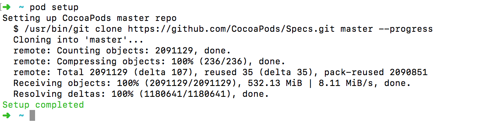

https://blog.csdn.net/jancywen/article/details/77945296

https://www.jianshu.com/p/82d0ba43f8c3

https://reactnative.cn/docs/0.51/linking-libraries-ios.html#content


### CocoaPods

CocoaPods是专门为 iOS 工程提供对第三方库的依赖的管理工具，通过 CocoaPods ，我们可以更方便地管理每个第三方库的版本，而且不需要我们做太多的配置。直观、集中和自动化地管理我们项目的第三方库。

我们都有这样的经历，当我们添加第三方库的时候，需要导入一堆相关依赖库，更新的时候也要删掉重新导入然后再配置。当我们需要更新某个第三方库的时候，我们又要手动移除该库，导入新的库，然后再配置。这些是很麻烦且没有意义的工作。

安装 CocoaPods 需要用到 gem 。gem 是 [RubyGems](http://rubygems.org/) 的缩写，属于 ruby 上的包管理工具。

这里建议切换国内镜像源地址，当然你也可以加上 `-p` 参数来配置 proxy

```bash
gem sources --remove https://rubygems.org/ && gem sources -a https://gems.ruby-china.org/
```

将 RubyGems 升级到最新版本，不然有可能导致配置 CocoaPods 失败。

```bash
sudo gem update --system
```

可以使用下面命令来查看替换镜像位置是否成功：

```bash
gem sources -l
```

结果应该是：

```
*** CURRENT SOURCES ***

https://gems.ruby-china.org/
```

接下来就可以放心的安装 CocoaPods了：

```bash
sudo gem install cocoapods
```

然后继续进行 setUp：

```bash
pod setup
```

这一步是将Github上的开源库都托管都安装Podspec索引安装到到本地，这一步会很慢，建议添加本地 proxy。

我使用 ShadowsocksR 代理，默认代理端口为1080，配置好代理之后去终端输入git配置命令。

如果你同事电脑上有安装好,你其实可以从你同事电脑上拷贝过来。也可以直接访问 [https://github.com/CocoaPods/Specs](https://link.jianshu.com/?t=https://github.com/CocoaPods/Specs) 这个源地址直接 download 下来。

> 如何恢复 git config proxy 可以采用 `git config --global --unset http.proxy`

```bash
# gloabl proxy
git config --global http.proxy socks5://127.0.0.1:1080

# only github proxy
git config --global http.https://github.com.proxy socks5://127.0.0.1:1080
```

下载安装完毕后会是如下图：



然后检测版本：`pod --version`，我这里显示是 1.5.0，至此 CocoaPods 安装完毕。

接下来 `pod install` 的时候也会遇到速度较慢的问题，可以切换为[国内镜像](https://mirror.tuna.tsinghua.edu.cn/help/CocoaPods/)，我这里直接添加 proxy了。


### 创建项目


#### 创建 Podfile

进入项目根目录，打开 terminal，初始化 Podfile，建议不要手动创建 Podfile：

```bash
pod init
```


### Reference

- [CocoaPods最新安装(不使用淘宝镜像)](https://www.jianshu.com/p/adad5ee721af)
- [看一遍就会的CocoaPods的安装和使用教程](https://www.jianshu.com/p/1711e131987d)
- [RubyGems *- Ruby China*](https://gems.ruby-china.org/)
- [[IOS/MAC] -Integrating react-native app with existing apps not creating .workspace](https://github.com/facebook/react-native/issues/7775)