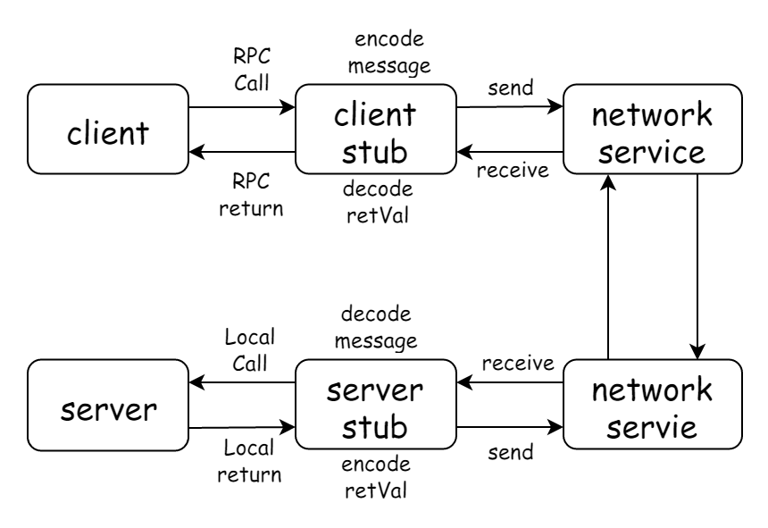

由于不同的环境下面的例子可能会存在一些误差，下面列出本机环境：

- `Docker -v` ：Docker version 18.09.1, build 4c52b90
- `docker-compose -v` ：docker-compose version 1.23.2, build 1110ad01
- `go version` : go version go1.12.4 darwin/amd64
- `system_profiler SPSoftwareDataType` : macOS 10.14.3 (18D42) Darwin 18.2.0
-  IDE golang latest

## RPC

### what's RPC

RPC 全名为 `Remote procedure call` ,直译过来就是 **远程过程调用** ，也就是说两台服务器A，B，一个应用部署在A服务器上，想要调用B服务器上应用提供的函数/方法，由于不在一个内存空间，不能直接调用，需要通过网络来表达调用的语义和传达调用的数据。

调用的基本流程可以看下图：



RPC 的协议可以简单分成两大类。

一类是通讯层协议，通讯层协议一般是和业务无关的，它的职责是将业务数据打包后，安全、完整的传输给接受方，HSF、Dubbo、gRPC 这些都是属于通讯层协议。

另一类是应用层协议。约定业务数据和二进制串的转换规则，常见的应用层协议有 Hessian，Protobuf，JSON。

### why RPC

为什么RPC呢？就是无法在一个进程内，甚至一个计算机内通过本地调用的方式完成的需求，比如比如不同的系统间的通讯，甚至不同的组织间的通讯。由于计算能力需要横向扩展，需要在多台机器组成的集群上部署应用，

### http vs RPC

HTTP 调用其实也是一种特殊的 RPC 。RPC 可以基于 HTTP 协议实现，也可以直接在 TCP 协议上实现。

> HTTP 与 RPC 的关系就好比普通话与方言的关系，普通话效率不高，废话较多，但是胜在通用。方言用的人少，短小精炼，理解起来也较为困难（保密性好），效率高。

HTTP1.0 协议时，HTTP 调用还只能是短链接调用，一个请求来回之后连接就会关闭。HTTP1.1 在 HTTP1.0 协议的基础上进行了改进，引入了 `KeepAlive` 特性可以保持 HTTP 连接长时间不断开，以便在同一个连接之上进行多次连续的请求，进一步拉近了 HTTP 和 RPC 之间的距离。

但是 HTTP 还是存在很多硬伤，比如通用定义的 http1.1协议的 TCP 报文包含太多废信息、序列化效率不高，以及三次握手四次挥手带来的 RTT 延迟，以及 `Head of line blocking` 、服务端推送 等等。注定了在高性能要求的下，不适合用做线上分布式服务之间互相使用的通信协议。

当 HTTP 协议进化到 2.0 之后，Google 开源了一个建立在 HTTP2.0 协议之上的通信框架直接取名为 gRPC，也就是 Google RPC，这个 gRPC 也就是本文将要详细介绍的通信框架。

> 需要注意的是，gRPC 由于协议还是基于 HTTP 2，HTTP 2 实际上也没有全部解决 HTTP 1 版本的问题，要不然就不会有 QUIC（HTTP3），只是在取舍之间选择了 HTTP 2 作为底层协议再封装 服务发现、 负载均衡 等高级 RPC 特征，这个具体会在下文详细分析

### advantage and disadvantage

个人简单的理解，RPC 的好处是：

- 精炼、效率高
- 保密性强

RPC 的坏处是：

- 通用型通用较差
- 可移植性差

## Node-RPC

### simple implements by Node

### further

## gRPC

gRPC 采用 HTTP 2 作为通信层协议。

### what's gRPC and why

gRPC 是 google 开源的高性能跨语言的 RPC 方案。gRPC 的设计目标是在任何环境下运行，默认使用 protobuf 作为 接口描述语言 (IDL interface description language) 及底层消息通信格式。

支持可插拔的负载均衡，跟踪，运行状况检查和身份验证。

它不仅支持数据中心内部和跨数据中心的服务调用，它也适用于分布式计算的最后一公里，将设备，移动应用程序和浏览器连接到后端服务。

可以看这篇文章 [gRPC动机和设计原则](https://grpc.io/blog/principles/)

很多主流库以及设施已经在使用 gRPC，比如 k8s 

在人工智能领域，RPC 也很重要，著名的 TensorFlow 框架如果需要处理上亿的数据，就需要依靠分布式计算力，需要集群化，当多个分布式节点需要集体智慧时，就必须引入 RPC 技术进行通讯。Tensorflow Cluster 的 RPC 通讯框架使用了 Google 内部自研的 gRPC 框架。

### protobuf

protobuf 是谷歌推出的一种轻便高效的结构化数据存储格式，把结构化的数据序列化。常用以存储数据、作为网络通信的数据载体。具有提供多种编程语言的 API、跨平台和可扩展的特性。比 JSON 和 XML 更小、解析速度更快、更易于程序员上手。

gRPC 采用 Protobuf 作为应用层协议。

[Protobuf](https://developers.google.com/protocol-buffers/) 是谷歌提出来的数据交换协议，使用方式可以查看对应文档各个语言的 tutorial 。

你需要在这里下载 `protoc binary file` 并确保可执行文件在 `PATH` 当中 : [protobuf](https://github.com/protocolbuffers/protobuf/releases)

或者也可以通过下面方式安装，默认装在了 `$GOPATH/bin` 之下，所以也要确保这个目录在 `PATH` 下：

``` sh
go get -u github.com/golang/protobuf/protoc-gen-go
```

### gRPC web

准确来说 gRPC 设计上是分层的，底层支持不同的协议，目前gRPC支持：

- [gRPC over HTTP2](https://github.com/grpc/grpc/blob/master/doc/PROTOCOL-HTTP2.md)
- [gRPC Web](https://github.com/grpc/grpc/blob/master/doc/PROTOCOL-WEB.md)

由于我们是在 web 环境当中测试，所以需要额外下载对应的插件：[protoc-gen-grpc-web](https://github.com/grpc/grpc-web/releases)

### protoc

### advantage and disadvantage

### who use it

## envoy proxy

引用官网的一段描述：

``` txt

Envoy is an L7 proxy and communication bus designed for large modern service oriented architectures. The project was born out of the belief that:
"The network should be transparent to applications. When network and application problems do occur it should be easy to determine the source of the problem."

```


具体详情请看本文尾部的 reference 

### how and why

Envoy 是作为一个主打 Service Mesh(微服务) 方案的 proxy。

为什么不选 nginx 呢？首先 Nginx 的反向代理早期不支持 http2/grpc ，其次 Nginx 的很多微服务功能都是要买 Nginx Plus 才有。

对我个人来说还是因为官方推荐。

## gRPC golang

### why golang

### how implements it with golang

### advantage and disadvantage

我们现在知道 gRPC 是基于 HTTP 2 的，那它有什么优点呢？

- HTTP/2 是一个公开的标准，并且是一个经过实践检验的标准
- HTTP/2 天然支持物联网、手机、浏览器
- 基于HTTP/2 多语言的实现容易，每个流行的编程语言都会有成熟的HTTP/2 Client
- HTTP/2支持 Stream 和 流控
- HTTP/2 天然支持 ssl 
- 鉴权成熟，从HTTP/1发展起来的鉴权系统已经很成熟了，可以无缝用在HTTP/2上

缺点呢？

- RPC 的元数据的传输不够高效
- HTTP/2 标准本身是只有一个 TCP 连接，但是实际在 gRPC 里是会有多个 TCP 连接
- gRPC 选择基于 HTTP/2，那么它的性能肯定不会是最顶尖的。但是对于 gRPC 来说中庸的 QPS 可以接受，通用和兼容性才是最重要的事情。

## hello world

### tree

你可以在这里 clone 本文项目源代码。

然后我们先看一下当前目录结构：`tree -I node_modules`

``` txt

.
├── Docker-compose.yml
├── Dockerfile-envoy
├── Dockerfile-envoy-standalone
├── Dockerfile-server
├── README.md
├── envoy-standalone.yaml
├── envoy.yaml
├── protobuf-spec
│   └── helloworld.proto
├── script
│   ├── bootstrap.sh
│   ├── build-client.sh
│   ├── build-server.sh
│   ├── codegen-clinet.sh
│   ├── codegen-server.sh
│   ├── docker-envoy-standalone.sh
│   └── docker-compose.sh
├── server
│   ├── main.go
│   └── protobuf-spec
│       └── helloworld.pb.go
└── web
    ├── bundle.js
    ├── index.html
    ├── index.js
    ├── package.json
    ├── protobuf
    │   ├── user_grpc_web_pb.js
    │   └── user_pb.js
    └── webpack.config.js

6 directories, 24 files

```

### environment

首先我们需要准备本文开头列出的系统环境。

其次下载并以及对应的 `protobuf` 和 `protoc-gen-grpc-web` 插件，确保它们都是可执行文件：必须加入 `PATH` 当中。

根据上面的 tree 建立相应的文件目录即可：`script` 和 `protobuf-spec` 和 `server` 以及 `web`，其他的目录可选

### develop it

#### define protoc

首先我们创建一个 `protoc` 文件来定义 `gRPC service`：在 `protobuf-spec` 目录下面创建文件 `helloworld.proto`。

具体语法请查看 [protocol-buffers](https://developers.google.com/protocol-buffers/)，在这文件当中我们定义了 **请求信息** 和 **响应信息**，以及提供了一个 RPC 服务：`SayHello`：

``` protoc

syntax = "proto3";

package helloworld;

service Greeter {
  rpc SayHello (HelloRequest) returns (HelloReply);
}

message HelloRequest {
  string name = 1;
}

message HelloReply {
  string message = 1;
}

```

接下来我们根据定义的 `helloworld.proto` 文件生成对应的客户端、服务端工作区源代码。

#### web code

首先准备好 `web` 文件目录，我们准备在这个目录下建立一个 webpack-dev-server 来辅助测试与开发

建立 `package.json`：

``` json

{
  "name": "web",
  "version": "1.0.0",
  "description": "",
  "main": "bundle.js",
  "scripts": {
    "protobuf:web": "npx webpack-dev-server --config ./webpack.config.js --watch --port 8081"
  },
  "author": "",
  "license": " MIT",
  "dependencies": {
    "webpack": "^4.30.0",
    "webpack-dev-server": "^3.3.1",
    "google-protobuf": "^3.6.1",
    "grpc-web": "^0.4.0"
  },
  "devDependencies": {
    "webpack-cli": "^3.3.1"
  }
}

```

`index.html` 文件

``` html
<script src="./bundle.js"></script>
```

以及 `webpack.confg.js` 文件：

``` js

const path = require('path');

module.exports = {
    entry: path.join(__dirname, './index.js'),
    output: {
        filename: 'bundle.js',
        path: path.resolve(__dirname)
    }
};

```

以及最后一个空白的 `index.js` 来作为代码入口和 webpack 打包入口，最后我们安装 web 依赖：`npm i -d` 或者 `npm i -d --registry=https://registry.npm.taobao.org`

生成代码我们可以建立 `script/codegen-client.sh`，不要忘记 `chmod +x -R ./script`：

``` sh

#!/usr/bin/env bash

set -e

proto=$1

if [ -z "$proto" ];then
    echo "please prompt at last one argument for input file"
    exit
fi

# web
rm -rf ./web/protobuf && mkdir ./web/protobuf

OUT_DIR=./web/protoc-spec

protoc -I=./protobuf-spec $proto.proto \
    --js_out=import_style=commonjs:$OUT_DIR \
    --grpc-web_out=import_style=commonjs,mode=grpcwebtext:$OUT_DIR

echo "generate client success in directory : $OUT_DIR"

```

执行 `./script/codegen-client.sh hello` 在 `./web/protoc-spec` 目录下生成文件。

> 注意第一个参数 `hello` 是指在 `./protobuf-spec` 目录当中我们定义的 `protoc` 文件文件名简写

接下来来完善我们的 `index.js`：

``` js

const {HelloRequest} = require('./protobuf/helloworld_pb');
const {GreeterClient} = require('./protobuf/helloworld_grpc_web_pb');

const client = new GreeterClient('http://localhost:9090');

const request = new HelloRequest();
request.setName('gRPC World');

client.sayHello(request, {}, (err, response) => {
    if (err) throw err;
    console.log(response.getMessage());
});

```

#### golang code

golang 上的准备比较简单，首先准备好 `GOPATH` 在你当前的工作目录下，然后建立 `server` 目录：

``` sh

go get -u google.golang.org/grpc

```

在 `server` 目录下建立我们的空白服务入口文件 `main.go`

同样和 web 一样建立 `./script/codegen-server.sh` ：

```sh

#!/usr/bin/env bash

set -e

proto=$1

if [ -z "$proto" ];then
    echo "please prompt at last one argument for input file"
    exit
fi

# server
rm -rf ./server/protobuf-spec && mkdir ./server/protobuf-spec

protoc --go_out=plugins=grpc:./server ./protobuf-spec/$proto.proto

echo "generate server code success with ./server/protobuf-spec/$proto.pb.go"

```

执行后我们会在 `./server/protobuf-spec/` 下得到对应的代码

接下来完善我们的 server 也就是 `main.go` 文件来实现 gPRC :

``` go

package main

import (
	"context"
	"log"
	"net"
    "google.golang.org/grpc"
	// 注意：这里引入生成后的代码，具体路径要根据你的 GOPATH 来定
	pb "grpc/server/protobuf-spec"
)

const (
	port = ":8080"
)

// server is used to implement helloworld.GreeterServer.
type server struct{}

// SayHello implements helloworld.GreeterServer.
func (s *server) SayHello(ctx context.Context, in *pb.HelloRequest) (*pb.HelloReply, error) {
	log.Printf("Received: %v", in.Name)
	return &pb.HelloReply{Message: "Hello " + in.Name}, nil
}

func main() {
	lis, err := net.Listen("tcp", port)

	if err != nil {
		log.Fatalf("failed to listen: %v", err)
	}
	s := grpc.NewServer()
	pb.RegisterGreeterServer(s, &server{})
	if err := s.Serve(lis); err != nil {
		log.Fatalf("failed to serve: %v", err)
	}
}

```

### run it

在启动我们的 gRPC web 之前我们需要配置好 `envoy` 代理，先建立 `envoy-standalone.yaml` 文件：

``` yaml

static_resources:
  listeners:
    - name: listener_0
      address:
        socket_address: { address: 0.0.0.0, port_value: 9090 }
      filter_chains:
        - filters:
            - name: envoy.http_connection_manager
              config:

                # print access log to stdout
                access_log:
                  - name: envoy.file_access_log
                    config:
                      path: "/dev/stdout"

                codec_type: auto
                stat_prefix: ingress_http
                route_config:
                  name: local_route
                  virtual_hosts:
                    - name: local_service
                      domains: ["*"]
                      routes:
                        - match: { prefix: "/" }
                          route:
                            cluster: echo_service
                            max_grpc_timeout: 0s
                      cors:
                        allow_origin:
                          - "*"
                        allow_methods: GET, PUT, DELETE, POST, OPTIONS
                        allow_headers: keep-alive,user-agent,cache-control,content-type,content-transfer-encoding,custom-header-1,x-accept-content-transfer-encoding,x-accept-response-streaming,x-user-agent,x-grpc-web,grpc-timeout
                        max_age: "1728000"
                        expose_headers: custom-header-1,grpc-status,grpc-message
                        enabled: true
                http_filters:
                  - name: envoy.grpc_web
                  - name: envoy.cors
                  - name: envoy.router
  clusters:
    - name: echo_service
      connect_timeout: 0.25s
      type: logical_dns
      http2_protocol_options: {}
      lb_policy: round_robin

      # container access host
      # https://stackoverflow.com/questions/31324981/how-to-access-host-port-from-docker-container/31328031

      hosts: [{ socket_address: { address: host.docker.internal, port_value: 8080 }}]

admin:
  access_log_path: /tmp/admin_access.log
  address:
    socket_address: { address: 0.0.0.0, port_value: 9091 }

```

> 如果你之前仔细看过文件目录结构，你会发现有后缀为 `standalone` envoy 的配置文件。因为本地开发的时候我们的 server 在 docker 容器之外开发比较方便，所以需要把 envoy 单独处理。

建立 `./script/build-client.sh` 来启动我们的 web 服务：

``` sh

#!/usr/bin/env bash

set -e

cd ../web

npx webpack-dev-server --config ./webpack.config.js --watch --port 8081

```

和 `./script/docker-envoy-standalone.sh` 来方便我们启动 envoy docker 服务

``` sh

#!/usr/bin/env bash

set -e

containerName=grpc_envoy_standalone

if [  "$(docker ps -q -f name=grpc_envoy_standalone)" ]; then
    docker container rm $containerName -f
fi


docker build -t grpc_envoy_standalone -f ./Dockerfile-envoy-standalone .

docker run -d -p 9090:9090 -p 9091:9091 --name $containerName grpc_envoy_standalone

```

最后 `go run ./server/main.go` 来启动 server

我们可以在浏览器端访问 `localhost:8081`，可以在控制台上看到打印出来的 `hello gRPC world`

具体流程可以大致解释为：8081 为 webpack-dev-server 服务，然后客户端请求 envoy 容器抛出的 9090 端口提供的 restful 服务，envoy 转发到 8080 端口 server 服务上，然后 server 处理后交给 envoy 返回数据。

### deploy it

部署的时候这里采用了 `docker-compose` 作为容器编排，我们先建立 `docker-compose.yml` ：

```dockerfile

version: '3'

services:

  envoy:
    build:
      context: .
      dockerfile: Dockerfile-envoy
    ports:
      - '9090:9090'
      - '9091:9091'
    networks:
      - grpc

  server:
    build:
      context: .
      dockerfile: Dockerfile-server
    #    ports:
    #      - '8080:8080'
    networks:
      - grpc

networks:
  grpc:

```

在该文件当中我们指定了 `Dockerfile-envoy`

``` dockerfile

FROM envoyproxy/envoy:latest

ADD ./envoy.yaml /etc/envoy.yaml

CMD /usr/local/bin/envoy -c /etc/envoy.yaml

```

和 `Dockerfile-server` 来作为 build entry

``` dockerfile

FROM alpine

ADD server/server /app/server

ENTRYPOINT [ "/app/server" ]

```

以及 `envoy-yaml` 来作为 envoy 的 docker-compose 配置文件，这个文件基本上和上面的 `envoy-standalone.yaml` 一致，只需要修改关键字符串 `host.docker.internal` 为我们 docker 编排的容器名称 `server` 就可以了。

建立 `./script/build-server.sh` 来生成编译我们的服务器：

``` sh
#!/usr/bin/env bash

set -e

cd $(dirname $0)/..

export GOOS=linux
export GOARCH=amd64
export CGO_ENABLED=0

go build -o ./server/server ./server

```
最后直接运行：

``` sh

./script/build-server.sh

docker network create grpc

docker-compose pull

docker-compose up --build

```

就 deploy 成功了

### and more

## think in further

## reference
- [既然有了 http 请求为什么还要有 RPC](https://www.zhihu.com/question/41609070/answer/191965937)
- [聊聊 Node RPC](https://www.yuque.com/egg/nodejs/dklip5)
- [QUIC 简介](https://mp.weixin.qq.com/s?__biz=MzI4NzEyMjUxMA==&mid=2649068604&idx=1&sn=9d34b782a5d7c147e108f1af1c0fbc23&chksm=f3c3411dc4b4c80b7e8a72013a7b884e21814f6bcbc6f0ea8752ff6c434b93005efc854520ef&xtrack=1&scene=0&subscene=131&clicktime=1552095539&ascene=7&devic)
- [思考gRPC ：为什么是HTTP/2](https://blog.csdn.net/hengyunabc/article/details/81120904)
- [grpc-web github hellowolrd example](https://github.com/grpc/grpc-web/blob/master/net/grpc/gateway/examples/helloworld/README.md)
- [envoy 快速入门](https://juejin.im/post/5ad6fb06518825364001f619)
- [浅谈Service Mesh体系中的Envoy](http://jm.taobao.org/2018/07/05/Mesh%E4%BD%93%E7%B3%BB%E4%B8%AD%E7%9A%84Envoy/)