老规矩，列出本机器环境

- `serverless -v` 1.46.0
- `node -v` v10.15.0
- `system_profiler SPSoftwareDataType` : macOS 10.14.3 (18D42) Darwin 18.2.0
- 云平台 aws
- vsCode for editor

## 什么是 Serverless

Serverless 是一种架构模式。

根据 CNCF 的定义，Serverless 是指构建和运行不需要服务器管理的应用程序的概念。[(serverless-overview)](https://github.com/cncf/wg-serverless/tree/master/whitepapers/serverless-overview)

> Serverless computing refers to the concept of building and running applications that do not require server management. --- CNCF

简单来讲，Serverless 指的是在构建 Web 应用程序的时候，而不用担心如何配置服务器，但是这并不意味着应用程序不会在服务器上运行，而是说服务器的管理都可以尽可能地交给相应的云平台，从而最大程度地减轻开发人员的部署与配置工作。与之对应的一个名词可能就是 `Function As a Service（FAAS）`，由 AWS Lambda 这个命名上就能想到，当我们在构建 Serverless 架构时，实际上我们是在写一个个的 Function 即函数而已

## 云计算发展模式

云计算有常用的三种模式，如下图：

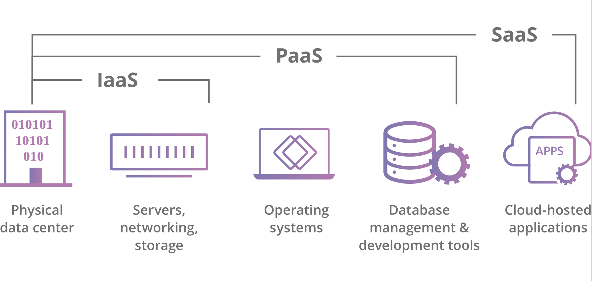

云计算的三种模型是 PaaS，SaaS（软件即服务）和 IaaS（基础架构即服务）。

- IaaS 是指云计算基础架构 - 服务器，存储等 - 由云供应商管理
- SaaS 是指托管在云中并由 SaaS 供应商维护的完整应用程序。
- 如果 SaaS 客户就像租房子一样，那么 PaaS 客户就像租用快速建造房屋所需的所有重型设备和电动工具一样，如果工具和设备由其所有者不断维护和修理。

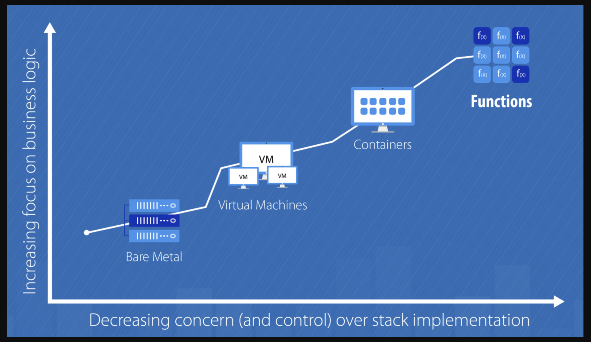

## 虚拟化与隔离

你可能要问云计算为什么有这么多模式？

其实从最早的物理服务器开始，我们都在不断地抽象或者虚拟化服务器，开发人员为了保证开发环境的正确，以及云计算为了进一步地自动管理这些虚拟化的资源，大致有以下发展路程：

- 虚拟机（如 XEN、KVM）
- 应用容器（如 Java 的 Tomcat）
- 虚拟环境（如 Python 中的 virtualenv）
- 流行的 Docker

这些都是为了来隔离了应用的操作系统与服务器的操作，乃至更底层的技术细节，方便开发者可以更进一步的只关心业务层面的需求。

## Serverless 的前景

近几年微服务发展迅速，加上 Serverless 的概念深入人心，各大云计算厂商纷纷推出了各自的 Serverless 产品，其中比较有代表性的有 `AWS lambda` 、`Azure Function` 、`Google Cloud Functions` 、阿里云函数计算等。

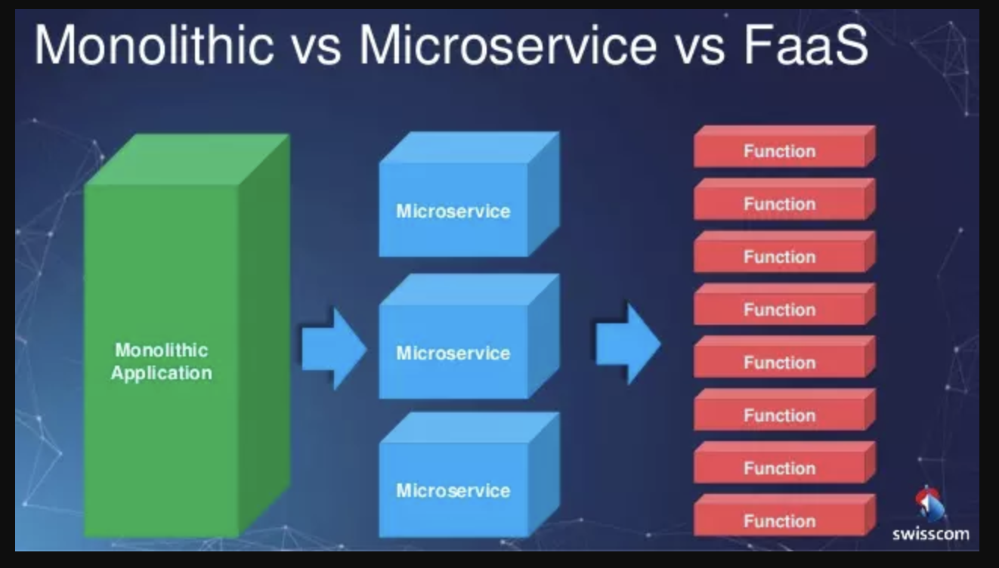

如果你了解了云计算模式，你会发现 Paas 和 `Function As a Service（FAAS）` 也就是 Serverless 似乎很相似，那么两者有什么区别呢？

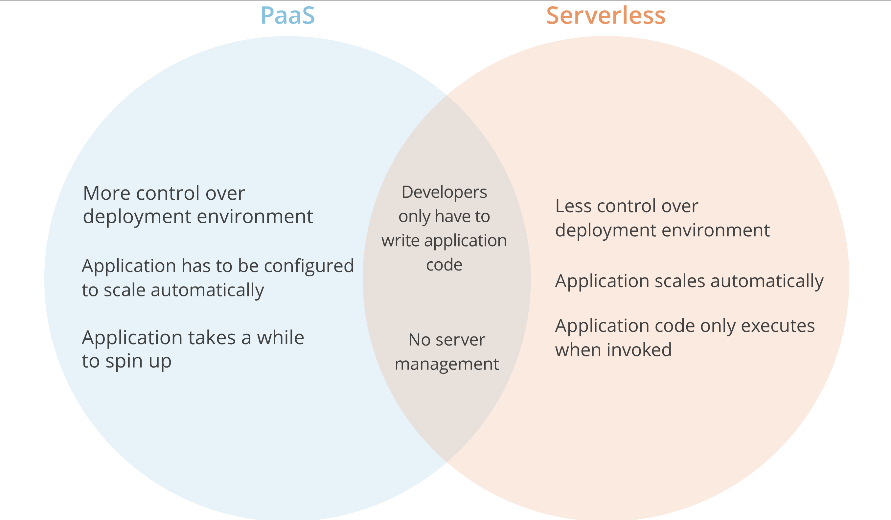

其实通过图简单对比可以看到，Serverless 架构的出现让开发者更进一步不用过多地考虑传统的服务器采购、硬件运维、网络拓扑、资源扩容等问题，可以将更多的精力放在业务的拓展和创新上。

另外，CNCF 也于 2016 年创立了 [Serverless Working Group](https://github.com/cncf/wg-serverless)，它致力于 [cloud native](https://www.cncf.io/) 和 Serverless 技术的结合，Google 推出了 [knative](https://cloud.google.com/knative/) 基于 k8s 的框架，可在任何公有私有云上实现无服务器架构，这样用户使用无服务器编程可以不限于特定的云平台。

下图是 CNCF Serverless 全景图，它将这些产品分成了工具型、安全型、框架型和平台型等类别。

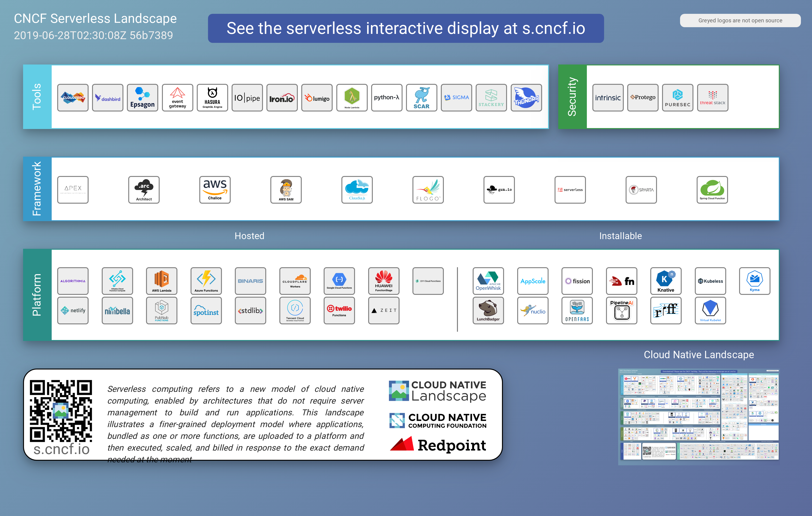

按照 Serverless 架构，Serverless 在云计算当中的位置可以大致为下图，也是上图的简化版本：


## 更深一层的 Serverless

### 架构原则

- 编写单一用途的无状态函数
- 设计基于推送的、事件驱动的管道
- 创建更强大的前端
- 与第三方服务集成

### 触发器

Serverless 的运行才计算，便意味着他是一种 “严格” 的事件驱动式计算。

> 事件驱动编程（英语：Event-driven programming）是一种电脑程序设计模型。这种模型的程序运行流程是由用户的动作（如鼠标的按键，键盘的按键动作）或者是由其他程序的消息来决定的。相对于批处理程序设计（batch programming）而言，程序运行的流程是由程序员来决定。批量的程序设计在初级程序设计教学课程上是一种方式。然而，事件驱动程序设计这种设计模型是在交互程序（Interactive program）的情况下孕育而生的

以 aws 为例，对应的触发器有：

- API Gateway(http request)
- S3
- CloudWatch Logs
- CodeCommit

等等各种各样的触发器，具体可以去 aws 上查看

### 计费方式

我们知道 Serverless 其实就是我们编写函数然后平台去 run，那么问题又来了，它到底是怎么对一个函数收钱的。我在 Lambda 函数上运行一个 Hello, world 它会怎么收我的钱呢？

如果要对一个运行的函数收费，那么想必只有运行时间、CPU、内存占用、硬盘这几个条件。可针对于不同的需求，提供不同的 CPU 是一件很麻烦的事。对于代码来说，一个应用占用的硬盘空间几乎可以忽略不计。

在一个基于 AWS 的 Serverless 应用里，应用的组成是：

- 网关 API Gateway 来接受和处理成千上万个并发 API 调用，包括流量管理、授权和访问控制、监控等
- 计算服务 Lambda 来进行代码相关的一切计算工作，诸如授权验证、请求、输出等等
- 基础设施管理 CloudFormation 来创建和配置 AWS 基础设施部署，诸如所使用的 S3 存储桶的名称等 -静态存储 S3 作为前端代码和静态资源存放的地方
- 数据库 DynamoDB 来存储应用的数据
- 等等

以博客系统为例，当我们访问一篇博客的时候，只是一个 GET 请求，可以由 S3 为我们提供前端的静态资源和响应的 HTML。

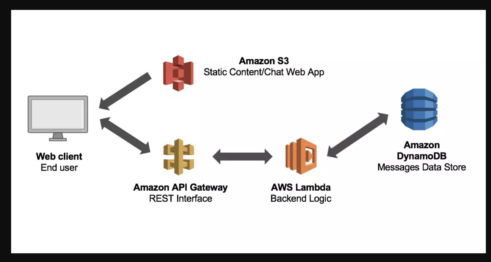

而当我们创建一个博客的时候：

- 我们的请求先来到了 API Gateway，API Gateway 计费器 + 1
- 接着请求来到了 Lambda，进行数据处理，如生成 ID、创建时间等等，Lambda 计费器 + 1
- Lambda 在计算完后，将数据存储到 DynamoDB 上，DynamoDB 计费器 + 1
- 最后，我们会生成静态的博客到 S3 上，而 S3 只在使用的时候按存储收费。
- 在这个过程中，我们使用了一系列稳定存在的云服务，并且只在使用时才计费。由于这些服务可以自然、方便地进行调用，我们实际上只需要关注在我们的 Lambda 函数上，以及如何使用这些服务完成整个开发流程。

根据 [aws 文档](https://aws.amazon.com/cn/lambda/pricing/)，Lambda 免费套餐包含每月 100 万个免费请求以及每月 400000GB-秒的计算时间。

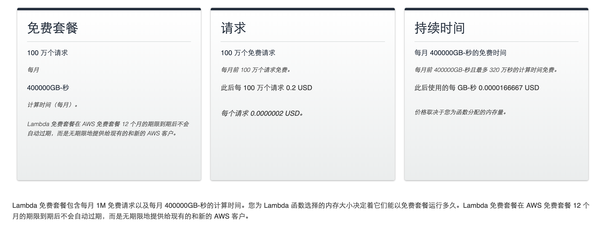

总结一下大致为：

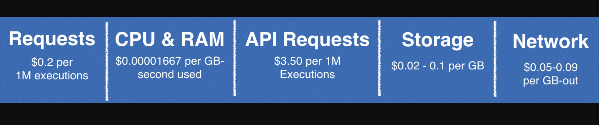

### 性能和冷启动时间

对于传统的应用，我们的程序启动起来之后，就常驻在内存中；而 Serverless 函数则不是这样。

当驱动函数执行的事件到来的时候，首先需要下载代码，然后启动一个容器，在容器里面再启动一个运行环境，最后才是执行代码。前几步统称为冷启动（Cold Start）。传统的应用没有冷启动的过程。

下面是函数生命周期的示意图：

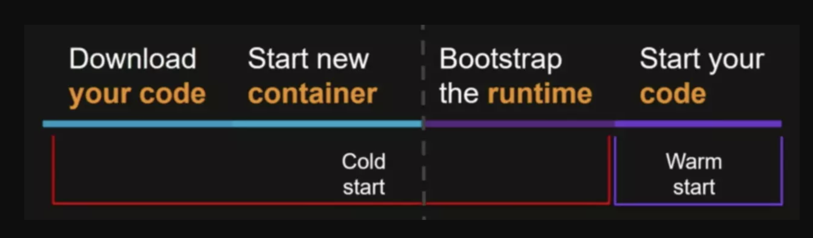

在此之前，已经有很多人测试过不同编程语言对冷启动时间的影响，比如：

- [Compare coldstart time with different languages, memory and code sizes](https://theburningmonk.com/2017/06/aws-lambda-compare-coldstart-time-with-different-languages-memory-and-code-sizes/)
- [Cold start / Warm start with AWS Lambda](https://blog.octo.com/en/cold-start-warm-start-with-aws-lambda/)

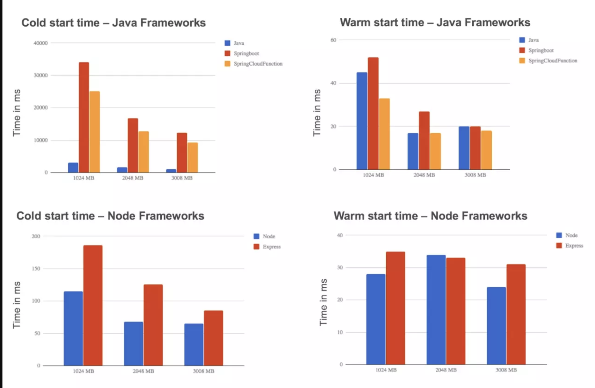

从这些测试中能够得到一些统一的结论：

- 增加函数的内存可以减少冷启动时间
- C#、Java 等编程语言的能启动时间大约是 Node.js、Python 的 100 倍

基于上述结论，如果想要 Java 的冷启动时间达到 Node.js 那么小，可以为 Java 分配更大的内存。但更大的内存意味着更多的成本。

刚开始接触 Serverless 的开发者可能有一个误区，就是每次函数执行，都需要冷启动。其实并不是这样。

当第一次请求（驱动函数执行的事件）来临，成功启动运行环境并执行函数之后，运行环境会保留一段时间，以便用于下一次函数执行。这样就能减少冷启动的次数，从而缩短函数运行时间。当请求达到一个运行环境的限制时，FaaS 平台会自动扩展下一个运行环境。

> 以 AWS Lambda 为例，在执行函数之后，Lambda 会保持执行上下文一段时间，预期用于另一次 Lambda 函数调用。其效果是，服务在 Lambda 函数完成后冻结执行上下文，如果再次调用 Lambda 函数时 AWS Lambda 选择重用上下文，则解冻上下文供重用。

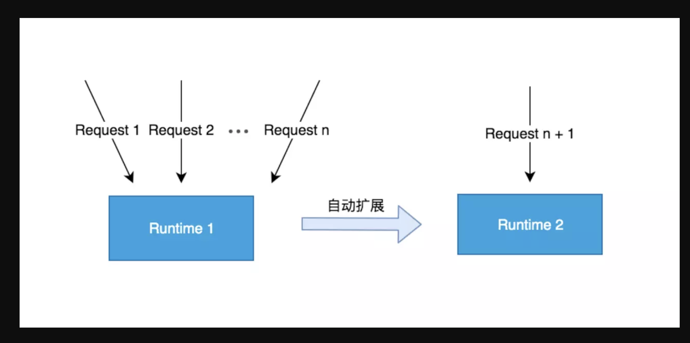

## 不同云平台的 Serverless

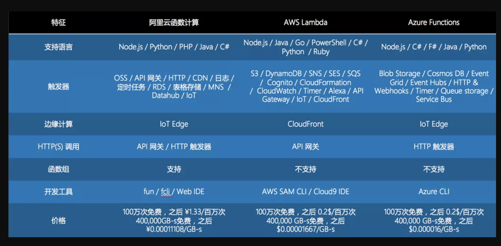

上图从支持语言、触发器、价格等多个方面对不同 Serverless 服务进行了对比，可以发现有差异，也有共性。

比如几乎所有 Serverless 服务都支持 Node.js/Python/Java 等语言。

当然也有很多的差异。

### Serverless 的优势

其实我们不难发现 Serverless 的一些优势也是上云的优势，只是相比较之前的云计算模式，有了一些 Serverless 独特的好处。

- 降低启动成本
- 减少运营成本

首先采用函数计算的 Serverless 与云服务器最大的不同之处在于：云服务器需要一直运行，而函数计算是按需计算。

按需计算就意味着，在请求到来的时候，才运行函数。没有请求的时候，是不算钱的。

其次 Serverless 意味无维护，Serverless 不代表完全去除服务器，而是代表去除有关对服务器运行状态的关心和担心，它们是否在工作，应用是否跑起来正常运行等等。Serverless 代表的是你不要关心运营维护问题。有了 Serverless，可以几乎无需 Devops 了。

- 系统安全性更高
- 适应微服务架构
- 自动扩展能力

对于传统应用来说，要应对更多的请求的方式，就是部署更多的实例。然而，这个时候往往已经来不及了。而对于 FaaS 来说，我们并不需要这么做，Serverless 提供的 FaaS 会自动的扩展。它可以在需要时尽可能多地启动实例副本，而不会发生冗长的部署和配置延迟。

## Serverless 的劣势

开发当然没有银弹，Serverless 也有对应的硬伤。

- 不适合长时间运行应用

Serverless 在请求到来时才运行。这意味着，当应用不运行的时候就会进入 “休眠状态”，下次当请求来临时，应用将会需要一个启动时间，即冷启动。

- 完全依赖于第三方服务

当你已经有大量的基础设施的时候，Serverless 对于你来说，并不是一个好东西。当我们采用 Serverless 架构的时候，我们就和特别的服务供应商绑定了。all in cloud，我们使用了 AWS 家的服务，那么我们再将服务迁到 Google Cloud 上就没有那么容易了

- 冷启动时间和性能
- 缺乏调试和开发工具
- 构建复杂（主要是各个云平台的差异

## Serverless 的适用场景

尽管 Serverless 在编写传统的 Web 应用上，有一定的缺点。然而，它的事件驱动及运行时计算，使得它在某些场景上相当的合适，比如：

- spa
- push notification
- web hook
- log trace
- iot
- cron job
- robot
- 等等

## 基于 Serverless 的前端开发模式

基于 Serverless 的前端开发模式，也有一些可取之处。

### 服务端渲染（ssr

传统的服务端渲染，每个请求的 path 都对应着服务端的每个路由，由该路由实现对应 path 的 HTML 文档渲染。用于渲染的服务端程序，就是这些集成了这些路由的应用。

使用 Serverless 来做服务端渲染，就是将以往的每个路由，都拆分为一个个函数，再在 FaaS 上部署对应的函数。这样用户请求的 path，对应的就是每个单独的函数。

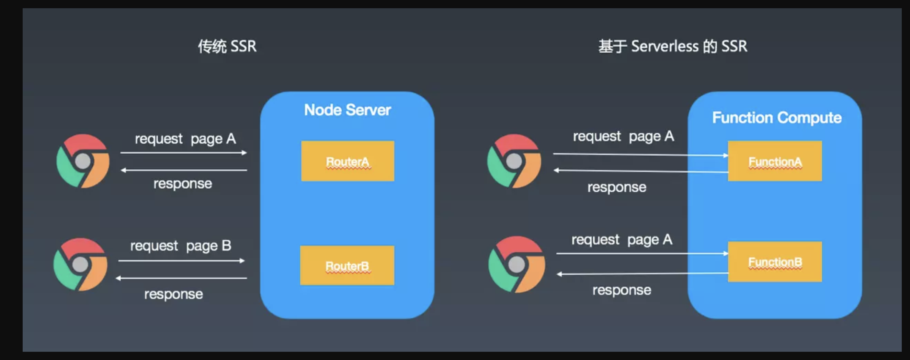

ZEIT 的 [Next.js](https://nextjs.org/docs/#serverless-deployment) 就对基于 Serverless 的服务端渲染做了很好的实现。

### 小程序开发

目前国内使用 Serverless 较多的场景可能就是小程开发了，可以参照[支付宝云开发](https://docs.alipay.com/mini/developer/todo-basement)当中的例子，函数就是定义在 FaaS 服务中的函数。

## hello world

我们采用 aws lambda 来编写第一个 Serverless 例子，我们也可以直接通过 GUI 的方式来创建，这种方式比较简单，不得不说这几年 aws 的 UI 做的非常好。

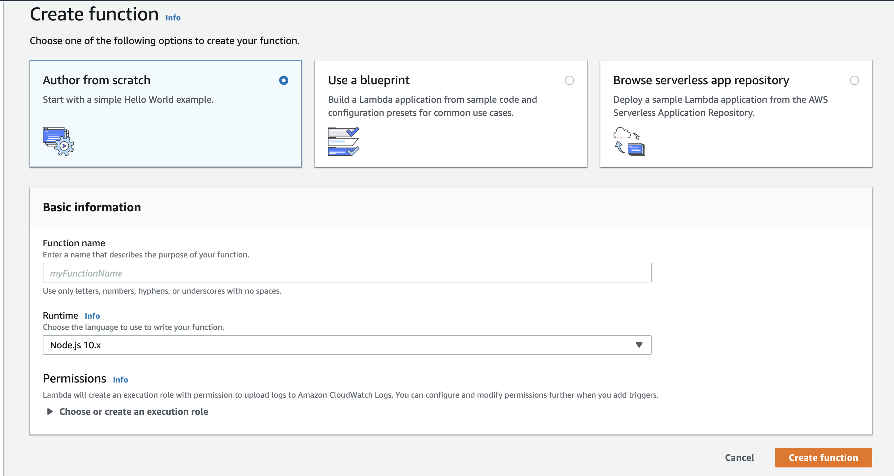

这里我们选择了通过 [Serverless](https://github.com/serverless/serverless) 框架来实现。

> 你也可以选择 tj 的 `Apex`

### aws user

首先我们需要设置 aws 凭证，也就是设置 `Provider Credentials`。具体可以参照这篇文章 [AWS - Credentials](https://serverless.com/framework/docs/providers/aws/guide/credentials/)

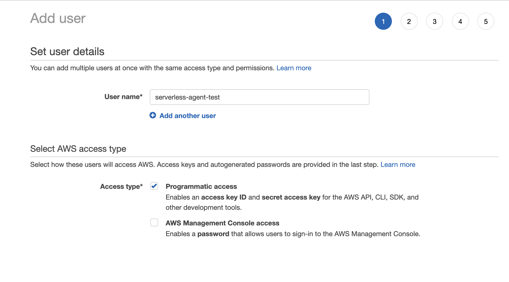

> 如果你觉得参考文章过于复杂，可以在步骤二 `set permissions` 里面可以选择 `Attach existing policies directly` 然后选择 `Filter policies` 为 `AdministratorAccess`，注意这个用户是 admin ，不要泄漏你的 key 和 token，当然还是建议按照上文的步骤来。

然后导出你的 key 和 token 并用 `serverless depoy` 保存在本地，将会自动生成配置到 `~/.aws/credentials`：

```bash
export AWS_ACCESS_KEY_ID=<your-key-here>
export AWS_SECRET_ACCESS_KEY=<your-secret-key-here>

serverless deploy
```

### deploy it

我们需要安装框架，然后生成对应的模板代码，创建我们的项目 hello-world：

> 我们通过配置 SLS_DEBUG=\* 环境变量来详细查看 log

```bash
npm i -g -d serverless

export SLS_DEBUG=* && serverless create --template aws-nodejs --path hello-world
```

成功后 terminal 会有以下 log：

```log
Serverless: Invoke create
Serverless: Generating boilerplate...
Serverless: Generating boilerplate in "/Users/***YOUR CURRENT PATH ***/hello-world"
 _______                             __
|   _   .-----.----.--.--.-----.----|  .-----.-----.-----.
|   |___|  -__|   _|  |  |  -__|   _|  |  -__|__ --|__ --|
|____   |_____|__|  \___/|_____|__| |__|_____|_____|_____|
|   |   |             The Serverless Application Framework
|       |                           serverless.com, v1.46.0
 -------'

Serverless: Successfully generated boilerplate for template: "aws-nodejs"
```

生成这两个文件，可以自行查看文件内容，其中 `serverless.yml` 是项目配置，`handler.js` 是当前主入口文件：

```txt
├── handler.js
└── serverless.yml
```

然后我们直接 `serverless deploy -v` 来部署，成功的话会有以下 log :

> serverless 框架选择 aws 的时候，默认 region 为 us-east-1

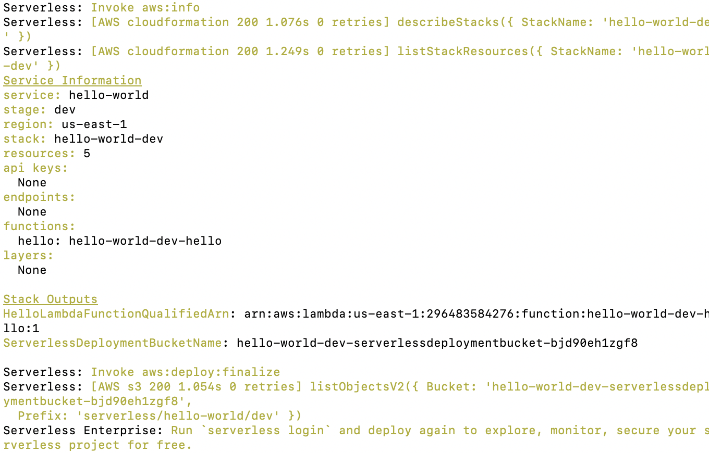

触发一下这个函数 `serverless invoke -f hello -l` 来测试我们的服务是否上线成功，会有以下返回：

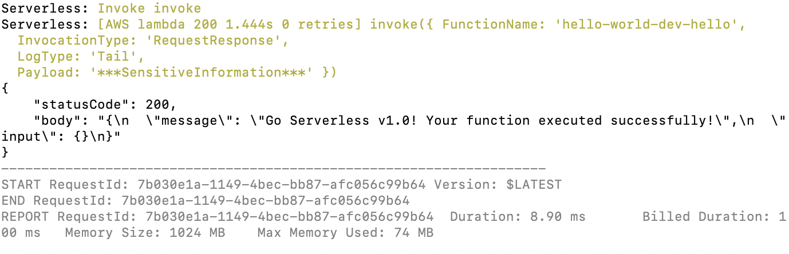

这意味着，我们的第一个服务已经成功上线了。

请注意这个目前还不能通过 http 的形式访问，需要添加 `API Gateway` trigger 来配置，这个可以在 `serverless` 框架当中配置也可以直接去 aws console 配置。

当我们配置好之后，对应的 http 地址大致为：`https://2peo0alpzb.execute-api.us-east-1.amazonaws.com/default/hello-world-dev-hello`

当然 Serverless 能做的远远不止这些，还有更多的功能等待各位去挖掘。

## Reference

- [https://serverless.com/](https://serverless.com/)
- [How are serverless computing and Platform-as-a-Service different? | PaaS vs. Serverless](https://www.cloudflare.com/learning/serverless/glossary/serverless-vs-paas/)
- [What Is a Service Mesh?](https://www.nginx.com/blog/what-is-a-service-mesh/)
- [knative](https://cloud.google.com/knative/)
- [serverless.ink](https://serverless.ink/)
- [探索 Serverless 中的前端开发模式](https://juejin.im/post/5cdc3dc2e51d453b6c1d9d3a)
- [The hidden costs of serverless](https://medium.com/@amiram_26122/the-hidden-costs-of-serverless-6ced7844780b)
