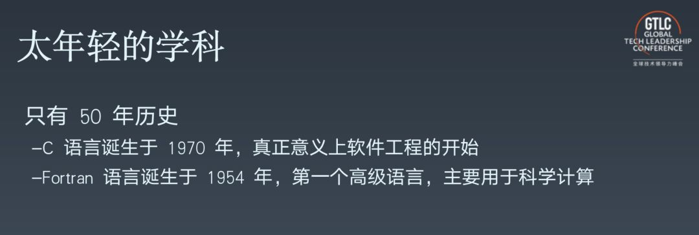
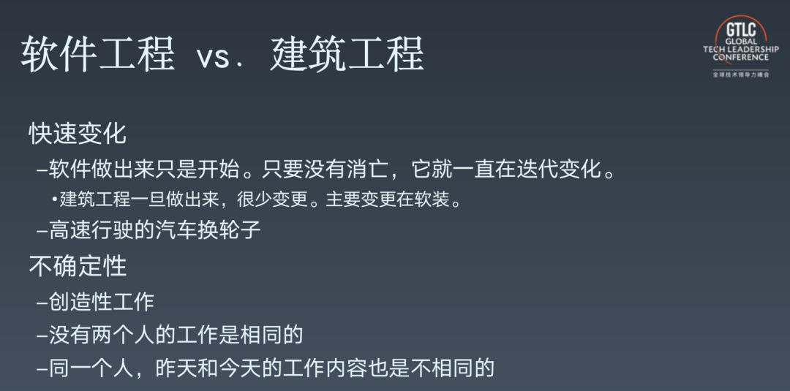
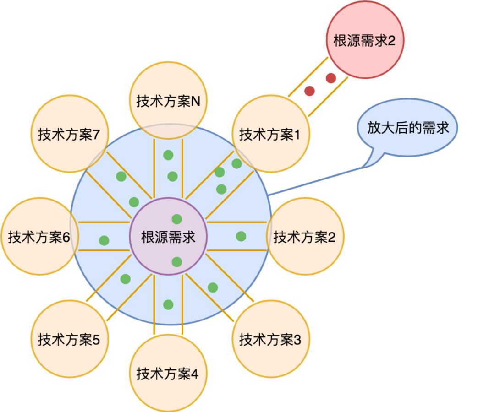
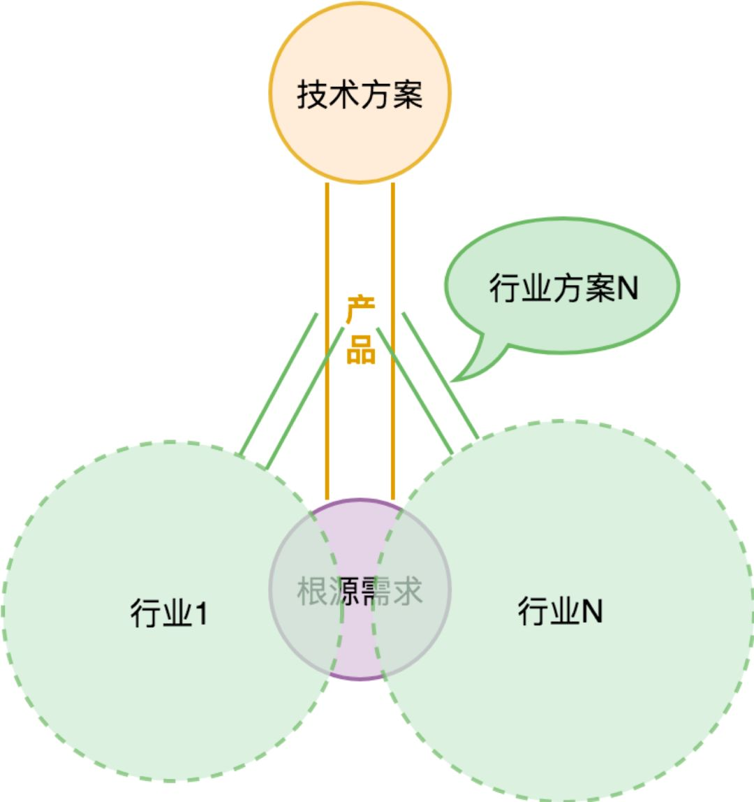
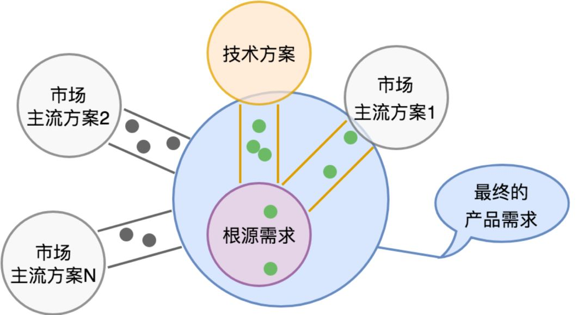
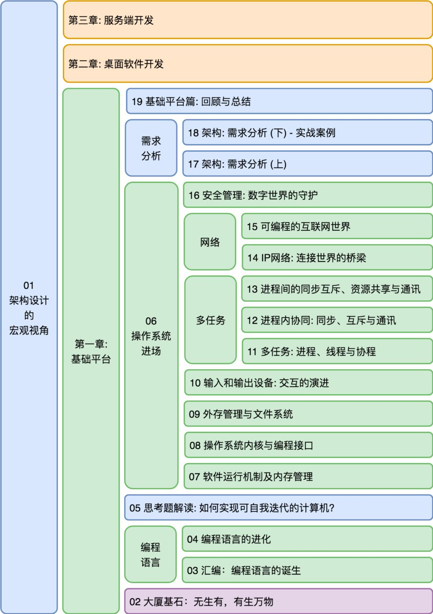

> 本文转载于许式伟在 INFOQ 大会上的演讲，原文地址为：[七牛云许式伟：我所理解的架构是什么](https://www.infoq.cn/article/scbBuLydXi00sZ4v*UyN)

### 从软件工程说起

大家好！

我已经很久没有做技术类的演讲了，因为我最近确实比较忙，很少会出来。为什么会突然又想谈一下架构呢？这是我个人的宿愿，我是技术出身，虽然现在比较少写技术相关的东西，但我在公司内部做了很多分享，分享课里我讲的东西与架构相关的占三分之二，基本都是和架构相关的。

所以今天借这个机会谈一谈我自己理解的架构到底是什么。

国内现在比较少真正意义上符合 “架构师” 这个词的定位的角色，我们的教育和工作氛围很难出真正意义上的架构师，比较凤毛麟角。我自己理解的架构师是从软件工程概念开始的，也许大家都学过软件工程，但如果我们把软件工程这门课重新看待，这门学科到底谈的是什么？是软件项目管理的方法论？

无论如何，[软件工程](https://zh.wikipedia.org/wiki/%E8%BD%AF%E4%BB%B6%E5%B7%A5%E7%A8%8B)是一门最年轻的学科，相比其他动辄跨世纪的自然科学而言，软件工程只有 50 年的历史。这门学科的实践太少了，任何一门学科的实践时间短的话，都很难沉淀出真正有创意的实践总结，因为这些经验总结总是需要很多代人共同推动来完成。

为什么只有 50 年时间呢？我们来看看 C 语言，一般意义上可能认为它是现代语言的开始。C 语言诞生于 1970 年，到现在是 49 年。再看 Fortran，它被认定为第一个高级语言，诞生于 1954 年，那时候主要面向的领域是科学计算。Fortran 的程序代码量不大，量不大的时候谈不上工程的概念。这也是为什么软件工程这门学科很年轻，它只有 50 岁，在这样一个年轻的学科里我们对它的认知肯定还是非常肤浅的。

软件工程和建筑工程对比可以发现二者有非常大的区别，具体在于两点：

- 1）快速变化。建筑工程在完工以后就结束了，基本上很少会进行变更，除非对它进行软装上的变更，软装更像是今天的软件。但其实软件工程里，软件生产出来只是开始，而且只要软件的生命周期没有结束，变更就一直存在，很像建筑里的软装一样，而且比软装变化剧烈得多。
- 2）不确定性。为什么软件工程有很大的不确定性？因为没有两个人的工作是一样的，虽然大家都在编程，但是编程的内容是不一样的。每个人昨天和今天的工作也是不一样的，没有人会写一模一样的代码，我们总是不停地写新的东西，做新的工作。这些东西是非常不同的，软件工程从事的是创造性的工作。

大家都知道创造是很难的，创造意味着会有大量的试错，因为我们没有做过。这会导致软件工程有非常大的不确定性。

以上这两点都会导致软件工程区别于传统意义上的所有工程，有非常强的管理难度。过去那么多年，工业界有非常多的工程实践，但是所有的工程实践对软件工程来说都是不适用的，因为二者有很大的不一样。

今天站在管理的视角再看软件工程，我们知道管理学谈的是确定性，我们如何去创造确定性是管理学中的追求，否则管理管什么呢？某种意义上来说管理学的目的就是要抑制不确定性，产生确定性。比如说开发的工期，时间成本是否能确定。其次，人力成本，研发成本和后期运维的成本是不是确定性的。所以软件项目的管理又期望达到确定性。这是一对矛盾。软件工程本身是快速变化的，是不确定的。但是软件工程管理又希望得到确定性，这就是软件工程管理上的矛盾。我们的目标是在大量的不确定性中找到确定性，这是我认为这件事情最核心的点。

### 程序员的三个层次

软件工程管理到底在管什么？和所有的管理活动一样 无非就是人和事。所有的工程项目都希望找到最好的人，当然是在能给出的预算以内找到最好的人，有的人可能找不起。不同项目最大的差别就是事，不同的事在哪里？从做事的角度来讲我们招到的人可能会分三个层次（程序员三个级别），大家经常开玩笑说我是做搬砖的，所以第一个 level 我把他叫软件搬砖师，再然后是软件工程师、软件架构师。

软件搬砖师可以有很多。但今天数量其实还不算太多，因为我们知道这门学科只有 50 年的历史。但是好的一点是，产生软件搬砖师并不难，我做了一个长达四年的实践：从小学二年级开始教小学生编程。结论是做搬砖师不难，小学生也能做到。这是很有意思的一件事情，编程并不是非常复杂的学问，只要具备基本的逻辑能力，把常规的业务代码按部就班地垒出来，基本上可以算打到搬砖师水准。我自己认为这并不难。

软件工程师会相对难一些，我心目中的软件工程师首先在代码上会非常追求可读性、可维护性。另外，毕竟我们工程是群体协作，所以在群体协作上还是有自己的方法论和思考。比如说代码评审、单元测试。在我看来搬砖师和工程师的区别有很大不同。只要看他写的代码有没有注意可维护性，会和同伴交流的时候刻意去追求让同伴更好地理解自己的思想，是不是对单元测试比较抗拒，是不是比较乐意去做代码评审并且非常认同这件事情的价值，基本上通过这些事情就可以评判这个人是搬砖师还是工程师。

### 软件架构师的能力要求

谈到软件架构师，由于我毕业后两年在从事架构性质的工作，因此对软件架构师的特性有一些总结。首先在用户需求上，有判断能力和预见能力，此处的判断可以理解为对需求的鉴别，虽然这可能与产品经理最为相关，但架构师需要具备自己的判断力，当然这也包括对未来需求的预见能力；产品迭代上，有规划能力，判断需求哪些应该先满足，哪些后满足。架构师应该源于程序员，但不应局限于程序员视角。系统设计上，有分解和组合能力。技术选型上，有决策力。技术选型应该被认为是架构的一部分，我们非常反对开发人员随意选用开源组件，这是一件需要认真探讨的事情。人力资源上，有统筹能力，通俗地讲是 “看菜做饭（看人下菜）”。

综上不难看出，架构师对综合能力要求比较高。这是因为我认为架构师需要对软件工程的结果负责，在不确定性和快速变化中寻找确定性。全局看软件发布流程，其比较重要的子过程有：需求分析（需求梳理 => 产品定义），系统设计（子系统划分 => 模块定义），模块设计（模块详细设计），编码实现，单元测试，代码评审，集成测试，灰度发布，正式发布等一系列过程。虽然有些过程看起来不属于架构师的范畴，但是这些活动过程属于软件工程的一部分，架构师一样需要全面参与把控。如果没有架构师把控就没有人观察得到全貌。正因为如此，软件架构师的要求相对较高。

如上所言，软件架构师需要具备产品经理的部分能力，因为需要对用户需求进行分析，并进行判断和预判，以及对产品迭代优先级进行把控。我自己习惯用如下图片表达软件架构师和产品经理之间的关系

我认为，产品是“桥”，连接了两端，分别是用户需求和先进的技术。我一直认为，用户需求的变化非常缓慢，那么为什么产品会产生迭代？这是因为技术在迭代。本质上讲，产品迭代是技术迭代导致的需求满足方式的变化，所以产品实际上是一种需求满足的方式。

从这个意义上讲，架构师更多是从技术方案的角度看产品，而产品经理更多是从用户需求来看，但二者一定会碰头，只要能力提升到角色所期望的样子，越厉害就越具备两侧的能力。所以我认为，产品经理和架构师是一体两面，本质上对人的能力、诉求是相通的。产品经理在做产品架构，架构师在做技术架构，但最终目的一样。

### 从产品和需求视角看架构师

如果展开讲解产品定义过程，首先需要进行需求梳理，关心用户反馈。但是，很多用户反馈并不代表其根本性需求。有很多用户反馈需求的时候，往往已经带着他自己给出的解决方案。这种需求反馈已经属于二次加工的需求，而非原始需求。这个时候我们要多问多推敲，把它还原到不带任何技术实现假设的根源需求。

如上图所示，根源需求可能会有非常非常多的技术方案可以满足它。我们上面示意图中的小圆点是一个个用户反馈的需求。在用户提这些需求的时候，往往可能会带着他熟悉的技术方案的烙印。

产品都是通过提供相应的技术方案在满足用户的根源诉求，但技术一直在迭代进步，从而导致原有的解决方案过时落后，这种情况下需要新的解决方案出现。如果对用户反馈的需求全部满足，产品就会变得十分庞大，编程一个四不像的东西。

其次，在这个过程中，有些用户需求是稳定的，有些是变化的。举例来说，计算机系统结构从计算机诞生之后到现在没变过，但电子设备的形态发生了很大变化，从最早的大型机，到个人电脑，到笔记本，到手机，再到手表，形态变化剧烈。但为什么计算机系统结构能够适应需求而不用改变架构，这其实是非常值得思考的事情，其根源就是对变化点的抽象，找到系统需求的变化点，预见变化并做对应的开放式设计。本质上讲，架构师关心产品的核心根源就是预测变化。

最后，理清产品边界。同样以计算机为例，经过多轮迭代，多样化外设（键盘等）变化较大，但 CPU、内存演进较小，所以在变化点上做相应的开放式设计是必要的。同样的，需要与合作伙伴做边界设定，把变化开放出去让合作伙伴做，只有这样的产品才能达到较好效果。

从产品和解决方案角度来看，产品往往需要适应很多行业，但这个过程会让产品变得非常庞大。在我看来，产品应该为行业解决方案提供能力，行业解决方案优先选择合作伙伴做，以更加开放的心态看待这件事情，避免把行业方案视作产品的一部分。

梳理需求中比较关键的点是市场策略，需要解决的需求有非常多现成的方案，但哪些方案是主流的，哪些是最关键的都需要思考。虽然不能放大产品需求覆盖面，但也需要为某些关心既有市场的玩家做桥梁，这些桥梁也是产品的功能点。我倾向于认为关键市场可能会把既有玩家的能力适配到产品上作为很重要的功能，但是大部分市场主流方案我们还是提供“桥”，而不是自己解决掉。

### 从技术视角看架构师

以上是从产品和需求维度看架构师，从技术视角看，架构师很重要的能力是具备技术的全局视角，所谓的技术全貌是指从底到上的核心骨架，比如最底下的硬件结构、操作系统、编程语言，甚至浏览器等，只有掌握每一层的核心思想，才能在架构设计中没有技术盲点。

从培养架构师的角度来看，为什么真正意义上的架构师比较难找？这是因为需要构建两个层次的能力：

- 1、懂用户、懂市场，有一定市场洞察能力。

作为技术人员，可能会不自觉、甚至不愿意和用户打交道，更希望坐在家里安静码代码。但是，作为架构师，不和用户打交道，成长会比较受限，不接触用户就无法理解用户需求，亲自和用户打交道倾听来的需求和探讨完全不一样。因此，架构师要尊重用户反馈，并学会思考需求分析和推演，这比技术能力更重要。架构的第一步就是需求分析，如果需求分析没做好，后续自然没办法做得很极致。

- 2、建立技术上的全局视角。

以上两点是架构师最核心的两个能力。

最后，我要介绍下，最近我在极客时间上开设了架构课，到现在为止刚好第一章全部发布。专栏内容的结构基本是相互交织的两条线

1、信息世界的构建过程，从底层硬件到操作系统逐层递进，还原信息世界的构建历程，主要关注宏观结构及需求变化，每一层都经历了哪些变化

2、架构方法论。如果我们纯讲架构方法论，容易过度抽象，比如什么开闭原则、单一职责原则之类。所以我们要结合信息世界的构建过程讲，它本身就是最宏大的架构实践案例

以上就是我的演讲内容，谢谢大家。
