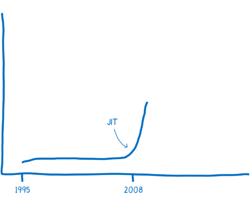
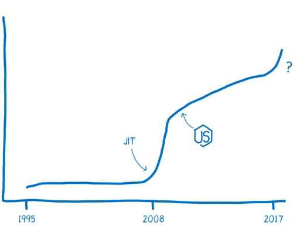
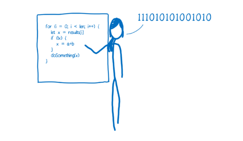
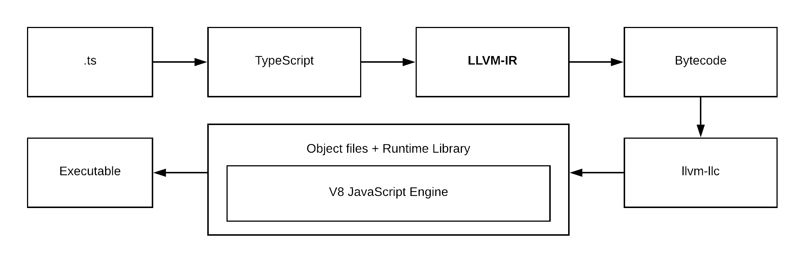
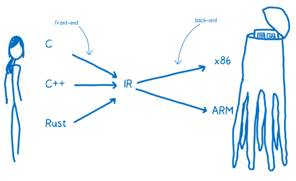
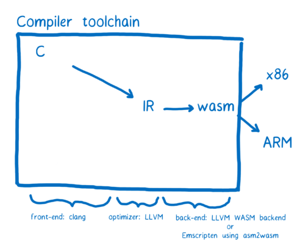

老规矩，列出本机器环境

- `system_profiler SPSoftwareDataType` : macOS 10.14.3 (18D42) Darwin 18.2.0
- `cargo --version` cargo 1.38.0-nightly (e3563dbdc 2019-07-16)
- `rustc --version` rustc 1.38.0-nightly (311376d30 2019-07-18)
- `wasm-pack -V` wasm-pack 0.8.1
- `clang --version` x86_64-apple-darwin18.2.0 posix
- `LVVM` Apple LLVM version 10.0.0 (clang-1000.10.44.4)

## JavaScript 历史

JavaScript 于 1995 年问世，它的设计初衷并不是为了执行起来快，在前 10 个年头，它的执行速度也确实不快。被人们广为传播的“性能大战”在 2008 年打响。许多浏览器引入了 Just-in-time 编译器，也叫 JIT。JavaScript 代码的运行渐渐变快

随着性能的提升，JavaScript 可以应用于后端开发的 Node.js。性能的提升使得 JavaScript 的应用范围得到很大的扩展。



现在通过 WebAssembly，JavaScript 的性能可以再次提速。



## JIT

计算机使用的是机器语言，也就是 010101 二进制，而我们编写的 JavaScript 代码是基于人类的认知而设计出来的高级编程语言，所以需要引擎把把人类的语言转换成机器能看懂的语言。

这就像电影《降临》中，人类和外星人的互相交流一样


在代码的世界中，通常有两种方式来翻译机器语言：解释器和编译器。

- 如果是通过解释器，翻译是一行行地边解释边执行
- 编译器是把源代码整个编译成目标代码，执行时不再需要编译器，直接在支持目标代码的平台上运行。

这两种翻译的方式都各有利弊。



> 解释器启动和执行的更快。你不需要等待整个编译过程完成就可以运行你的代码。从第一行开始翻译，就可以依次继续执行了，这样可以很快速的执行代码并看到结果。

> 可是当你运行同样的代码一次以上的时候，解释器的弊处就显现出来了。比如你执行一个循环，那解释器就不得不一次又一次的进行翻译，这样效率十分低下。


> 编译器的问题则恰好相反。它需要花一些时间对整个源代码进行编译，然后生成目标文件才能在机器上执行。对于有循环的代码执行的很快，因为它不需要重复的去翻译每一次循环。

而 Just-in-time 编译器：综合了两者的优点，首先可以以解释器的形式去翻译，接着 JIT 监视代码的运行状态，把 hot 代码（重复执行多次的代码）进行优化，生成一个更快速和高效的代码版本出来，并且存储之。

但是为了使执行速度变快，JIT 会增加很多多余的开销，远不如 AOT（Ahead-of-Time ）方式性能好。

而且对于 JavaScript 这种动态数据类型的语言来说，要实现一个完美的 JIT 非常难。因为 JavaScript 中的很多东西都是在运行的时候才能确定的。

## LLVM

> 编译器如何生成汇编的过程可以简单说为：编译器的前端把高级语言翻译到 IR（Intermediate Representation，中间端表达式），编译器的后端把 IR 翻译成目标机器的汇编代码。这里我们着重介绍 LLVM

[LLVM](https://en.wikipedia.org/wiki/LLVM)包含一系列模块化的编译器组件和工具链，用来开发编译器前端和后端。最初被用来取代现有于 GCC 堆栈的程式码产生器，LLVM 目前支援了很多种语言。

提供了完整编译系统的中间层，它会将中间语言 IR 从编译器取出与最佳化，最佳化后的 IR 接着被转换及链结到目标平台的汇编语言。LLVM 可以接受来自 GCC 工具链所编译的 IR，包含它底下现存的编译器。

在 LLVM 的编译当中，存在三个阶段，图片来自 [asoa book](http://www.aosabook.org/en/llvm.html)：


- `frontend` ：解析原始语言并吐出 LLVM 中间表示（IR）代码
- `optimiser`：LLVM 的核心是中间端表达式 IR，一种类似汇编的底层语言。IR 是一种强类型的精简指令集（Reduced Instruction Set Computing，RISC），并对目标指令集进行了抽象。
- `backend` ：采用 IR 并生成针对特定 CPU 优化的机器代码。

我们可以通过 `brew install llvm` 在 mac 上安装 LVVM，然后通过一个最简单的代码来理解其中的过程，一个命名为 `sample.c` 的文件：

```c
#include <stdio.h>

int main()
{
  return 0;
}
```

`frontend` 阶段：通过命令 `clang -emit-llvm -S sample.c` 转换为 LVVM IR，得到以下代码，注意后面的注释是我根据理解添加：

```IR
define i32 @main() #0 { // 定义一个命名为 main 并且返回 32 bit 整型的函数
  %1 = alloca i32, align 4 // 在栈上分配 32 位的整型，align 4 保证地址一定是 4 的倍数
  store i32 0, i32* %1, align 4 // 指针
  ret i32 0 // 返回结果
}
```

接下来我们可以继续优化这个 IR ，也就是 `optimiser` 阶段。

我们可以加参数 `-Os` 来自动完成优化： `clang -emit-llvm -S -oS sample.c` 得到的 IR 代码为：

```IR
define i32 @main() local_unnamed_addr #0 {
  ret i32 0
}
```

最后就是 `backend` 阶段生成对应的机器码，这里我们生成 x86-64 平台的机器码：`llc -O3 sample.ll -march=x86-64 -o sample-x86-64.s`

> 在本机环境当中，`llc` 需要指定 PATH ：`export PATH="/usr/local/opt/llvm/bin:$PATH"`

```s
	.section	__TEXT,__text,regular,pure_instructions
	.macosx_version_min 10, 14
	.globl	_main                   ## -- Begin function main
	.p2align	4, 0x90
_main:                                  ## @main
	.cfi_startproc
## %bb.0:
	pushq	%rbp
	.cfi_def_cfa_offset 16
	.cfi_offset %rbp, -16
	movq	%rsp, %rbp
	.cfi_def_cfa_register %rbp
	movl	$0, -4(%rbp)
	xorl	%eax, %eax
	popq	%rbp
	retq
	.cfi_endproc
                                        ## -- End function

.subsections_via_symbols
```

也可以生成 ARM 平台的机器码：`llc -O3 sample.ll -march=arm -o sample-arm.s`

在 WebAssembly 成为标准之前，还有一个 [asm.js](http://asmjs.org/)。

以及这个通过 LVVM 来实现的伪 Assembly： [ts-llvm](https://github.com/ts-llvm/ts-llvm)，以及这个 [StaticScript](https://github.com/ovr/StaticScript)，基本实现流程如下：



## WebAssembly

> WebAssembly not Assembly



我们已经知道了编译器是如何从高级语言翻译到机器码的，上图中 WebAssembly 在什么位置呢？实际上，你可以把它看成另一种 **目标汇编语言** ：可以抽象地理解成它是概念机器的机器语言，而不是实际的物理机器的机器语言。


假设想从 C 语言到 WebAssembly。

我们就需要 clang 前端来把 C 代码变成 LLVM 中间代码。当变换成了 LLVM IR 时，说明 LLVM 已经理解了代码，它会对代码自动地做一些优化，最后通过后端编译器从 LLVM IR 生成 WebAssembly，



## why WebAssembly fast

不论哪种方式，WebAssembly 都更贴近机器码，所以它更快，使它更快的原因有几个：

- 在编译优化代码之前，它不需要提前运行代码以知道变量都是什么类型。
- 编译器不需要对同样的代码做不同版本的编译。
- 很多优化在 LLVM 阶段就已经做完了，所以在编译和优化的时候没有太多的优化需要做。
- 垃圾回收阶段，WebAssembly 垃圾回收都是手动控制的，效率比自动回收更高。

## Rust

> 由于 Rust 对 WebAssembly 的支持度较好，所以例子我们采用 Rust 来实现

Rust 的安装比较方便：`curl https://sh.rustup.rs -sSf | sh` 按照提示就可以安装了。

通常需要把~/.cargo/bin 加入\$PATH 里面的。运行下面的命令：

```bash
echo PATH="$PATH:\$HOME/.cargo/bin" >> you_profile && source your_profile && rustc --version
```

> your profile 根据你的 shell 环境而定，我用的 zsh 因此是 `~/.zshrc`

通过 rustup 安装了 Rust 之后，很容易更新到最新版本：`rustup update`

值得注意的是，Rust 分为多个版本，对于支持 WebAssembly 的一些特性而言，需要 `nightly` 版本支持，使用下面的命令切换默认配置为 nightly：

```bash
rustup toolchain install nightly
rustup default nightly
```

Cargo 是 Rust 的构建系统和包管理器。大多数 Rustacean 们使用 Cargo 来管理他们的 Rust 项目，因为它可以为你处理很多任务，比如构建代码、下载依赖库并编译这些库。

### 简单入门 Rust

我们可以通过 `cargo new wasm` 来创建一个新项目，它的目录结构看起来应该如此 `tree wasm`:

```txt
wasm
├── Cargo.toml
└── src
    └── main.rs
```

> `Cargo.toml` 使用 TOML 格式，这是 Cargo 配置文件，文件 `src/main.rs` 是项目默认的主入口，首次运行 `cargo build` 或者 `cargo run` 时，也会使 Cargo 在项目根目录创建一个新文件：Cargo.lock。这个文件记录项目依赖的实际版本，我们永远不要碰这个文件，让 Cargo 自行处理。

查看 `src/main.rs` 可以看到这是一个基础模板代码：

```rust
fn main() {
    println!("Hello, world!");
}
```

接下来我们可以使用 `cargo run` 在一个命令中同时编译并运行生成的可执行文件：

```txt
➜  wasm git:(master) ✗ cargo run
   Compiling wasm v0.1.0 (/Users/zhangchi416/Desktop/wasm)
    Finished dev [unoptimized + debuginfo] target(s) in 1.39s
     Running `target/debug/wasm`
Hello, world!
```

至此，简单的 Rust 入门算是完成了。

### wasm-pack

我们需要能够将 Rust 代码编译成 WebAssembly 的工具。这里推荐 [wasm-pack](https://github.com/rustwasm/wasm-pack)，可以按照官方文档自行安装：

```bash
curl https://rustwasm.github.io/wasm-pack/installer/init.sh -sSf | sh
```

它几乎是现在最佳的 WebAssembly 的编译器，上手几乎没有难度。

而且它和 npm 生态联动，使用起来和一些库很相似，尤其是 webpack。并且自动将 Rust 编译，并且产生 js 代码，这个 js 代码是对 wasm 调用的胶水封装，这样对开发者而言，使用起来就像一个普通的 js 包一样。

另外它还可以产生了 ts 的定义文件，方便 IDE 代码提示。

## sample fibonacci

> 上面我们说到了 `wasm-pack` 对前端工程化十分友好，你可以通过 `cargo generate --git https://github.com/rustwasm/wasm-pack-template` 来生成 wasm-pack 的官方模板，我们这里采用自力更生的 `cargo new wasm`

继续回到上面的 `wasm` 文件目录。

首先我们更新 `dependencies`，并指定 [crate-type](https://doc.rust-lang.org/reference/linkage.html) 为 `cdylib`，即动态链接类型，并指定默认的文件入口。这样`Cargo.toml` 文件为：

```toml
[package]
name = "wasm"
version = "0.1.0"
authors = ["YOUR NAME <YOUR DEFAULT GIT CONFIG EMAIL>"]
edition = "2018"

# See more keys and their definitions at https://doc.rust-lang.org/cargo/reference/manifest.html

[lib]
crate-type = ["cdylib"]
path = "src/main.rs"

[dependencies]
wasm-bindgen = "0.2.48"
```

> 如果你的 IDE 支持，更新 dependencies 后一般 IDE 是自动更新，否则需要手动执行 `Cargo update` 来更新包

`Cargo update`：

```txt
➜  wasm git:(master) ✗ cargo update
    Updating crates.io index
      Adding bumpalo v2.5.0
			......
```

并更新 `src/main.rs` 为：

```rs
use wasm_bindgen::prelude::*;

#[wasm_bindgen]
pub fn fibonacci(n: u32) -> u32 {
    match n {
        0 => 1,
        1 => 1,
        _ => fibonacci(n - 1) + fibonacci(n - 2),
    }
}
```

上面定义了一个 `fibonacci` 函数，入参和输出结构都是 `u32`，下面简单介绍一下 Rust 的写法：

- `use` 是 Rust 的模块系统当中的一个关键字，用来将路径（模块）引入作用域
- `#[]` 是 Rust 过程自定义宏，可以理解为元编程（metaprogramming)，全名是 [Derive mode macros](https://rustlang-cn.org/office/rust/reference/macros/procedural-macros.html#derive-mode-macros)
- `pub` 关键字使函数变为公有，对外可见
- `match` 关键字是 Rust 的模式匹配语法

接下来编译成 wasm： `wasm-pack build --no-typescript --target web --mode normal`，这个编译初次会非常慢，可以耐心等待一会：

```bash
➜  wasm git:(master) ✗ wasm-pack build --no-typescript --target web --mode normal
[INFO]: 🎯  Checking for the Wasm target...
[INFO]: 🌀  Compiling to Wasm...
   Compiling proc-macro2 v0.4.30
   Compiling unicode-xid v0.1.0
   Compiling wasm-bindgen-shared v0.2.48
   Compiling log v0.4.8
   Compiling syn v0.15.42
   Compiling cfg-if v0.1.9
   Compiling lazy_static v1.3.0
   Compiling bumpalo v2.5.0
   Compiling wasm-bindgen v0.2.48
   Compiling quote v0.6.13
   Compiling wasm-bindgen-backend v0.2.48
   Compiling wasm-bindgen-macro-support v0.2.48
   Compiling wasm-bindgen-macro v0.2.48
   Compiling wasm v0.1.0 (/Users/zhangchi416/Desktop/wasm)
    Finished release [optimized] target(s) in 38.37s
⚠️   [WARN]: origin crate has no README
[INFO]: ⬇️  Installing wasm-bindgen...
[INFO]: Optional fields missing from Cargo.toml: 'description', 'repository', and 'license'. These are not necessary, but recommended
[INFO]: ✨   Done in 38.71s
[INFO]: 📦   Your wasm pkg is ready to publish at ./pkg.
```

我们从 log 可以看到已经成功生成了 wasm pkg 在 `./pkg` 文件目录下：

```bash
➜  wasm git:(master) ✗ tree pkg
pkg
├── package.json
├── wasm.js
└── wasm_bg.wasm

0 directories, 3 files
```

- `wasm.js` 为 wasm-pack 自动生成的胶水文件
- `wasm_bg.wasm` 为我们的目标 WebAssembly 文件
- `package.json` 为 wasm-pack 自动生产符合 webpack 工程化的文件，我们这里不需要用到

我们来看一下这个 WebAssembly 文件：

```bash
➜  wasm git:(master) ✗ xxd pkg/wasm_bg.wasm
00000000: 0061 736d 0100 0000 0186 8080 8000 0160  .asm...........`
00000010: 017f 017f 0383 8080 8000 0200 0005 8380  ................
00000020: 8080 0001 0011 0796 8080 8000 0206 6d65  ..............me
00000030: 6d6f 7279 0200 0966 6962 6f6e 6163 6369  mory...fibonacci
00000040: 0001 0abc 8080 8000 0233 0101 7f41 0121  .........3...A.!
00000050: 0102 4020 0041 0249 0d00 4101 2101 0340  ..@ .A.I..A.!..@
00000060: 2000 417f 6a10 0020 016a 2101 2000 417e   .A.j.. .j!. .A~
00000070: 6a22 0041 014b 0d00 0b0b 2001 0b06 0020  j".A.K.... ....
00000080: 0010 000b 0bea 8380 8000 0100 4180 80c0  ............A...
00000090: 000b e003 0000 0000 0000 0000 0000 0000  ................
000000a0: 0000 0000 0000 0000 0000 0000 0000 0000  ................
000000b0: 0000 0000 0000 0000 0000 0000 0000 0000  ................
000000c0: 0000 0000 0000 0000 0000 0000 0000 0000  ................
000000d0: 0000 0000 0000 0000 0000 0000 0000 0000  ................
000000e0: 0000 0000 0000 0000 0000 0000 0000 0000  ................
000000f0: 0000 0000 0000 0000 0000 0000 0000 0000  ................
00000100: 0000 0000 0000 0000 0000 0000 0000 0000  ................
00000110: 0000 0000 0000 0000 0000 0000 0000 0000  ................
00000120: 0000 0000 0000 0000 0000 0000 0000 0000  ................
00000130: 0000 0000 0000 0000 0000 0000 0000 0000  ................
00000140: 0000 0000 0000 0000 0000 0000 0000 0000  ................
00000150: 0000 0000 0000 0000 0000 0000 0000 0000  ................
00000160: 0000 0000 0000 0000 0000 0000 0000 0000  ................
00000170: 0000 0000 0000 0000 0000 0000 0000 0000  ................
00000180: 0000 0000 0000 0000 0000 0000 0000 0000  ................
00000190: 0000 0000 0000 0000 0000 0000 0000 0000  ................
000001a0: 0000 0000 0000 0000 0000 0000 0000 0000  ................
000001b0: 0000 0000 0000 0000 0000 0000 0000 0000  ................
000001c0: 0000 0000 0000 0000 0000 0000 0000 0000  ................
000001d0: 0000 0000 0000 0000 0000 0000 0000 0000  ................
000001e0: 0000 0000 0000 0000 0000 0000 0000 0000  ................
000001f0: 0000 0000 0000 0000 0000 0000 0000 0000  ................
00000200: 0000 0000 0000 0000 0000 0000 0000 0000  ................
00000210: 0000 0000 0000 0000 0000 0000 0000 0000  ................
00000220: 0000 0000 0000 0000 0000 0000 0000 0000  ................
00000230: 0000 0000 0000 0000 0000 0000 0000 0000  ................
00000240: 0000 0000 0000 0000 0000 0000 0000 0000  ................
00000250: 0000 0000 0000 0000 0000 0000 0000 0000  ................
00000260: 0000 0000 0000 0000 0000 0000 0000 0000  ................
00000270: 0000 0000 00bb 8080 8000 046e 616d 6501  ...........name.
00000280: b080 8080 0002 0022 7761 736d 3a3a 6669  ......."wasm::fi
00000290: 626f 6e61 6363 693a 3a68 3635 3438 3331  bonacci::h654831
000002a0: 3065 3231 3631 3533 3439 0109 6669 626f  0e21615349..fibo
000002b0: 6e61 6363 6900 8c81 8080 0009 7072 6f64  nacci.......prod
000002c0: 7563 6572 7302 086c 616e 6775 6167 6502  ucers..language.
000002d0: 0452 7573 7400 0452 7573 7404 3230 3138  .Rust..Rust.2018
000002e0: 0c70 726f 6365 7373 6564 2d62 7903 0572  .processed-by..r
000002f0: 7573 7463 2531 2e33 382e 302d 6e69 6768  ustc%1.38.0-nigh
00000300: 746c 7920 2833 3131 3337 3664 3330 2032  tly (311376d30 2
00000310: 3031 392d 3037 2d31 3829 0677 616c 7275  019-07-18).walru
00000320: 7305 302e 382e 300c 7761 736d 2d62 696e  s.0.8.0.wasm-bin
00000330: 6467 656e 1230 2e32 2e34 3820 2861 3364  dgen.0.2.48 (a3d
00000340: 6464 3039 3765 29                        dd097e)
```

这个文件看起来有点大：

```bash
➜  wasm git:(master) ✗ du -sh pkg/wasm_bg.wasm
4.0K	pkg/wasm_bg.wasm
```

> 我们可以通过一个 C++ 写的工具 [wasm-opt](https://github.com/webassembly/binaryen)来继续优化这个 wasm 大小，也可以详细参考这篇文章[Shrinking .wasm Code Size](https://rustwasm.github.io/book/reference/code-size.html)

接下来我们在 HTML 当中调用这个 WebAssembly：

```html
<script type="module">
  main()

  async function main() {
    // 引入胶水文件
    const wasm = await import('/pkg/wasm.js')
    // 加载 wasm
    await wasm.default('/pkg/wasm_bg.wasm')

    console.log(wasm.fibonacci(40))
  }
</script>
```

并通过 `python3 -m http.server 8080` 启动本地服务器，在 `console` 当中等待一会可以看到结果：`165580141`，你可以在这里[下载示例代码](./sample-fibonacci.zip)

## WebIDL

[Web Interfaces](https://heycam.github.io/webidl/) 作为扩展 JavaScript 对象 - 通常定义在 Web IDL（接口定义语言），是一种声明性语言。

WebIDL 能够提供浏览器的 API 接口给其他语言，这意味着操纵 DOM 不再是 JavaScript 专属。

Rust `wasm-bindgen` 实现了 [web-sys](https://github.com/rustwasm/wasm-bindgen/blob/master/crates/web-sys/README.md)，提供了对浏览器在 Web 上提供的所有 API 的绑定，也就是 WebIDL 的实现，通俗来讲可以操作 DOM

> 需要注意的是如果引入所有的 web-sys 绑定将会增加绑定文件的大小。按需引入必要的 API 是比较重要的。

另外我们也可以了解一下 [js-sys](https://github.com/rustwasm/wasm-bindgen/tree/master/crates/js-sys)，这是 `wasm-bindgen` 对项目的 JS 全局 API 进行原始绑定，通俗来讲可以使用 `Function`、`Reflect`等 JsValue

## sample console.log

我们先来根据上面的例子实现一个简单的 WebAssembly 调用 console 的功能。

首先我们实现 WebAssembly 调用 `console.log` ，实现有[多种多样的方式](https://rustwasm.github.io/docs/wasm-bindgen/examples/console-log.html)，可以使用 `wasm_bindgen` 、`macro_rules（宏）`以及 `web-sys`，这里我们采用 `web-sys`

在 `Cargo.toml` 文件尾部添加下依赖并自动安装依赖：

```toml
[dependencies.web-sys]
version = "0.3.4"
features = [
  'console',
]
```

更改 `src/main.rs` 为:

```rs
use wasm_bindgen::prelude::*;
use web_sys::console;

#[wasm_bindgen]
pub fn hello() {
    console::log_1(&"Hello Rust using web-sys".into());
}
```

使用 `wasm-pack` 编译后可以在浏览器当中看到已经输出：`Hello Rust using web-sys`

> 你可以在这里[下载当前代码](./sample-console.zip)

## Rust DOM

我们接下来根据上面的例子，来实现一个简单的 WebAssembly 调用 canvas 绘图的功能

根据上面的例子，我们已经在 `dependencies.web-sys` 添加了 `console`，实现 canvas 绘图需要更多的 `feature` 并更新依赖：

```toml
[dependencies.web-sys]
version = "0.3.4"
features = [
  'Document',
  'Element',
  'HtmlElement',
  'Window',
  'Node',
  'console',
  'CanvasRenderingContext2d',
  'HtmlCanvasElement',
]
```

更新 `src/main.rs`：

```rs
use std::f64;
use wasm_bindgen::prelude::*;
use wasm_bindgen::JsCast;
use web_sys;

#[wasm_bindgen]
pub fn canvas() -> Result<(), JsValue> {
    let window = web_sys::window().expect("no global `window` exists");
    let document = window.document().expect("should have a document on window");
    let body = document.body().expect("document should have a body");


    let canvas = document.create_element("canvas")?;

    // 添加 canvas 到 DOM 节点
    body.append_child(&canvas)?;

    // 绘制 canvas

    draw_canvas(canvas.dyn_into::<web_sys::HtmlCanvasElement>()
        .map_err(|_| ())
        .unwrap()
    );

    Ok(())
}

fn draw_canvas(canvas: web_sys::HtmlCanvasElement) {
    let context = canvas
        .get_context("2d")
        .unwrap()
        .unwrap()
        .dyn_into::<web_sys::CanvasRenderingContext2d>()
        .unwrap();

    context.begin_path();

    // Draw the outer circle.
    context
        .arc(75.0, 75.0, 50.0, 0.0, f64::consts::PI * 2.0)
        .unwrap();

    // Draw the mouth.
    context.move_to(110.0, 75.0);
    context.arc(75.0, 75.0, 35.0, 0.0, f64::consts::PI).unwrap();

    // Draw the left eye.
    context.move_to(65.0, 65.0);
    context
        .arc(60.0, 65.0, 5.0, 0.0, f64::consts::PI * 2.0)
        .unwrap();

    // Draw the right eye.
    context.move_to(95.0, 65.0);
    context
        .arc(90.0, 65.0, 5.0, 0.0, f64::consts::PI * 2.0)
        .unwrap();

    context.stroke();
}

```

使用 `wasm-pack` 编译后可以在浏览器当中看到自动添加了一个 DOM canvas 并绘制了一张笑脸：


> 你可以在这里[下载当前代码](./sample-canvas.zip)

## Rust React

前面我们可以看到 Rust 已经可以运行 jsValue ，更可以通过 webIDL 操作 DOM ，那么是不是也可以使用 Rust 来写前端页面了？

当然是可以的，这里推荐一个 [yew](https://github.com/DenisKolodin/yew) ：Rust 版本的 React

根据官方的例子可以很轻松的实现一个 Rust WebAssembly 版本的 TODO MVC，这里不再一一阐述，读者可以自行线下实现

## debug WebAssembly Outside of Browser

[Debugging WebAssembly Outside of the Browser](https://hacks.mozilla.org/2019/09/debugging-webassembly-outside-of-the-browser/)

## WebAssembly in Node

> WebAssembly in Node compare with Node Addon ???

## 新的银弹？

WebAssembly 的出现似乎给客户端干掉前端的机会？

其实不然，首先由于 V8 的强大性能，以及 JIT HOT 优化的存在，几乎大部分的应用场景衡算成本（主要是开发成本）后都不需要 WebAssembly

而且现在的 WebAssembly 还不够完美，未来会继续支持线程，异常处理，垃圾收集等。

WebAssembly 应用场景在我看来更多的是：

- 扩展浏览器端视音频处理能力（H.265）
- 基于 WebAssembly 的高性能 Web 应用 (加密、游戏、挖矿？

> Webpack4 已经支持 import wasm 的形式，未来 WebAssembly 将可能直接通过 HTML 标签进行引用

那现在到底谁在使用 WebAssembly 呢？印象比较深刻的是 [AutoCAD](https://blogs.autodesk.com/autocad/autocad-web-app-google-io-2018/) ，更多的可以查看下面的 Twitter：

[JamesLMilner who is actually using WebAswsembly?](https://twitter.com/JamesLMilner/status/1151824280914731008)

## Reference

- [LLVM wikipedia](https://zh.wikipedia.org/wiki/LLVM)
- [IR wikipedia](https://en.wikipedia.org/wiki/Intermediate_representation)
- [LLVM asoa book](http://www.aosabook.org/en/llvm.html)
- [Understanding the simplest LLVM IR](https://stackoverflow.com/questions/27447865/understanding-the-simplest-llvm-ir)
- [Lin Clark: A Cartoon Intro to WebAssembly | JSConf EU](https://www.youtube.com/watch?v=HktWin_LPf4)
- [A cartoon intro to WebAssembly](https://hacks.mozilla.org/2017/02/a-cartoon-intro-to-webassembly/)
- [wasm-bindgen](https://rustwasm.github.io/docs/wasm-bindgen/introduction.html)
- [wasm-bindgen examples](https://github.com/rustwasm/wasm-bindgen/blob/master/examples/README.md)
- [MDN Rust_to_wasm](https://developer.mozilla.org/zh-CN/docs/WebAssembly/Rust_to_wasm)
- [yew](https://github.com/yewstack/yew)
- [Roundup: The AutoCAD Web App at Google I/O 2018](https://blogs.autodesk.com/autocad/autocad-web-app-google-io-2018/)
- [Experimenting with Web Assembly and Node.js](https://dev.to/azure/experimenting-with-web-assembly-and-nodejs-40f4)
- [在线 CPP 转 WASM。WasmExplorer:](http://mbebenita.github.io/WasmExplorer/))
- [悄悄掀起 WebAssembly 的神秘面纱](https://juejin.im/post/5b76862b51882533380543d4)
- [WebAssembly 系列](https://zhuanlan.zhihu.com/p/25800318)
