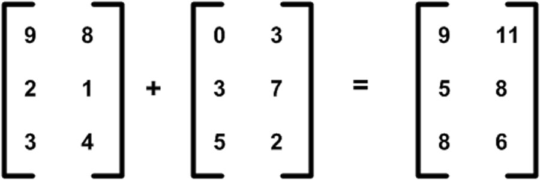
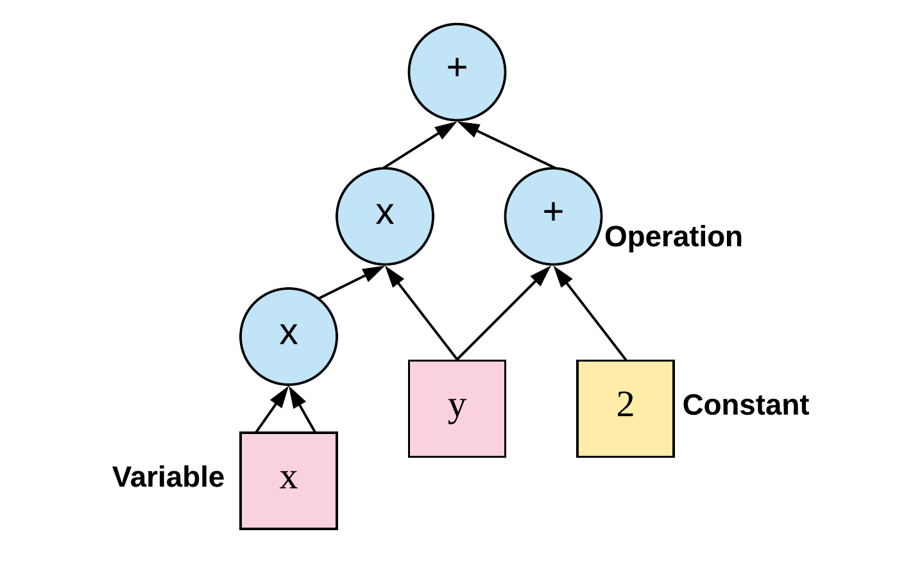

> 本文只是简单 TensorFlow 的一些理解和介绍，并不包含详细的安装、API、以及更多深层内容。

首先简单说一下 标量（`Scalar`）、向量（`Vector`）、张量（`Tensor`）。

下面会以 `physical student` 和 `cs student` 两个角度来解释。

## Scalar

在物理学角度，标量是遵循简单代数规则的一些量，与坐标系的选取无关。例如，加法，减法等。标量也可以被定义为仅需要识别幅度的量。例如温度，电流等

CS 里面可以简单认为是一个常量（`constant`）

## Vector

物理学角度向量是空间中的箭头，也可以是矢量。

决定一个向量的是它的长度（`length`）和它所指的方向（`direction`），而且只要以上特征相同，你一个任意移动一个向量而保持它不变。比如速度和力。而且平面中（平面直角坐标系）的向量是二维的，处于我们生活当中的向量是三维的。

举个例子，一个二维向量 `[-2,3]` 以平面直角坐标系来表示为：


> 第一个数代表沿 X 轴走多远，第二个数代表沿 Y 轴走多远。

图中的黄色箭头就是向量，可以看到一个向量都有一个唯一一对对数

而一个三维向量 `[2,1,3]` 以平面直角坐标系来表示为：


> 第一个数代表沿 X 轴走多远，第二个数代表沿 Y 轴走多远，第三个数代表沿 Z 轴走了多远

CS 角度向量是一个二维数组（二维）、三维数组（三维）或者说是矩阵。代表有序的数字集合。

### 线性代数

向量在线性代数当中可以叫做**矩阵（matrix）**，矩阵可以做一些基本的运算，对应的加法和乘法规则是：

- 两个矩阵行列数必须要相同才能进行求和运算。



- 两个矩阵要相乘，前一个矩阵的列数必须要等于后一个矩阵的行数，也可以看成是列的加权求和


> 至于更多的矩阵求逆、求导超出本文的范畴，请自行学习线性代数。

我们也可以换一种方式来看向量的坐标，把一个 `[1,1]` 的向量定义为 `基向量`。


上文的二维向量 `[-2,3]`，对应的每个坐标可以看作一个为 `Scalar`（标量）。这个向量可以看作把`基向量`按照标量的大小进行缩放所产生。`-2` 代表往右 2 倍，`3` 代表向上 3 倍

## Tensor

[Tensor](https://en.wikipedia.org/wiki/Tensor) 到底是什么？

在物理学当中，张量是个很复杂的概念，简单来说：张量是在空间的不同方向上测量时具有不同值的量，例如[惯性矩](https://zh.wikipedia.org/zh-tw/%E6%83%AF%E6%80%A7%E7%9F%A9)。

张量在 CS 眼里其实就是一个多维数组。

简单理解张量是向量和标量的一般形式，我们用一个属性来表示张量：`rank`，代表张量的**阶**，也可以叫做**维度**，或者叫做**这是个几维数组**：

- 如果张量仅具有幅度而没有方向（即，等级 0 张量），则称为标量或者 rank 0
- 如果张量具有幅度和一个方向（即，等级 1 张量），则称为向量、矢量或者 rank 1
- 如果张量具有幅度和两个方向（即，等级 2 张量），则称为二元或者 rank 2
- ...

我们可以想象出这样的各种类型的张量：


具体更多关于张量的解释请看这个视频：[What's a Tensor?](https://www.youtube.com/watch?v=f5liqUk0ZTw)，或者[关于张量的描述及理解](https://www.youtube.com/watch?v=aL10dphqNuw)

## DataFlow Graphs

根据官方对 [Graphs](https://www.tensorflow.org/guide/graphs#why_dataflow_graphs) 的解释：

> TensorFlow uses a dataflow graph to represent your computation in terms of the dependencies between individual operations. This leads to a low-level programming model in which you first define the dataflow graph, then create a TensorFlow session to run parts of the graph across a set of local and remote devices.

简单来说 TensorFlow 使用数据流图表根据各个操作之间的依赖关系来表示您的计算。关于 Tensorflow 的最大想法是所有数值计算都表示为计算图。 换句话说，任何 Tensorflow 程序的主干都是 `Graph`。 模型中发生的任何事情都由计算图表示。 这使得它可以用于与您的模型相关的任何事情。

`Dataflow` 官方认为有很多好处，比如分布式执行、并行、可移植性等等，你也可以在 [TensorBoard](https://www.tensorflow.org/guide/summaries_and_tensorboard) 上在线可视化编辑 Graph。

> 流程通俗来讲：我们需要首先在其中定义数据流图（使用 TensorFlow 提供的 `operation` 来实现）并创建 `session` 来运行。


比如我们如果实现一个简单的函数：`f(x,y)=x+y`，TensorFlow 中的 Graph 类似于：


该图由一系列通过边连接的节点组成：图中的每个节点的操作都称为 `operation`，所以看起来我们是在操作每一个节点。

通俗来讲 `Tensor` 通过 `operation`（如数学运算）或生成新的`Tensor`（如变量和常量）。 每个 `operation`节点将零个或多个 `Tensor` 作为输入，并产生新的 `Tensor` 作为输出。

接下来实现一个稍微复杂的函数：`f(x,y)=x^2y+y+2`，Graph 将类似于：



## Tensor && Flow

可是 Tensor 在实际当中有什么用处呢？

我们知道 Tensor 简单可以理解为是多维数组，严格来讲：如果用数据来表示实物，高纬度（rank）的 Tensor 可以表示更多纬度的实物信息，什么意思呢？

举个例子，我们有这样一组图片需要做 OCR，判断出来那张图片是 cat：

图片拥有什么可用的信息来进行区分呢？简单列一下：

- 宽度
- 高度
- RGBA

而且我们是一组图片，不是单个图片，有可能有一万张（毕竟样本数量越多训练精度越高），怎么处理这些数据呢？

我们可以用 `[[rank 3 Tensor],[rank 3 Tensor],[rank 3 Tensor]...]`来表示这组数据，也就是一万个 `rank 3` 的 Tensor，根据这些数据再来进行科学计算、训练精度。

至于为什么叫做 `TensorFlow` 呢？通过上面的解释应该很清楚了，尤其是 `f(x,y)=x+y` 的例子，个人理解通俗来讲就是 `Tensor` 之间的 `Flow`。

## `f(x,y)=x+y`

下面我们简单的用代码实现一下上面的：`f(x,y)=x+y`。

> 因篇幅有限，`Tensor type`、`Placeholder`等概念本文不介绍，只简单说一下 `operation` 和 `session`

`operation` 是实现 Tensor 科学运算的基本方式，在 `math_ops.py` 当中定义了很多运算规则，常见的`add`、`multiply`、`pow`、`multiply`等等。

`session` 是计算 graph 的必要条件。要计算任何内容，必须在 `session` 中启动图表。 从技术上讲，`session` 将图形操作放在诸如 CPU 或 GPU 之类的硬件上，并提供执行它们的方法，得到上下文才能运行。

最终代码可以为：

```py
import tensorflow as tf

x = 2
y = 3

with tf.Session() as sess:

    # 加法运算
    add_op = tf.add(x, y, name='Add')
    print('sess.run(add_op) return value', sess.run(add_op))

```

最终输出`sess.run(add_op) return value 5`，并且对应的 `Tensorboard` 生成的图为：


## Reference

- [Scalars, Vectors and Tensors](http://zeus.plmsc.psu.edu/~manias/MatSE447/03_Tensors.pdf)
- [What's the difference between vector and tensor?](https://www.quora.com/Whats-the-difference-between-vector-and-tensor)
- [What's a Tensor?](https://www.youtube.com/watch?v=f5liqUk0ZTw)
- [关于张量的描述及理解](https://www.youtube.com/watch?v=aL10dphqNuw)
- [线性代数 Essence of linear algebra](https://www.youtube.com/playlist?list=PLZHQObOWTQDPD3MizzM2xVFitgF8hE_ab)
- [Learning AI if You Suck at Math — P4 — Tensors Illustrated (with Cats!)](https://hackernoon.com/learning-ai-if-you-suck-at-math-p4-tensors-illustrated-with-cats-27f0002c9b32#.2jpelkuhd)
