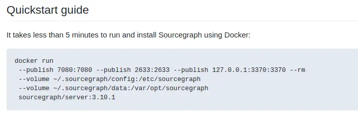
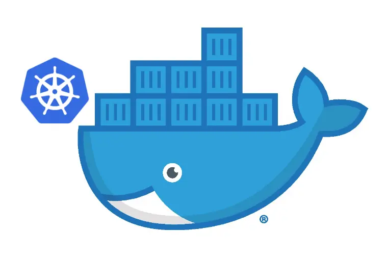
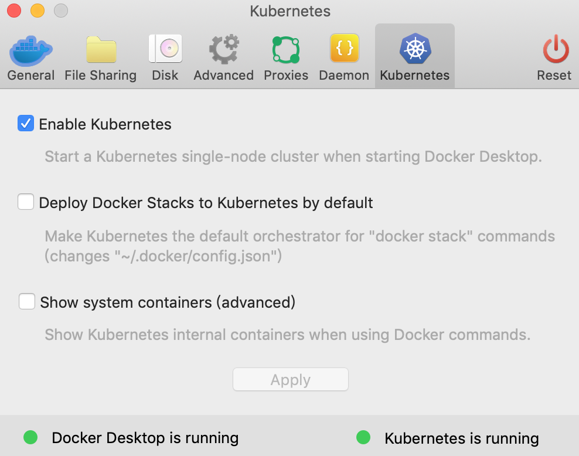
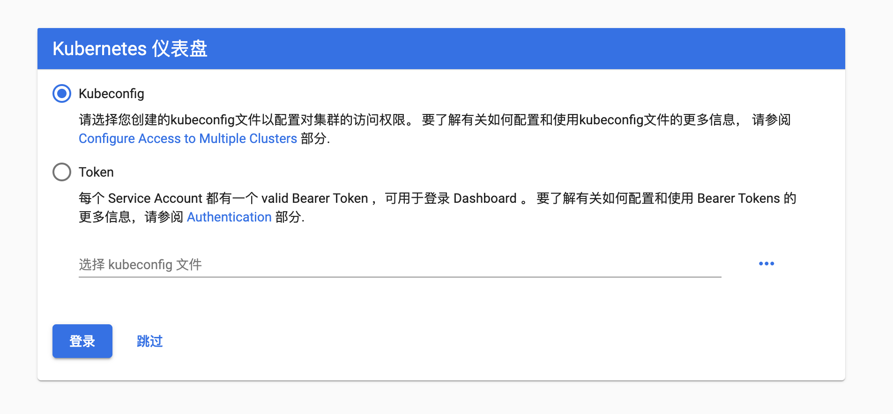
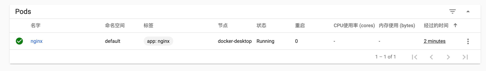
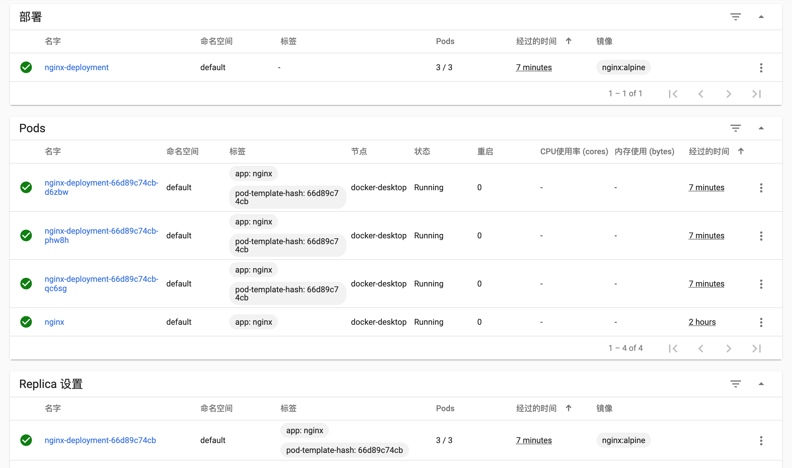
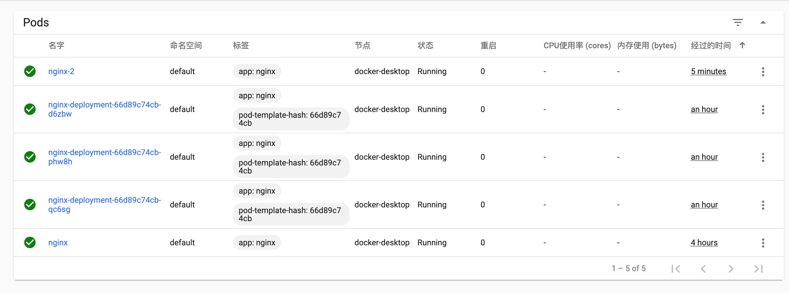
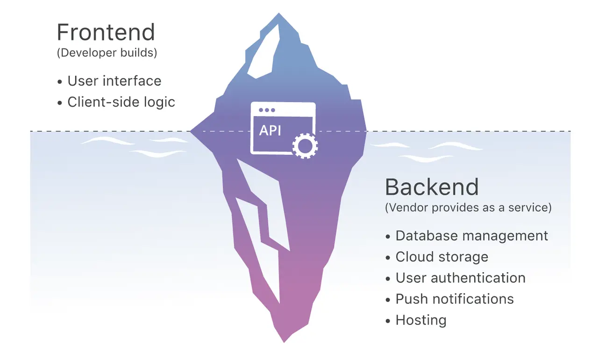
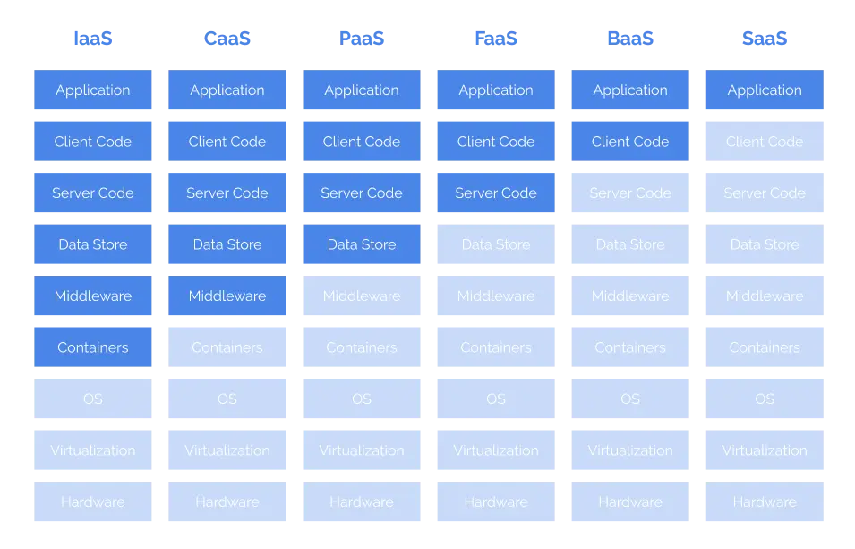

> 本文部分文案转载于 Cody Chan 在掘金上的文章[云原生基础及调研](https://juejin.im/post/5deda052f265da33942a7631)，有大量的个人实践和修改

老规矩，列出本机器环境

- `system_profiler SPSoftwareDataType` : macOS 10.14.1 (18B75) Darwin 18.2.0
- `docker -v` : Docker version 19.03.5, build 633a0ea
- Docker desktop GUI : 2.1.0.5(40693) stable
- `kubectl version` : 根据 Docker desktop GUI 而定

本文仅用于简单普及，达到的目的是给没接触过或者很少接触过这方面的人一点感觉，阅读起来会比较轻松，作者深知短篇幅文章是不可能真正教会什么的，所以也不会出现 [RTFM](https://en.wikipedia.org/wiki/RTFM) 的内容。

## 概念

提到云原生（Cloud Native）可能部分人会陌生，但是如果说 Serverless 相信很多人就知道了，实际上两者并不等价。Serverless 是一种理念或者服务交付形态，目标是屏蔽硬件和运维细节。

而云原生则是实现此类目标的一种规范以及基础设施。

再进一步，介于 Docker 天然的隔离性和高效等特点，以及 [Kubernetes](https://kubernetes.io/) 成为事实意义上的 [Docker](https://www.docker.com/) 编排标准，凡是见到云原生或者 Serverless 的地方，几乎都可以认为是基于 Docker + Kubernetes 的一种实践。

单个点展开讲太枯燥，索性我们从历史的角度看看为什么会有云原生。

## Docker

先申明下，Docker 是一种容器技术（具体可深入 [namespaces](https://en.wikipedia.org/wiki/Linux_namespaces) 和 [cgroups](https://en.wikipedia.org/wiki/Cgroups)），而不是虚拟化技术，真正的虚拟化比较常见的是 Xen 和 KVM，可能有同学要举手了：老师，那我们经常用的 VirtualBox 和 VMware 算虚拟化么？当然算！不过大多数情况下，它们用在桌面虚拟化领域。不要急着撕，我说的是大多数，而且虚拟化方案也还有很多。

可能大家之前经常遇到这样的场景：为什么在我这可以运行在你那就不行了？为什么刚刚可以运行现在就不行了？最终解决下来，大多是环境不一致导致的问题。这里的环境除了开发环境还包括操作系统。

所以一般给别人代码的时候还需要告诉别人此代码可运行的操作系统版本，所依赖的各种软件的版本，甚至目录、磁盘、内存、CPU 都有要求！

当然这个问题还有更直接的办法，就是把代码跑在虚拟机里，然后打包虚拟机！（不要笑，实际上还真有人这么干）为什么此刻你笑了，因为虚拟机太重了，无论从打包的体积还是运行时占用的资源都太重了。

那有没有轻点的「虚拟机」呢？嗯，如标题，不过我们叫做容器化，特点：

- 进程级别的隔离性；
- 除里面运行的应用本身外几乎不占用宿主资源；
- 结构化的配置文件（Dockerfile）；
- 无状态无副作用（主流方式）；
- 分层的联合文件系统；
- ...

**Docker 让运行环境变得可编程！**

拿一个最近部署 [Sourcegraph](https://github.com/sourcegraph/sourcegraph) 的经历举个栗子，官方有个开发者 [清单](https://github.com/sourcegraph/sourcegraph/blob/master/doc/dev/local_development.md#step-1-install-dependencies)，一堆依赖和环境设置，照着这个部署会爆炸的，好在官方还提供了可快速部署的镜像，就是这么简单：



## 微服务

传统的 WEB 应用核心分为业务逻辑、适配器以及 API 或通过 UI 访问的 WEB 界面，这种单体应用比较适合于小项目。

开发简单直接，集中式管理，而且基本不会重复开发，

当然对于互联网公司来说，缺点也是很明显，比如效率、维护、稳定性和拓展性等等。

所以，现在主流的设计一般会采用微服务架构。其思路不是开发一个巨大的单体式应用，而是将应用分解为小的、互相连接的微服务。

每个业务逻辑都被分解为一个 `微服务`，微服务之间通过 `REST API` 通信。一些微服务也会向终端用户或客户端开发 API 接口

微服务这种架构相比传统应用有很多的优点：

- 解决了复杂性问题，将单体应用分解为一组服务
- 只要符合服务 API 契约，每个服务都可以由专注于此服务的团队独立开发，开发人员可以自由选择开发技术。这就意味着开发人员可以采用新技术编写或重构服务
- 微服务架构可以使每个微服务独立部署，更好的 CI、CD
- 微服务架构使得每个服务都可独立扩展

当然微服务也有一些缺点：

- 没有一个统一的标准。
- 微服务的分布式特点带来的复杂性。

> 开发人员需要基于 RPC 或者消息实现微服务之间的调用和通信，而这就使得服务之间的发现、服务调用链的跟踪和质量问题变得的相当棘手。

- 跨服务的更改和依赖，而且在微服务架构中，一个服务故障可能会产生雪崩效用，导致整个系统故障
- 分布式数据库体系和分布式事务
- 微服务架构对测试也带来了很大的挑战。传统的单体 WEB 应用只需测试单一的 `REST API` 即可，而对微服务进行测试，需要启动它依赖的所有其他服务。这种复杂性不可低估。
- 部署困难

> 单体应用可以简单的部署在一组相同的服务器上，然后前端使用负载均衡即可。每个应用都有相同的基础服务地址，例如数据库和消息队列。而微服务由不同的大量服务构成。每种服务可能拥有自己的配置、应用实例数量以及基础服务地址。这里就需要不同的配置、部署、扩展和监控组件。此外，我们还需要服务发现机制，以便服务可以发现与其通信的其他服务的地址。

针对以上问题和挑战，以及如何解决这些痛点可以大致概况为：

- `API Gateway`
- `Service Proxy`
- `Monitor && Logging && Tracing`
- `RPC`
- `Distributed Stroage && Messaging`
- `Server Discovery`、`服务容错（熔断、服务降级、限流）`、`服务部署（Container Define && Image Build）`

你会发现这些其实在 `Docker` 和 `K8s` 里面或多或少已经都实现了，而且各种各样的库也是为了解决这些痛点而生：比如 [GRPC-RPC](https://grpc.io/)、[Enovy-Service Proxy](https://www.envoyproxy.io/)、[Kong-API Gateway](https://github.com/Kong/kong)、[Fluentd](https://www.fluentd.org-Logger/)等等

个人认为可以说正是微服务的流行，促使了这些工具或者库的繁荣

但是这些都没有一个统一的标准

## Kubernetes

> Kubernetes 名字太长，以下简称 K8S，类似的简称形式还有 [很多](https://en.wikipedia.org/wiki/Numeronym)。

Docker 虽然很厉害，但是在成人看来也只是小孩的玩具，稍微大点的公司内部可能服务就多的吓人，特别是 [微服务架构](https://en.wikipedia.org/wiki/Microservices) 盛行后。

Docker 只解决了单个服务的交付问题，一个具备完整形态的应用必然会涉及各种服务依赖，人为组织这些依赖也是会死人的。Docker 把我们从各种跟环境纠缠里解放出来，却让我们陷入了更高维度的服务依赖之间的纠缠。

是个 Docker 用户应该都会想到去解决这个问题，如你所愿，出现了三国争霸的局面：[Docker Swarm](https://docs.docker.com/engine/swarm/)、[Apache Mesos](http://mesos.apache.org/) 和 [Google Kubernetes](https://kubernetes.io/)，一定程度上 K8S 成为了现在主流的 Docker 编排标准。有意思的是 K8S 有舵手之意，而 Docker 有集装箱之意，所以结合下是不是更合理了？



更有意思的是，K8S 管理 Docker 的过程也是一层层抽象，并针对抽象出来一些概念：

- [Pod](https://kubernetes.io/docs/concepts/workloads/pods/pod/)

> 为了解决一组密切相关容器集合的调度，K8S 的最小的调度单位是 Pod，而不是容器，同一个 Pod 里的容器的资源可以互相访问，它将应用的容器、存储资源以及独立的网络 IP 地址等资源打包到了一起，表示一个最小的部署单元，但是每一个 Pod 中的运行的容器可能不止一个

- [Deployment](https://kubernetes.io/docs/concepts/workloads/controllers/deployment/)

> 为了管理发布、回滚、扩缩容，又在这之上抽象了一个 Deployment，实际上这是我们最直接使用的单元

- [Service](https://kubernetes.io/docs/concepts/services-networking/service/)

> 为了管理负载均衡（LB）和调度、网络可以访问到集群内部的 `Pod` 又抽象了一个叫 Service

请注意，`service` 大致分为 `ClusterIP`、`NodePort`、`LoadBalancer`、`ExternalName`，默认是 `ClusterIP` 。具体详细的请看[官方文档 Publishing Services (ServiceTypes)](https://kubernetes.io/docs/concepts/services-networking/service/#publishing-services-service-types)，也可以查看[Kubernetes NodePort vs LoadBalancer vs Ingress? When should I use what?](https://medium.com/google-cloud/kubernetes-nodeport-vs-loadbalancer-vs-ingress-when-should-i-use-what-922f010849e0)。这里简单介绍一下：

- `ClusterIP`，默认值， 说明当前 `Pod` 只能在集群内访问，需要端口转发（和 `Docker` 的 `EXPOSE` 有点类似）
- `NodePort` 表示可以当前 `Pod` 可以通过端口在集群外部访问（在本例子当中也就是宿主机或者我们的浏览器）
- `LoadBalancer` 表示云服务提供者可以自动根据当前负载情况将请求转发到当前 `Pod`
- `ExternalName` 在 [CoreDNS](https://coredns.io/) 1.7 以上的版本才可使用的类型，通过配置 `externalName` 来一个 `CNAME`记录。

还有一个 [Ingress](https://kubernetes.io/docs/concepts/services-networking/ingress/)，这个严格来讲实际上不是一种服务。相反，它位于多个服务之前，充当集群中的“智能路由器”或入口点，可以做路由的转发、HTTPS、蓝绿发布等等，大概作用如下：


以上概念是 K8S 基本概念，不过我想强调的是这个：**解决复杂问题很多都是在一层层抽象**，这点展开还可以说很多东西。

K8S 做的比较极致的点就是以上所有资源的管理都是通过声明式（Declarative）的编程方式，**K8S 把容器运维变得可编程！**，开发者只需要提交一份文件，K8S 将会自动为你分配创建所需的资源。对这些设施的 CRUD 都可以通过程序的方式自动化操作，下面会有对应的例子可以感受。

### 第一个 K8s 应用

K8s 在 Mac 上安装也是非常方便，参照[官方文档](https://kubernetes.io/docs/tasks/tools/install-kubectl/)：

```bash

brew install kubectl

kubectl version

# 根据个人需要是否添加 alias
# echo 'alias k=kubectl' >>~/.zshrc

```

你也可以使用官方更方便的 [Docker desktop GUI](https://docs.docker.com/)，然后配置 `Enable Kubernetes` 等待自动下载就会安装好所需的库，在后台跑起一个默认的 `Kubernetes cluster`。



> 请注意上图的 `Docker Desktop is Running` 和 `Kubernetes is Running` 两个都为绿点才是安装成功

下一步我们需要安装 [Kubernetes Dashboard](https://kubernetes.io/docs/tasks/access-application-cluster/web-ui-dashboard/#deploying-the-dashboard-ui)：

```sh

# 我们这里把官方推荐的配置文件下载到本地，便于修改配置

curl https://raw.githubusercontent.com/kubernetes/dashboard/v2.0.0-beta8/aio/deploy/recommended.yaml >> recommended.yaml

kubectl apply -f ./recommended.yaml
kubectl proxy

```

> 上诉关于 Kubernetes Dashboard 的 [kubernetes-dashboard.yaml](https://raw.githubusercontent.com/kubernetes/dashboard/v2.0.0-beta8/aio/deploy/recommended.yaml) 文件也是一个很好的学习 K8s 配置的例子，可以读一读。

另外还需要参照这个 stackoverflow 的问题设置一下 [enable-skip-login](https://stackoverflow.com/questions/46664104/how-to-sign-in-kubernetes-dashboard)，这样就可以**跳过登录阶段，不用配置 config 和 token**。我这里选择在 `containers kubernetes-dashboard` 的配置下添加 `--enable-skip-login`

> If you are using dashboard version v1.10.1 or later, you must also add --enable-skip-login to the deployment's command line arguments. You can do so by adding it to the args in kubectl edit deployment/kubernetes-dashboard --namespace=kube-system:

比如下面配置：

```yaml
containers:
  - args:
      - --auto-generate-certificates
      - --enable-skip-login # <-- 添加这一行配置
      - --namespace=kubernetes-dashboard
```

然后在浏览器里面访问地址就可以看到如下界面，然后点击跳过来直接进入 Dashboard：[http://localhost:8001/api/v1/namespaces/kubernetes-dashboard/services/https:kubernetes-dashboard:/proxy/.](http://localhost:8001/api/v1/namespaces/kubernetes-dashboard/services/https:kubernetes-dashboard:/proxy/.)



### Pod

这时候 Dashboard 是空的，我们来添加一个小型的 `Pod` ：

我们使用 `nginx:alpine` 作为镜像部署了一个 `Pod`，并且暴露了 80 端口

```yaml
# nginx-pod.yaml

apiVersion: v1
kind: Pod
metadata:
  name: nginx
  # 指定 label，便于检索
  labels:
    app: nginx
spec:
  containers:
    - name: nginx
      # 指定镜像
      image: nginx:alpine
      # 指定暴露端口
      ports:
        - containerPort: 80
```

使用 `kubectly apply`，部署 Pod：

```sh

kubectl apply -f nginx-pod.yaml

# output
# pod/nginx created

```

校验部署状态，此时 `STATUS` 为 `Running` 表明部署成功：

```sh

# 获取 Pod 部署的状态，特别是 IP
# -o wide 列出IP/Node等更多信息

kubectl get pods nginx -o wide

# output
# NAME    READY   STATUS    RESTARTS   AGE   IP          NODE             NOMINATED NODE   READINESS GATES
# nginx   1/1     Running   0          65s   10.1.0.14   docker-desktop   <none>           <none>

```

如果你想得到当前 `nginx pod` 的更详细的信息，也可以通过 `kubectl describe pod nginx` 来获取
这个时候刷新 Dashboard 我们可以看到：



此时我们可以使用 `kubectl exec` 进入 `Pod` 的内部容器。如果 `Pod` 中有多个容器，使用 `kubectl exec -c` 指定容器：`kubectl exec -it nginx sh` （ sh 是 alpine 的默认终端 sh 入口）

这个时候我们是不能直接访问这个 `Pod` 的，只能在集群内访问，所以如果我们要想在浏览器当中访问，我们需要 `port-forward`：

```sh
kubectl port-forward nginx 8080:80

# output
# Forwarding from 127.0.0.1:8080 -> 80
# Forwarding from [::1]:8080 -> 80
```

然后就可以直接访问这个 nginx 服务了：

```sh

curl 127.0.0.1:8080

# output

<!DOCTYPE html>
<html>
<head>
<title>Welcome to nginx!</title>
<style>
    body {
        width: 35em;
        margin: 0 auto;
        font-family: Tahoma, Verdana, Arial, sans-serif;
    }
</style>
</head>
<body>
<h1>Welcome to nginx!</h1>
<p>If you see this page, the nginx web server is successfully installed and
working. Further configuration is required.</p>

<p>For online documentation and support please refer to
<a href="http://nginx.org/">nginx.org</a>.<br/>
Commercial support is available at
<a href="http://nginx.com/">nginx.com</a>.</p>

<p><em>Thank you for using nginx.</em></p>
</body>
</html>
```

> 前面我们说到 `Pod` 是最小的一个单元，而且这个方法只能暴露特定的 `Pod`，所以并不实用，后面我们把整个 `Deployment` 暴露成一个服务供给外部访问

### Deployment

在 k8s 中编排应用可以更好地做容器编排弹性扩容，负载均衡。既然要均衡，一个 Pod 肯定不能均衡，自然要部署多个 Pod

> `docker-compose` 可以简单地通过 `docker-compose scale` 来扩容

在 k8s 中管理 `Pod` 的称作 `Controller`，我们可以使用 `Deployment` 这种 `Controller` 来为 `Pod` 进行编排管理

根据[官方文档](https://kubernetes.io/docs/tasks/run-application/run-stateless-application-deployment/)，我们可以简单编写一个 `Deployment` 的资源配置文件，其中：

- `spec.template` : 指定要部署的 Pod
- `spec.replicas` : 指定要部署的个数
- `spec.selector` : 定位需要管理的 Pod

```yaml
# nginx-deployment.yaml

apiVersion: apps/v1
kind: Deployment
metadata:
  name: nginx-deployment
spec:
  selector:
    matchLabels:
      app: nginx
  replicas: 3
  template:
    metadata:
      labels:
        app: nginx
    spec:
      containers:
        - name: nginx
          image: nginx:alpine
          ports:
            - containerPort: 80
```

我们使用 `kubectl apply` 部署生效后查看 `Pod` 以及 `Deployment` 状态

```bash
kubectl apply -f

# output
# deployment.apps/nginx-deployment created
```

成功部署后来查看一下 `Pod`：

```bash
kubectl get pods -o wide -l 'app=nginx'

# output

NAME                                READY   STATUS    RESTARTS   AGE    IP          NODE             NOMINATED NODE   READINESS GATES
nginx                               1/1     Running   0          160m   10.1.0.14   docker-desktop   <none>           <none>
nginx-deployment-66d89c74cb-d6zbw   1/1     Running   0          48s    10.1.0.15   docker-desktop   <none>           <none>
nginx-deployment-66d89c74cb-phw8h   1/1     Running   0          48s    10.1.0.16   docker-desktop   <none>           <none>
nginx-deployment-66d89c74cb-qc6sg   1/1     Running   0          48s    10.1.0.17   docker-desktop   <none>           <none>
```

再来查看一下部署状态：

```bash
kubectl get deploy nginx-deployment

# output
NAME               READY   UP-TO-DATE   AVAILABLE   AGE
nginx-deployment   3/3     3            3           2m9s
```

这个时候我们发现 `READY 3/3` 这表明全部部署成功，此时再来查看 Dashboard，我们会发现已经成功：



接下来我们填一下上面 `Pod` 末尾的坑，我们把 `Deployment` 暴露成一个服务，供外部访问：

```bash
kubectl get deployment

# output

NAME               READY   UP-TO-DATE   AVAILABLE   AGE
nginx-deployment   3/3     3            3           10m

kubectl expose deployment nginx-deployment --type=NodePort --name=nginx-deployment

# output
service/nginx-deployment exposed

kubectl get service  -o wide

# output
NAME               TYPE        CLUSTER-IP      EXTERNAL-IP   PORT(S)        AGE    SELECTOR
kubernetes         ClusterIP   10.96.0.1       <none>        443/TCP        29h    <none>
nginx-deployment   NodePort    10.98.205.114   <none>        80:31422/TCP   5m1s   app=nginx
```

> 你会发现最后一条命令的 output 里面 `TYPE` 有不同的值，这个在上面开始的时候已经强调过： `NodePort`，这代表外部或者宿主机可以访问，而 `ClusterIP` 代表服务只能在集群内部访问

接下来就可以以 [http://localhost:31422/](http://localhost:31422/) 来访问 `nginx` 服务了

### Service

现在我们已经部署了一个 `Deployment`，但是你可能发现这些 `Pod` 的 ip 都不是固定的，那我们如何向这三个 Pod 请求服务呢？怎么做服务发现呢？

> k8s 里面的[服务发现](https://kubernetes.io/docs/concepts/services-networking/service/#discovering-services)可以通过 `Environment variables` 和 `DNS` 实现

我们可以通过 `Service` 解决这个问题，做指定 `Deployment` 或者特定集合 `Pod` 的网络层抽象

配置文件如下

- `spec.selector` : 指定如何选择 Pod
- `spec.ports` : 指定如何暴露端口

```yaml
# nginx-service.yaml

apiVersion: v1
kind: Service
metadata:
  name: nginx-service
spec:
  selector:
    app: nginx
  ports:
    - protocol: TCP
      port: 80
      targetPort: 80
```

接下来部署：

```bash
kubectl apply -f nginx-service.yaml

# output
service/nginx-service created

kubectl get svc nginx-service -o wide

# output
NAME            TYPE        CLUSTER-IP      EXTERNAL-IP   PORT(S)   AGE   SELECTOR
nginx-service   ClusterIP   10.110.133.24   <none>        80/TCP    30m   app=nginx
```

此时我们都是发现 `ClusterIP`，所以我们需要进入 `Pod` 内部进行访问。

- 为了验证，我们需要再建立一个 `Pod` 或者 集群来测试这个集群的 IP 是否能在当前 `Cluster`，也就是 k8s 的 `Context` 内访问。我们偷一下懒，新建个 `Pod` 就好了，把上面的 `nginx Pod` 配置文件稍微更改一下：

```yaml
# nginx-pod2.yaml

apiVersion: v1
kind: Pod
metadata:
  name: nginx-2 # 这里名称改 nginx-2
  # 指定 label，便于检索
  labels:
    app: nginx
spec:
  containers:
    - name: nginx-2 # 这里名称改 nginx-2
      # 指定镜像
      image: nginx:alpine
      # 指定暴露端口
      ports:
        - containerPort: 80
```

- 然后创建这个 `Pod`：`kubectl apply -f nginx-pod2.yaml`，Dashboard 上多了一个 nginx-2 的 `Pod`：



- 然入这个 `Pod` : `kubectl exec -it nginx-2 sh`
- 安装 curl：`apk add curl`
- 最后访问上面 `Service` 的地址：`curl 10.110.133.24` 就能访问到其他集群的 nginx 服务了

进入 `Pod` 后的完整命令如下：

```bash

kubectl exec -it nginx-2 sh

/ # apk add curl
fetch http://dl-cdn.alpinelinux.org/alpine/v3.10/main/x86_64/APKINDEX.tar.gz
fetch http://dl-cdn.alpinelinux.org/alpine/v3.10/community/x86_64/APKINDEX.tar.gz
(1/4) Installing ca-certificates (20190108-r0)
(2/4) Installing nghttp2-libs (1.39.2-r0)
(3/4) Installing libcurl (7.66.0-r0)
(4/4) Installing curl (7.66.0-r0)
Executing busybox-1.30.1-r2.trigger
Executing ca-certificates-20190108-r0.trigger
OK: 30 MiB in 41 packages
/ # curl 10.110.133.24
<!DOCTYPE html>
<html>
<head>
<title>Welcome to nginx!</title>
<style>
    body {
        width: 35em;
        margin: 0 auto;
        font-family: Tahoma, Verdana, Arial, sans-serif;
    }
</style>
</head>
<body>
<h1>Welcome to nginx!</h1>
<p>If you see this page, the nginx web server is successfully installed and
working. Further configuration is required.</p>

<p>For online documentation and support please refer to
<a href="http://nginx.org/">nginx.org</a>.<br/>
Commercial support is available at
<a href="http://nginx.com/">nginx.com</a>.</p>

<p><em>Thank you for using nginx.</em></p>
</body>
</html>
/ #
```

但是服务发现的含义是我们只需要知道服务的名字便能够访问服务，只能通过 IP 访问也肯定不行

在 k8s 中，所有的服务可以通过 `my-svc.my-namespace.svc.cluster.local` 做服务发现，对于刚才部署的 `Service` 就是 `nginx-service.default.svc.cluster.local`

所以在这个新建的 `Pod` 当中访问 `nginx-service.default.svc.cluster.local` 也是可以的

```bash

/ # curl nginx-service.default.svc.cluster.local
<!DOCTYPE html>
<html>
<head>
<title>Welcome to nginx!</title>
<style>
    body {
        width: 35em;
        margin: 0 auto;
        font-family: Tahoma, Verdana, Arial, sans-serif;
    }
</style>
</head>
<body>
<h1>Welcome to nginx!</h1>
<p>If you see this page, the nginx web server is successfully installed and
working. Further configuration is required.</p>

<p>For online documentation and support please refer to
<a href="http://nginx.org/">nginx.org</a>.<br/>
Commercial support is available at
<a href="http://nginx.com/">nginx.com</a>.</p>

<p><em>Thank you for using nginx.</em></p>
</body>
</html>

```

### 完整配置

完整配置如下：

```yaml
apiVersion: v1
kind: Pod
metadata:
  name: nginx
  # 指定 label，便于检索
  labels:
    app: nginx
spec:
  containers:
    - name: nginx
      # 指定镜像
      image: nginx:alpine
      # 指定暴露端口
      ports:
        - containerPort: 80

apiVersion: apps/v1
kind: Deployment
metadata:
  name: nginx-deployment
spec:
  selector:
    matchLabels:
      app: nginx
  replicas: 3
  template:
    metadata:
      labels:
        app: nginx
    spec:
      containers:
        - name: nginx
          image: nginx:alpine
          ports:
            - containerPort: 80

apiVersion: v1
kind: Service
metadata:
  name: nginx-service
spec:
  selector:
    app: nginx
  ports:
    - protocol: TCP
      port: 80
      targetPort: 80
```

至此，简单的 K8s 部署我们也过了一遍

## Cloud Native

如果要直接在生产环境使用 K8S 基本也可以了，但是：

都知道 Java 后端广泛采用的 Web 框架是 Spring MVC，那可是 02 年的老古董了！即使现在有了 Spring Boot，也可以算是一种升级，跟近几年百花齐放的前端三大框架比少了太多的口水仗。

百花齐放的原因很大一部分就是前端一开始就没有形成强有力的最佳实践！从工程化角度看，太多的重复轮子很容易导致工程的可维护性变差。

Web 后端稳定性的特点不太能容忍这样的事情发生，推导到云上也一样。

**云原生就是云的（或狭义指 K8S 的）最佳实践，生而为云，所谓云原生！**

为了达到此目的，还有了 [CNCF 云原生计算基金会](https://www.cncf.io/)，有了组织就靠谱多了。这个组织有一个收集（或孵化）了各种最佳实践的 [云原生全景图谱](https://landscape.cncf.io/)。

## Serverless

有了云原生，基本各种业务场景都可以找到适合的最佳实践，Serverless 就是其中一种。个人很不理解为什么这个词被翻译成：无服务器架构，Serverless 屏蔽的是运维，所以叫无运维架构更合适。迫于无法接受其中文翻译，文中还是用 Serverless。

你可能好奇，为啥这里要把 Serverless 单独拉出来说下，因为这是 CNCF 的宠儿啊！CNCF 范畴内太多项目了，但是大多还是偏硬，普通业务很难用上并落地，所以抓了个可以落地的当典型，还为其起草了个 [白皮书](https://github.com/cncf/wg-serverless/tree/master/whitepapers/serverless-overview)，建议有兴趣的可以细品。

在说屏蔽运维之前，我们先回顾下运维一般包括哪些：

- 服务器、网络、存储等物理资源（IaaS）申请；
- 测试、发布、扩缩容；
- 监控、日志；
- ...

要达到屏蔽运维大体就是无需关心以上点，目前业界主流形式有 BaaS 和 FaaS：

- BaaS（Backend as a Service）：此服务做法就是把常见的后端服务抽象出来，比如数据存储、文件存储、消息等，客户端使用这些服务时感觉就像在使用普通的 SDK/API。



- FaaS（Function as a Service）：BaaS 只在大多数场景好使，某些特殊场景可能就比较麻烦，有些能力可能并没有提供，但是又必须要在后端写。完整关心整个后端代码框架并没必要，所以就可以抽象简单一个个 function 让用户去完成。目前 Google 采用的是 Knative，这里还有个其它方案的对比 文章。

具体采用何种方式取决于业务形态，大体上就是用灵活性换方便度，给各种云服务一个灵活度排序：`IaaS（各种云主机） > CaaS（Docker 等容器服务） > PaaS（BAE、SAE、GAE 等 APP Engine） > FaaS > BaaS > SaaS（各种 Web APP，如 Google Doc）`。



歪歪的云计算九层架构，深色的表示留给用户定制的，[灵感来源](https://www.google.com/search?q=iaas+paas+saas&source=lnms&tbm=isch)

**Serverless 为开发者提供了一种屏蔽运维又具备一定灵活度的云服务。**

## Reference

- [一篇文章快速理解微服务架构](http://dockone.io/article/3687)
- [云原生基础及调研](https://juejin.im/post/5deda052f265da33942a7631)
- [Docker 核心技术与实现原理](https://draveness.me/docker)
- [谈 Kubernetes 的架构设计与实现原理](https://draveness.me/understanding-kubernetes)
- [How to sign in kubernetes dashboard?](https://stackoverflow.com/questions/46664104/how-to-sign-in-kubernetes-dashboard)
- [Kubernetes NodePort vs LoadBalancer vs Ingress? When should I use what?](https://medium.com/google-cloud/kubernetes-nodeport-vs-loadbalancer-vs-ingress-when-should-i-use-what-922f010849e0)
