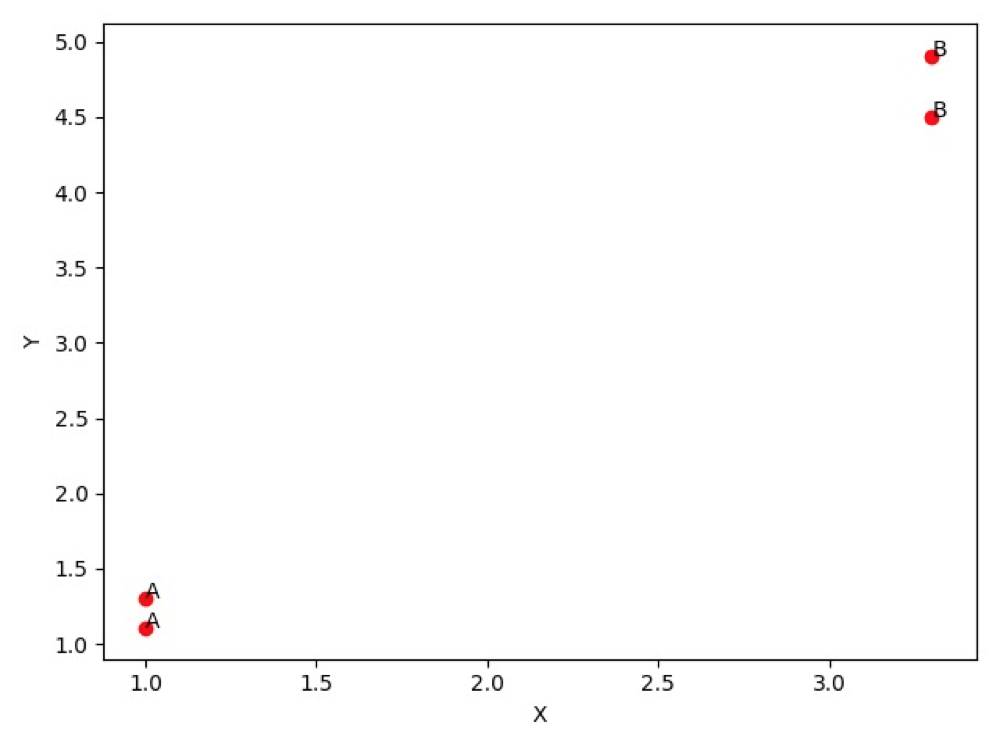

机器按照是否 **分类** 和 **回归** 可以分为两种：

- **监督学习**

监督学习需要分类和回归，这类算法必须知道预测什么，即目标变量的分类信息。

监督学习的用途有：

- k-近邻算法（`KNN`）
- 朴素贝叶斯算法
- 支持向量机
- 决策树
- 线性回归
- 局部加权线性回归
- Ridge 回归
- Lasso 最小回归系数估计

我们在本文当中会逐个说到上诉用途

- **非监督学习**

与监督学习相对应的是无监督学习，此时数据没有类别信息，也不会给定目标值。在无监督 学习中，将数据集合分成由类似的对象组成的多个类的过程被称为聚类；将寻找描述数据统计值 的过程称之为密度估计。

此外，无监督学习还可以减少数据特征的维度，以便我们可以使用二维或三维图形更加直观地展示数据信息。

无监督学习的用途有：

- K-均值
- DBSCAN
- 最大期望算法
- Parzen 窗设计

## KNN

> kNN（k-Nearest Neighbor）算法的核心思想是如果一个样本在特征空间中的 k 个最相邻的样本中的大多数属于某一个类别，则该样本也属于这个类别

`KNN` 是机器学习中最简单易懂的算法，它的适用面很广，并且在样本量足够大的情况下准确度很高，多年来得到了很多的关注和研究，K-近邻算法采用测量不同特征值之间的距离方法进行分类。适用数据范围：数值型和标称型

**`kNN` 当中的 k 取不同值时，分类结果可能会有显著不同。**

- 优点：简单，易于理解，易于实现，精度高、对异常值不敏感、无数据输入假定。
- 缺点：计算复杂度高、空间复杂度高。

下面是 k-近邻算法当中带有 4 个数据点的简单例子，例子当中对 4 个数据点进行了简单分类为 `A` 和 `B`：

```python
import numpy as np
import matplotlib.pyplot as plt

# 4 个测试数据点和已经分好类的数组
group = np.array([[1.0, 1.1], [1.0, 1.3], [3.3, 4.5], [3.3, 4.9]])
labels = ['A', 'A', 'B', 'B']

def data_set_plt():
    ax = plt.figure().add_subplot(111)

    for i in range(len(labels)):
        x = group[i][0]
        y = group[i][1]
        ax.scatter(x, y, c='r')
        ax.text(x, y, labels[i])

    plt.xlabel('X')
    plt.ylabel('Y')
    plt.show()

if __name__ == '__main__':

    data_set_plt()

```

对应的结果为：



`KNN` 需要计算样本之间的距离，需要用到[欧氏距离公式](https://zh.wikipedia.org/wiki/%E6%AC%A7%E5%87%A0%E9%87%8C%E5%BE%97%E8%B7%9D%E7%A6%BB)


对应的实现为：

```python
def classify(input, dataSet, labels, k):
    dataSize = dataSet.shape[0]

    # 计算欧式距离
    diff = np.tile(input, (dataSize, 1)) - dataSet
    sqdiff = diff ** 2
    squareDist = np.sum(sqdiff, axis=1)  # 行向量分别相加，从而得到新的一个行向量
    dist = squareDist ** 0.5

    # 对距离进行排序
    sortedDistIndex = np.argsort(dist)  # argsort()根据元素的值从大到小对元素进行排序，返回下标

    classCount = {}
    for i in range(k):
        voteLabel = labels[sortedDistIndex[i]]
        # 对选取的K个样本所属的类别个数进行统计
        classCount[voteLabel] = classCount.get(voteLabel, 0) + 1
    # 选取出现的类别次数最多的类别
    maxCount = 0
    for key, value in classCount.items():
        if value > maxCount:
            maxCount = value
            classes = key

    return classes

```

接下来简单测试一个新的数据点 `[0,0]`，套入上面的简单 `KNN` 实现当中去计算：

```python
classify([0,0], group, labels, 3)
```

得到输出结果为 `A` ，你可以在这里[下载上诉代码](./knn1.py)

我们再次回顾上面的[欧氏距离公式](https://zh.wikipedia.org/wiki/%E6%AC%A7%E5%87%A0%E9%87%8C%E5%BE%97%E8%B7%9D%E7%A6%BB)，我们发现方程中数字差值最大的属性对计算结果的影响最大，在处理这种不同取值范围的特征值时，我们通常采用的方法是将数值**归一化**，如将取值范围 处理为 0 到 1 或者 -1 到 1 之间。

## Reference

- [机器学习（一）——K-近邻（KNN）算法](https://www.cnblogs.com/ybjourney/p/4702562.html)
- [CNN(卷积神经网络)、RNN(循环神经网络)、DNN(深度神经网络)的内部网络结构有什么区别？](https://www.zhihu.com/question/34681168/answer/84061846)
