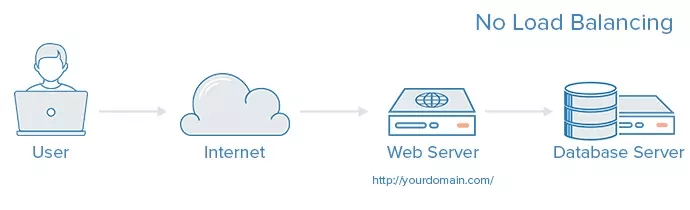
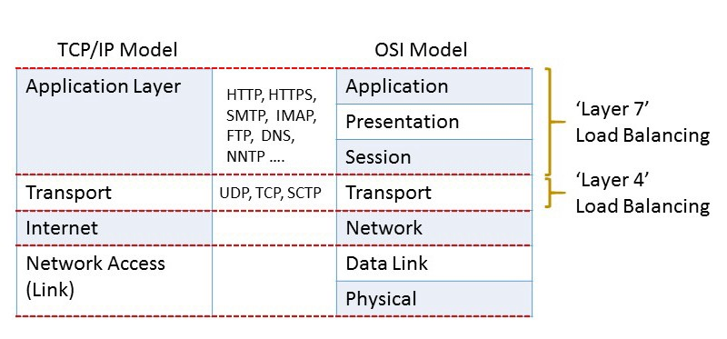

> 本文是根据 [system-design-primer（系统设计入门）](https://github.com/donnemartin/system-design-primer) 整理，本文主要讲负载均衡

数据流量过大的网络中，尤其是高并发（High Concurrency）网络，单一设备一般是无法承担的，需要多台设备进行数据分流，而负载均衡（Load Balance）就是将请求或者数据**均匀**分摊到多个操作单元上执行。

高并发常用的一些指标有：

- 响应时间（Response Time）
- 吞吐量（Throughput）
- 每秒查询率（Query Per Second），简称 `QPS`

没有负载均衡的 web 架构大概如下图：



用户直接连接服务器，这个时候如果这台服务器挂了，那么就整个网站挂了。

有负载均衡的架构如下图：


用户不直接访问后端服务器，而是访问负载均衡服务器，由负载均衡服务器再次转发到后端服务器。

如果这个时候有一台后端服务器挂掉了，那么负载均衡服务器会剔除掉它，将后续请求都转发到好的那台，这样就不影响网站的正常运行。

这个时候我们也需要考虑负载均衡服务器会不会挂掉，那就引入第二个负载均衡服务器来缓解一下。

负载均衡器能帮助**水平扩展（Horizontal scaling）**，提高性能和可用性。相对使用商业硬件的性价比更高，并且比在单台硬件上**垂直扩展（Vertical scaling）**更贵的硬件具有更高的可用性。

- 水平拓展：增强单机硬件性能或者优化单机架构
- 垂直拓展：只要增加服务器数量，就能线性扩充系统性能

针对负载均衡有各种各样的实现，我们来简单梳理一下。

## 客户端负载均衡

简单来讲，客户端会有一个服务器地址列表，由客户端自行选择目标服务器的 IP 地址。

客户端不存在缓存的问题，也能检查服务可用性来选择可用 IP。

## DNS 负载均衡

DNS 维护着域名与 IP 地址之间的映射关系，而且是可以接受我们控制的，因此可以在这里实现负载均衡策略。

> DNS 负载均衡可以通过 NS 记录将域名解析指给多台智能 DNS，以保障解析高可用，通过 IP 地址库及指定算法进行智能解析，可根据不同运营商、地理位置、内部应用情况进行智能解析分配。

DNS 负载均衡技术实现比较灵活，成本较低，也可以根据域名解析成用户地址最近的一个服务器地址。

缺点也很明显：

- 可靠性没有保障：DNS 并不检查服务器的可用性，即便目标服务器宕机或者无法访问了，也返回其 IP 地址
- 更新不及时：DNS 的解析结果往往会被层层缓存，记录更新无法立即生效
- 流量分配策略较为简单，支持的算法较少

另外一个问题，DNS 负载均衡默认采用的是 `round-robin` 算法，不能区分服务器之间的差异，也不能反应状态。

K8s 当中也 [不推荐使用 round-robin DNS](https://kubernetes.io/docs/concepts/services-networking/service/#why-not-use-round-robin-dns) ，个人看法是 DNS 轮询来做域名对应的 IP 扩容，负载均衡交给下层应用。

## 硬件负载均衡

直接在服务器和外部网络间安装负载均衡硬件设备，这种设备我们通常称之为负载均衡器。

由专门的设备完成，独立于操作系统，整体性能得到大量提高，加上更多的负载均衡策略，智能化的流量管理，可达到最佳的负载均衡需求。

一般来说，硬件负载均衡在功能、性能上优于软件方式，可以做 4-7 层负载均衡，不过成本昂贵。

硬件负载均衡常见的有 [F5](https://www.f5.com/)。

## OSI 模型

接下来就是软件负载均衡，在这之前我们要简单过一下 [OSI（Open System Interconnect）参考模型](https://en.wikipedia.org/wiki/OSI_model)，OSI 将网络分为 7 个层次：


自下而上，依次为：

- `Physical Layer`：物理层，通过物理介质发送和接收原始比特流
- `Data Link Layer`：数据链路层，在通过物理层连接的两个节点之间可靠地传输数据帧
- `Network Layer`：网络层，构建和管理多节点网络，包括寻址，路由和流量控制
- `Transport Layer`：传输层，在网络上各点之间可靠地传输数据段，包括分段，确认和多路复用
- `Session Layer`：会话层，管理通信会话，即在两个节点之间以多次来回传输的形式连续交换信息
- `Presentation Layer`：表现层，联网服务和应用程序之间的数据转换；包括字符编码，数据压缩和加密/解密
- `Application Layer`：应用层，高级 API，包括资源共享，远程文件访问

## Layer 2 负载均衡 和 Layer 3 负载均衡

Layer 2 负载均衡（本文简称为：L2）在数据链路层（Data Link Layer）工作，根据源/目标 MAC 地址进行分发，例如将虚拟 MAC 地址根据既定策略映射到实际 MAC 地址。

Layer 3 负载均衡（本文简称为：L3）在网络层（Network Layer）工作，仅根据 IP 寻址（源和目标）来做出路由决策。

根据 OSI 模型，越靠近底层，所能用来进行分发决策的信息越少，所以 L2 和 L3 的实际用途有限。

## Layer 4 负载均衡

Layer 4 负载均衡（本文简称为：L4）在 OSI 模型当中的传输层（transport layer）工作，根据数据包标头中记录的 **源 IP 地址** 和 **目标 IP 地址以及端口** （基于 TCP、UDP、IP）进行负载平衡决策，但是不考虑数据包的内容：

> When the Layer 4 load balancer receives a request and makes the load balancing decision, it also performs Network Address Translation (NAT) on the request packet, changing the recorded destination IP address from its own to that of the content server it has chosen on the internal network. Similarly, before forwarding server responses to clients, the load balancer changes the source address recorded in the packet header from the server’s IP address to its own. (The destination and source TCP port numbers recorded in the packets are sometimes also changed in a similar way.)

当收到请求并做出负载平衡决定时，它还会对请求数据包执行网络地址转换（NAT），将记录的目标 IP 地址从其自身更改为在服务器上选择的内容服务器的目标 IP 地址，同样，在将服务器响应转发给客户端之前，负载均衡器会将记录在数据包头中的源地址从服务器的 IP 地址更改为自己的 IP 地址。

另外 L4 根据从 TCP 流中前几个数据包中提取的地址信息做出路由决策，并且不检查包内容。通常是供应商提供的专用硬件设备，NAT 操作可能由专用芯片执行。

与更复杂的 Layer 7 负载均衡相比，Layer 4 负载均衡所需的计算更少。

当时商用硬件的功能不如现在强大，但是 CPU 和内存现在足够快且便宜，以至于在大多数情况下，第 4 层负载平衡的性能优势变得微不足道或无关紧要。

常用的 L4 有 [LVS](http://www.linuxvirtualserver.org/) 等等。

## Layer 7 负载均衡

Layer 7 负载均衡（本文简称：L7）在 OSI 模型当中最高一层工作：应用层（application layer）。

L7 可以比 L4 处理复杂得多的方式路由网络流量，尤其适用于基于 `TCP` 的流量，例如 `HTTP`。

> Layer 7 load balancers base their routing decisions on various characteristics of the HTTP header and on the actual contents of the message, such as the URL, the type of data (text, video, graphics), or information in a cookie.

L7 的路由决策基于 HTTP 标头的各种特征以及消息的实际内容，例如 URL，数据类型（文本，视频，图形）或 cookie 中的信息：

就时间和所需的计算能力而言，L7 比 L4 昂贵，但是 L7 拥有更全面的上下文信息，可以在此基础上进行更聪明的全局决策，可以做流量控制，还能对内容进行优化和修改（比如压缩和加密）。

由于现代硬件性能通常足够强大，以至于 L4 所节省的计算成本还不足以抵消 L7 所带来的更大灵活性和效率的好处。

> A device that performs Layer 7 load balancing is often referred to as a reverse‑proxy server.

执行 Layer 7 负载均衡的设备通常称为反向代理服务器。

上面所说的 L N 负载均衡其实都是根据 OSI 模型，和 TCP/IP 模型对比起来，严格来讲，L7 应该叫 L5~L7，因为结合了 OSI 模型中 5~7 层的相关信息：



常用的 L7 有 `Nginx` 和 `HAproxy` 等等，下面我们会简单说一下 `Nginx` 的负载均衡。

## Nginx 上的负载均衡

我们以 Nginx 上的 L7 HTTP 负载均衡为例，可以通过配置 `upstream` ：

```nginx

upstream backend {
    server 10.10.12.45:80 weight=1;
    server app.example.com:80 weight=2;
}

server {
    location / {
        proxy_pass http://backend;
    }
}

```

上面在 80 端口上配置了 2 台 HTTP server，其中 `weight` 代表**权重**，代表这 2 个 server 分配到的概率分别为 1/3 和 2/3。

另外 nginx 的负载均衡策略有：

- `Round robin`：默认策略
- `Least connections`：此方法通过将当前请求代理到具有最少打开连接数的上游服务器来平衡负载
- `least time`：依赖于 NGINX Plus，优先分配给响应时间最短的服务器
- `hash`：管理员使用给定的文本，请求或运行时的变量或两者来定义哈希，nginx 通过当前 hash 来决定负载均衡
- `Random`：随机
- `IP hash`：只在 `HTTP` 下工作，来自同一个 ip 的请求永远只分配一台服务器，有效解决了动态网页存在的 `session` 共享问题。

## Nginx Health Checks

nginx 针对负载均衡也提供了 Health Checks（健康检查），分为被动检查（Passive Health Checks）和 主动检查（Active Health Checks），下面以 HTTP 为例：

- 被动检查（Passive Health Checks）

```nginx

upstream backend {
    server backend1.example.com:1234 max_fails=3 fail_timeout=3s;
    server backend2.example.com:1234 max_fails=3 fail_timeout=3s;
}

```

被动检查在 nginx 开源版本就可以得到支持。

> Use NGINX health checks with load balancing to ensure that only healthy upstream servers are utilized:
> NGINX passively moni‐ tors upstream HTTP, TCP, and UDP servers to ensure that they’re healthy and performing.

使用健康检查可以当负载均衡保证只有健康的上游服务器才会被利用，这个功能在 nginx 当中默认开启，被动检查上游的 HTTP、TCP、UDP 服务来确保健康度和性能。

- 主动检查（Active Health Checks）

```nginx

http {
    server {
        location / {
            proxy_pass http://backend;
            health_check interval=2s fails=2 passes=5 uri=/ match=welcome;
        }
    }
     # status is 200, content type is "text/html",
     # and body contains "Welcome to nginx!"
     match welcome {
         status 200;
         header Content-Type = text/html;
         body ~ "Welcome to nginx!";
    }
}

```

主动检查需要 nginx plus 版本支持。

> This health check configuration for HTTP servers checks the health of the upstream servers by making an HTTP request to the URI '/' every two seconds. The upstream servers must pass five consecutive health checks to be considered healthy. They are considered unheal‐ thy if they fail two consecutive checks. The response from the upstream server must match the defined match block,which defines the status code as 200, the header Content-Type value as 'text/html', and the string "Welcome to nginx!" in the response body. The HTTP match block has three directives: status, header, and body. All three of these directives have comparison flags, as well.

根据上面的配置，上游服务器返回的内容必须符合定义的 `match` 字段。

而且通过每隔 2（interval） 秒发出 HTTP 请求 URI（uri） `/` 来检测上游服务器的运行状况，上游服务器必须通过 5（passes） 次的连续健康检测才能被认为健康，如果 2（fails） 次连续健康检查不通过，则认为不健康。

## Reference

- [Pragmatic Programming Techniques](http://horicky.blogspot.com/2010/10/scalable-system-design-patterns.html)
- [What Is Layer 4 Load Balancing?](https://www.nginx.com/resources/glossary/layer-4-load-balancing/)
- [What Is Layer 7 Load Balancing?](https://www.nginx.com/resources/glossary/layer-7-load-balancing/)
- [有软件负载均衡，也有硬件负载均衡，选择哪个？](https://cloud.tencent.com/developer/news/343236)
- [lvs 为何不能完全替代 DNS 轮询](https://www.w3cschool.cn/architectroad/architectroad-dns-polling.html)
- [NGINX Cookbook Advanced Recipes for High Performance Load Balancing（2019 UPDATE）](https://www.nginx.com/resources/library/nginx-cookbook-2019-edition)
