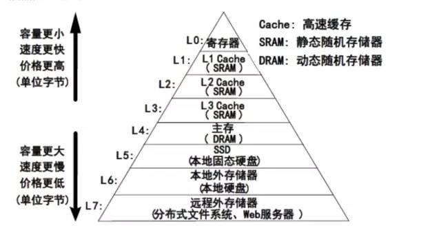
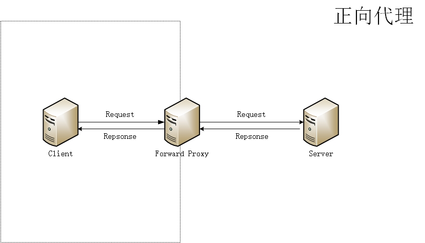

> 本文是根据 [system-design-primer（系统设计入门）](https://github.com/donnemartin/system-design-primer) 整理，本文主要讲缓存

从操作系统的角度来看，不同存储之间的读写速度是有区别的。缓存就是把低速存储的结果，临时保存在高速存储的技术。



在实际业务当中，缓存可以提高页面加载速度，并可以减少服务器或者数据库的负载。在这个模型中，应用会先查看请求之前是否被响应过，如果有则将之前的结果直接返回，来省掉真正的处理。

下面我们会以从客户端请求到 web 应用服务器这个流程当中可能涉及到的缓存为例来简单说一下。

## Service Worker 缓存

[Service Worker](https://developers.google.com/web/fundamentals/primers/service-workers) 是浏览器在后台独立于网页运行的脚本，可以提供请求拦截、推送通知、后台同步等功能。

`Service Worker` 需要浏览器支持，也需要 HTTPS，并且对应的生命周期完全独立于 [网页生命周期（Page Lifecycle API）](https://developers.google.com/web/updates/2018/07/page-lifecycle-api)。


在成功安装 Service Worker 之后可以通过监听 `fetch` 事件来决定是否需要缓存：

```js
self.addEventListener('fetch', function(event) {
  event.respondWith(
    caches.match(event.request).then(function(response) {
      // Cache hit - return response
      if (response) {
        return response
      }
      return fetch(event.request)
    }),
  )
})
```

Service Worker 对应的 API 和最佳实践都比较复杂，我们可以采用官方推荐的 [workbox](https://developers.google.com/web/tools/workbox) 来配置和部署，并且也提供了以下 [缓存策略](https://developers.google.com/web/tools/workbox/modules/workbox-strategies)：

- `CacheFirst`: 缓存优先
- `CacheOnly`: 仅缓存
- `NetworkFirst`: 网络优先
- `NetworkOnly`: 仅网络
- `StaleWhileRevaidate`: 取缓存，再走网络更新缓存

## 客户端缓存

客户端缓存可以位于操作系统或者浏览器，在移动互联网当中也可以存在于 App 当中，可以减少服务端请求，避免文件重复加载。

客户端缓存有无法预知资源的更新的缺点，所以需要多维度的配合。

## DNS 缓存

DNS（**D**omain **N**ame **S**ystem）作为将域名和IP地址相互映射的一个分布式数据库，相当于互联网的通讯录。

当我们请求一个域名，DNS 服务器会通过递归 DNS 服务器的方式帮我们查到对应的 IP。为了提升域名查询效率，查询过后会把域名和 IP 缓存下来，下次请求的时候直接读取缓存当中的 IP。

缓存是有有效时间的，资源记录中的 TTL（Time-to-Live）值相当于该记录的保质期，DNS 服务器会根据 TTL 的值来决定把这条消息缓存多久。

DNS 缓存一般来讲有：浏览器 DNS 缓存、操作系统 DNS 缓存等等。

## Proxy 缓存

Proxy（代理）分为正向代理和反向代理：

- 正向代理



正向代理就是我们接触最多的代理模式，一般来讲，很多企业以前（现在也有不少）是不允许员工随便访问外网的，有一些则是部分外网，如果你想要或者需要访问外网资源，那你很可能会希望在自己家里搭建一个代理服务器。

由于需求的不同，催生了一些不同用途的代理，比如 HTTP 代理、FTP 代理等等，我们常用的梯子就是 SOCKS5 代理。

- 反向代理


相对于正向代理来说，反向代理的技术含量更高一些，应用的范围也更加广泛，从小到你代理访问网站 ，大到网站内部负载均衡都会使用到这种技术。

它的特点就是绝对可以保护代理后边的东西，用户只能访问到代理服务器，而代理服务器后边发生的事情你绝对不会知晓，是个黑箱。

> Cache（缓存）技术和代理服务技术是紧密联系的，代理服务器可以把资源缓存下来，方便资源再次获取

[HTTP Cache-Control](https://developer.mozilla.org/en-US/docs/Web/HTTP/Headers/Cache-Control) 可以针对代理服务器设置缓存策略：

- `private` 要求代理服务器不能缓存资源
- `proxy-revalidate` 要求代理服务器在资源过期后，必须向原始服务器验证。

## CDN 缓存

内容分发网络（Content Delivery Network）简称 `CDN`，是一个全球性的代理服务器分布式网络，它从靠近用户的位置提供内容。

将内容存储在 CDN 上可以从两个方面来提供性能:

- 从靠近用户的数据中心提供资源
- 通过 CDN 你的服务器不必真的处理请求

CDN 本身也会做一些缓存，CDN 缓存策略因服务商不同而不同，但一般都会遵循 HTTP 缓存标准协议，一些 CDN 服务提供商也会添加一些自定义的 HTTP Header。

CDN 缓存存在一些缺点：即使源站资源已经更新，也会因为 CDN 服务器上的数据没有即时更新而导致用户访问异常。

## HTTP 缓存

HTTP 缓存策略分为**强缓存**和**协商缓存**。

其中强缓存有：

- `Expires`
- `Cache-Control`
- `Age`

缓存的资源到期了，并不意味着资源内容发生了改变，如果和服务器上的资源没有差异，实际上没有必要再次请求。客户端和服务器端通过某种验证机制验证当前请求资源是否可以使用缓存。

对应的协商缓存有：

- `Last-Modified`
- `If-Modified-Since`
- `If-None-Match`
- `ETag`


## 应用缓存

应用缓存可以简单分为**内存缓存**和**硬盘缓存**：

- 内存：将缓存存储于内存中是最快的选择，无需额外的 I/O 开销，但是内存的缺点是不能持久化，一旦应用异常 break down 而重新启动，数据很难或者无法复原。
- 硬盘：一般来说，很多缓存框架会结合使用内存和硬盘，在内存分配空间满了或是在异常的情况下，可以被动或主动的将内存空间数据持久化到硬盘中，达到释放空间或备份数据的目的。

基于内存的缓存比如 `Memcached` 和 `Redis` 是应用程序和数据存储之间的一种键值存储。由于数据保存在 `RAM` 中，它比存储在磁盘上的典型数据库要快的多，也有一些应用是基于磁盘缓存。

## 数据库缓存

基于磁盘的数据库，存在着查询速度慢（频繁的查询）、扩展成本、需要简化数据访问等常见的问题。

数据库缓存消除了主数据库面临的不必要的压力（通常是频繁访问的读取数据），对其功能有所助益。缓存本身可存在于数据库、应用程序等许多区域中，也可作为独立层存在。常用的数据库缓存类型有：

- **数据库集成缓存**，该缓存在数据库引擎中托管，具有内置直写功能。
- **本地缓存**，本地缓存可存储应用程序中经常使用的数据。这不仅加快了数据检索速度，而且消除了与之相关的网络流量，使其速度快于其他缓存架构
- **远程缓存（分布式缓存）**，远程缓存存储在专用服务器上，由于远程缓存可用作供所有不同系统使用的连接集群，因此非常适用于分布式环境。

## Reference

- [System Design, Chapter 4: Caching](https://medium.com/system-designing-interviews/system-design-chapter-4-caching-b59a4cf83f10)
- [Service Worker](https://developers.google.com/web/fundamentals/primers/service-workers)
- [DNS Processes and Interactions](https://docs.microsoft.com/en-us/previous-versions/windows/it-pro/windows-server-2008-R2-and-2008/dd197552%28v%3dws.10%29)
- [数据库缓存](https://aws.amazon.com/cn/caching/database-caching/)