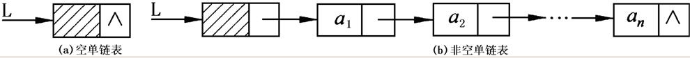
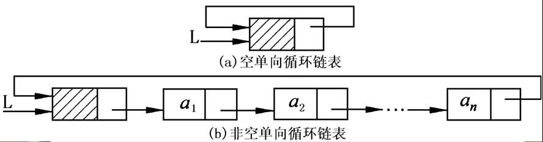
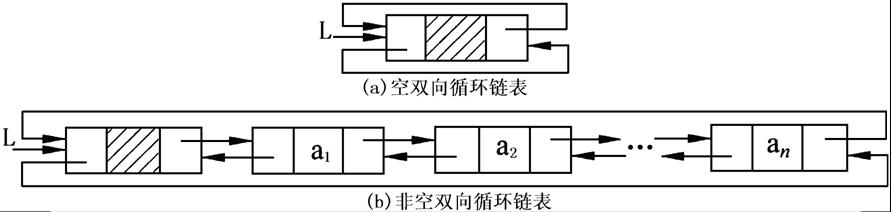

### List

##### list 定义

- 是**n(n≥0)个相同类型**的**数据元素**构成的**有限**序列。

##### list ADT

```adt
ADT List
{
    Data:
    Operation:
        InitList(&L)
        CreateList(&L)
        ListEmpty(L)
        ListLength(L)
        LocateElem(L,e)
        PriorElem(L,cur_e,&pre_e)
        NextElem(L,cur_e,&pre_e) 
        ListInsert(&L,i,e)
        ListDelete(&L,i,&e)
        GetElem(L,i,&e)
        ListTraverse(L)
        DestroyList(&L)
    }//ADT List
```

##### list 简单实现

```javascript
/**
 * List Structure
 */

class List {

  /**
   * 顺序表初始化操作，申请使用内存
   * @constructor
   */
  InitList() {
    this.list = []
  }

  /**
   * 判断顺序表是否为空
   * @returns {boolean}
   * @constructor
   */
  ListEmpty() {

    return this.list.length === 0
  }

  /**
   * 顺序表求表长操作
   * @returns {number}
   * @constructor
   */
  ListLength() {

    return this.list.length
  }

  /**
   * 顺序表定位元素(返回与e值相等的元素下标)
   * @param item
   * @returns {*}
   * @constructor
   */
  LocateElem(item) {
    return this.list.indexOf(item)
  }

  /**
   * 获取指定元素的上一个元素
   * @param item
   * @returns {*}
   * @constructor
   */
  PriorElem(item) {

    const indexOf = this.list.indexOf(item)

    if (indexOf <= 0) {
      return null
    } else {
      return this.list[indexOf - 1]
    }

  }

  /**
   * 获取指定元素的下一个元素
   * @param item
   * @returns {*}
   * @constructor
   */
  NextElem(item) {

    const indexOf = this.list.indexOf(item)

    if (indexOf >= this.list.length - 1) {
      return null
    } else {
      return this.list[indexOf + 1]
    }

  }

  /**
   * 在顺序表L的第i个元素之前插入新的元素e
   * @param i
   * @param elem
   * @returns {boolean}
   * @constructor
   */
  ListInsertBefore(i, elem) {

    if (i <= 0) {
      return false
    }

    this.list.splice(i - 1, 0, elem)

    return true

  }

  /**
   * 在顺序表L的第i个元素之后插入新的元素e
   * @param i
   * @param elem
   * @returns {boolean}
   * @constructor
   */
  ListInsertAfter(i, elem) {
    if (i <= 0) {
      return false
    }

    this.list.splice(i, 0, elem)

    return true
  }

  /**
   * 在顺序表L的最后一个元素之后插入新的元素e
   * @param elem
   * @returns {boolean}
   * @constructor
   */
  ListInsertBottom(elem) {
    this.list.push(elem)

    return true
  }

  /**
   * 在递增有序顺序表L中查找插入新的元素e
   * 暂时只支持 []int 类型的 list
   * @param elem
   * @returns {boolean}
   * @constructor
   */
  ListInsertByOrder(elem) {
    if (typeof elem !== "number") {
      return false
    }

    for (let i = 0; i < this.list.length; i++) {
      if (this.list[i] <= elem && this.list[i + 1] >= elem) {
        this.ListInsertBefore(i, elem)
        return true
      }
    }

    return false
  }

  /**
   * 在顺序表L中删除第i个元素，并返回其值
   * @param i
   * @returns {*}
   * @constructor
   */
  ListDelete(i) {

    if (i <= 0) return false

    if (!this.list[i]) return false

    return this.list.splice(i - 1, 1)[0]

  }

  /**
   * 取出顺序表L中第i个元素，并返回其值
   * @param i
   * @returns {*}
   * @constructor
   */
  GetElem(i) {

    return this.list[i]
  }

  /**
   * 顺序表遍历输出各元素
   * @constructor
   */
  ListTraverse() {
    this.list.forEach(item => console.log(item))
  }

  /**
   * 删除顺序表
   * @constructor
   */
  DestroyList() {
    this.list = null
  }
}
```

线性表顺序存储结构个人总结优点是：

- 无需为表示表中元素之间的逻辑关系而增加额外的存储空间
- 可以快速的读取表中任意位置的元素

缺点是：

- 插入和删除需要移动大量的元素

### 链表

链表是为了解决线性表插入和删除的时候需要移动大量元素耗时的问题

可以充分利用计算机内存空间，实现灵活的内存动态管理。但是链表失去了数组随机读取的优点，同时链表由于增加了结点的指针域，空间开销比较大。

链表具体大致分为：

- 单向链表
- 双向链表
- 单向循环链表 `single liked list`
- 双向循环链表 `double linked list`

#### 单向链表

##### 单向链表定义：

链式存储结构：用一组任意的存储单元存储**数据结构**（这里是线性表)里的各元素(这组存储单元可以是地址连续的，也可以是不连续的)，并且每个存储元素有一个数据域，一个（或多个）指针域，数据域用来存储元素内容，指针域用来反映元素的逻辑关系(前后位置关系)，这种存储方式成为链式存储（也叫非随机存取的存储结构）



- **表头指针**：存放单链表中第一个结点的地址的指针。【指向a0(带头结点时)或指向a1(不带头结点时)的指针，上图中的L】
- **头结点**：带头结点的单链表中L【上图中的a1之前的结点a0】
- **开始结点**：，又称首节点，存放单链表的第一个存放元素的结点。【a1】
- **表尾结点**：单链表中最后一个结点，表尾结点的指针域指针为空。【an】

##### 单向链表实现方式：

```javascript
class LinkSingle {

  constructor() {
    this.size = 0
    // 虚拟头部
    this.dummyNode = new Node({
      type: 'dummyNode'
    })
  }

  /**
   * 根据 index 获取节点
   * @param index
   * @returns {Node|*|((value?: any) => IteratorResult<T>)|((value?: any) => Promise<IteratorResult<T>>)}
   * @constructor
   */
  GetNode(index) {
    this.CheckIndex(index + 1)
    return this.FindNode(this.dummyNode, index, 0).next
  }

  /**
   * 在 index 位置添加数据为 value 的新节点
   * @param value
   * @param index
   * @returns {boolean}
   * @constructor
   */
  AddNode(value, index) {

    this.CheckIndex(index)

    const findPrevNode = this.FindNode(this.dummyNode, index, 0)

    /**
     * 这里需要把 上一个 node 的 next 放入 新 node 的 value 当中
     */
    findPrevNode.next = new Node({
      value,
      next: findPrevNode.next
    })

    this.size++

    return true
  }

  /**
   * 添加到头部
   * @param v
   * @returns {boolean}
   * @constructor
   */
  AddToHeader(v) {
    return this.AddNode(v, 0)
  }

  /**
   * 添加到最后一个
   * @param v
   * @returns {boolean}
   * @constructor
   */
  AddToLast(v) {
    return this.AddNode(v, this.size)
  }

  /**
   * 删除节点
   * @param index
   * @returns {boolean}
   * @constructor
   */
  RemoveNode(index) {

    this.CheckIndex(index)

    if (index >= this.GetSize()) {
      return false
    }

    const findedNode = this.FindNode(this.dummyNode, index, 0)

    let node = findedNode.next

    findedNode.next = node.next

    node = null

    this.size--

    return true
  }

  /**
   * 删除头部节点
   * @returns {boolean}
   * @constructor
   */
  RemoveHeader() {
    if (this.IsEmpty()) return true
    return this.RemoveNode(0)
  }

  /**
   * 移除最后一个节点
   * @returns {boolean}
   * @constructor
   */
  RemoveLast() {
    if (this.IsEmpty()) return true
    return this.RemoveNode(this.size - 1)
  }

  /**
   * 查找节点
   * @param node
   * @param index
   * @param currentIndex
   * @returns {*}
   * @constructor
   */
  FindNode(node, index, currentIndex) {
    if (index === currentIndex) return node
    return this.FindNode(node.next, index, currentIndex + 1)
  }

  /**
   * 是否空表
   * @returns {boolean}
   * @constructor
   */
  IsEmpty() {
    return this.size === 0
  }

  /**
   * 获取表的长度
   * @returns {number}
   * @constructor
   */
  GetSize() {
    return this.size
  }

  /**
   * 检查 index 是否符合要求
   * @param index
   * @constructor
   */
  CheckIndex(index) {
    if (index < 0 || index > this.size) {
      throw new Error('Index error')
    }
  }
}

class Node {
  constructor({ value = null, prev = null, type = null } = {}) {
    this.value = value
    this.prev = prev
    if (type) this.type = type
  }
}

```

#### 双向链表

##### 双向链表定义

- 双（向）链表就是每个结点中含有两个指针域的链表，其中一个指针域存放其前趋结点的地址，另一个指针域存放其后继结点的地址。


- **头结点**：双链表中第一个结点(上图中的a1之前的结点a0)
- **表头指针**：存放双链表中第一个结点的地址的指针。(指向a0的指针)
- **开始结点**：存放双链表的第一个元素的结点。(a1)
- **表尾结点**：双链表中最后一个结点，表尾结点的指针域指针为空。(an)

#####  双向链表实现方式

简单看起来，双向链表只是在每一个 Node 当中多了一个 prev 的指针指向，所以双向链表的实现就简单写一下

```javascript
class LinkDouble {
  constructor() {
    this.size = 0
    this.dummyNode = new Node({
      type: 'dummyNode'
    })
  }

  /**
   * 添加节点
   * @param value
   * @param index
   * @constructor
   */
  AddNode(value, index) {

    this.CheckIndex(index)

    const findPrevNode = this.FindNode(this.dummyNode, index, 0)

    const node = new Node({
      value,
      prev: findPrevNode,
      next: findPrevNode.next
    })

    findPrevNode.next = node

    this.size++

  }

  /**
   * 删除节点
   * @param index
   * @returns {boolean}
   * @constructor
   */
  RemoveNode(index) {
    this.CheckIndex(index)
    const findPrevNode = this.FindNode(this.dummyNode, index, 0)

    let node = findPrevNode.next

    findPrevNode.next = node.next
    node.prev = findPrevNode

    node = null

    this.size--

    return true

  }

  /**
   * 根据 index 获取节点
   * @param index
   * @returns {*}
   * @constructor
   */
  GetNode(index) {
    this.CheckIndex(index + 1)
    return this.FindNode(this.dummyNode, index + 1, 0)
  }

  /**
   * 获取长度
   * @returns {number}
   * @constructor
   */
  GetSize() {
    return this.size
  }

  /**
   * 查找节点
   * @param node
   * @param index
   * @param currentIndex
   * @returns {*}
   * @constructor
   */
  FindNode(node, index, currentIndex) {
    if (index === currentIndex) return node
    return this.FindNode(node.next, index, currentIndex + 1)
  }

  /**
   * 检查 index 是否符合要求
   * @param index
   * @constructor
   */
  CheckIndex(index) {
    if (index < 0 || index > this.GetSize()) {
      throw new Error('Index error')
    }
  }
}

class Node {
  constructor({ value = null, prev = null, next = null, type = null } = {}) {
    this.value = value
    this.prev = prev
    this.next = next
    if (type) this.type = type
  }
}
```

#### 循环链表

##### 循环链表的定义

- 一般有两种形式的循环链表，即**单向循环链表**和**双向循环链表**。
- 单向循环链表中，表尾结点的指针域不为空，回指第一个结点，整个链表形成一个环。
- 在双向循环链表中，除了表尾结点的后继指针域回指第一个结点外，同时表头结点的前驱指针域回指表尾结点，这样在链表中构成了两个环。





循环链表和上述链表大同小异，这里没有继续列出简单实现。

### Stack

##### stack 定义：

- 是一种特殊的线性表，这种表只能在固定的一端进行插入与删除操作
- 固定插入的一端叫**栈顶(top)**，而另一端称为**栈底(bottom)**。位于栈顶和栈底的元素分别称为**顶元**和**底元**。当表中无元素时，称为空栈
- 栈的修改是按照**后进先出**的原则进行（简称 LIFO）

##### stack ADT

```adt
ADT List
{
    Data:
    Operation:
        InitStack(&S,maxsize,incresize)
        ClearStack(&S)
        StackLength(S)
        Push(&S,e)
        Pop(&S,&e)
        GetTop(S,&e)
        StackTraverse(S)
        StackEmpty(S)
        DestroyStack(&S)
    }//ADT List
```

##### stack 简单实现

```go
package Stack

import (
	"fmt"
)

type Stack struct {
	Stack []int
}

func (S *Stack) InitStack() []int {
	S.Stack = []int{}
	return S.Stack
}

func (S *Stack) StackLength() int {
	return len(S.Stack)
}

func (S *Stack) Push(elem int) {
	S.Stack = append(S.Stack, elem)
}

func (S *Stack) Pop() int {

	len := len(S.Stack) - 1

	elem := S.Stack[len]

	S.Stack = S.Stack[:len]

	return elem
}

func (S *Stack) GetTop() int {
	return S.Stack[len(S.Stack)-1]
}

func (S *Stack) StackEmpty() bool {

	return len(S.Stack) <= 0
}

func (S *Stack) StackTraverse() {
	for _, elem := range S.Stack {
		fmt.Println(elem)
	}
}

func (S *Stack) DestroyStack() {
	S.Stack = []int{}
}
```

##### 数制转换问题

```go
package main

import (
	"DataStructure/Stack"
	"strconv"
)

/**
	简单版本的 十进制转任意进制
 */
func Conversion(input int, radix int) string {

	result := ""

	if input <= 0 || radix <= 0 {
		return result
	}

	S := Stack.Stack{}

	S.InitStack()

	for {

		if input <= 0 {
			break
		}

		S.Push(input % radix)

		input = input / radix

	}

	for {

		if S.StackEmpty() {
			break
		}

		result += strconv.Itoa(S.Pop())
	}

	return result

}
```

##### Valid Parentheses

本题参考自 [leet code](https://leetcode.com/problems/valid-parentheses)，可以通过 栈 的特性完成

```javascript
const isValid = function (s) {

    const stack = []

    const map = {
        "(": -1,
        ")": 1,
        "[": -2,
        "]": 2,
        "{": -3,
        "}": 3
    }

    for (let i = 0; i < s.length; i++) {
        const current = map[s[i]]
        if (current <= 0) {
            stack.push(current)
        } else {
            const last = stack.pop()
            if (last + current !== 0) return false
        }
    }

    return !stack.length > 0
};
```
##### 表达式求值 TODO

```javascript
class EvaluateExpression{
    
}
```

##### 汉诺塔 TODO

```javascript
class Hanoi{
    
}
```

### Queue


#### Queue 定义

- 与堆栈一样，**队列**也是一种特殊的线性表，这种表在一端进行插入操作，而在另一端进行删除操作
- 允许插入的一端叫**队尾(rear)**
- 允许删除的一端叫**队首(front)**
- 位于队首和队尾的元素分别称为**队首元素**和**队尾元素**
- 当表中无元素时，称为**空队**
- 队列的插入称为**进队**，队列的删除称为**出队**
- 数据元素从**rear（队尾，上方）**进队，从**front（队首，下方）**出队
- **先进入队列的元素比后进入队列的元素先出队列（后进入队列的元素比先进入的元素后出队列）**，即队列是一个先进先出(FIFO)表

#### Queue ADT

```adt
ADT Queue{
   Data：数据元素相同数据类型，相邻元素具有前驱和后继的关系。
   Operation：
        InitQueue(&Q，maxsize，incresize)
           操作结果：构造一个容量为maxsize的空队列Q。
        ClearQueue(&Q)
           初始条件：队列Q已存在。
           操作结果：将Q清为空队列。
        QueueLength(Q)
           初始条件：队列Q已存在。
           操作结果：返回Q的元素个数，即队列的长度。
        EnQueue(&Q，e)
           初始条件：队列Q已存在。
           操作结果：插入元素e为Q的新的队尾元素。
        DeQueue(&Q，&e)
            初始条件：Q为非空队列。
            操作结果：删除Q的队首元素，并用e返回其值。
        GetHead(Q，&e)
            初始条件：Q为非空队列。
            操作结果：用e返回Q的队头元素。
        QueueTraverse(Q)
            初始条件：队列Q已存在且非空。
            操作结果：从队头到队尾依次输出Q中各个数据元素。
        QueueEmpty(Q)
            初始条件：队列Q已存在。
            操作结果：若Q为空队列，则返回true；否则返回false。
        DestroyQueue(&Q)
           初始条件：队列Q已存在。
            操作结果：队列Ｑ被撤销，不再存在。
}ADT Queue	
```

#### 单链队列

单链存在**假溢出**的情况

> 当元素被插入到数组中下标最大的位置上时，数组的底端还有空闲空间，此时如果还有元素入队，就会发生“溢出”现象，显然这种溢出并不是真正的溢出，而是**假溢出**。

由于 `javascript` 内部自己动态分配数组，所以实现上不需要考虑这种情况。

单链队列实现方式如下：

```javascript
class SingleQueue {

  InitQueue() {
    this.queue = []
  }

  ClearQueue() {
    this.queue = []
  }

  QueueLength() {
    return this.queue.length
  }

  /**
   * 插入元素e到队尾，成功插入返回true，否则返回false
   * @param elem
   * @constructor
   */
  EnQueue(elem) {
    this.queue.push(elem)
    return true
  }

  /**
   * 删除队尾元素，并用e返回其值，成功删除返回true;否则返回false
   * @param elem
   * @returns {*}
   * @constructor
   */
  DeQueue(elem) {
    return this.queue.shift()
  }

  /**
   * 取出队首
   * @returns {*}
   * @constructor
   */
  GetHead() {
    return this.queue[0]
  }

  /**
   * 队列判断队空
   * @returns {boolean}
   * @constructor
   */
  QueueEmpty() {
    return this.queue.length === 0
  }

  DestroyQueue() {
    this.queue = []
  }
}
```

#### 顺序循环队列

为了解决**假溢出**的情况，可以由下面方式来解决：

- 修改出队算法，事先避免假溢出，每次出队后把所有元素望前移动一个位置。
- 修改进队算法，在发生假溢出的时候，把所有的元素往前移动一个位置。
- 通过顺序循环队列来解决

```javascript
class CricleQueue {

  constructor() {
    this.incrementSize = 5

    this.front = this.rear = 0
    this.queue = new Array(this.incrementSize)
  }

  /**
   * EnQueue
   * @param elem
   * @returns {boolean}
   * @constructor
   */
  EnQueue(elem) {

    /**
     * 判断是否存储满（少一个存储单元
     * 插入操作时，首先判断rear所指示的下一个位置是否是front，如果是，则停止插入。（队尾留一个单元）
     * 判满条件：(rear+1) mod maxsize = front
     */
    if ((this.rear + 1) % this.queue.length === this.front) {
      /**
       * 如果满则根据 incrementSize 扩容数组
       */
      const newQueue = new Array(this.queue.length + this.incrementSize + 1)
      for (let i = 0; i < this.queue.length; i++) {
        newQueue[i] = this.queue[(i + this.front) % this.queue.length]
      }
      this.queue = newQueue
    }

    this.queue[this.rear] = elem
    this.rear = (this.rear + 1) % this.queue.length

    return true

  }

  /**
   * DeQueue
   * @returns {*}
   * @constructor
   */
  DeQueue() {

    /**
     * 判断是否为空
     * 判空条件：rear == front
     */
    if (this.rear === this.front) {
      return false
    }

    const r = this.queue[this.front]
    this.queue[this.front] = null
    this.front = (this.front + 1) % this.queue.length

    return r
  }

  GetHead() {
    /**
     * 判断是否为空
     * 判空条件：rear == front
     */
    if (this.rear === this.front) {
      return false
    }

    /**
     * TODO
     * 这里是否需要添加自动判断队列长度缩减队列的逻辑
     */
    return this.queue[this.front]
  }

  QueueEmpty() {
    return this.rear === this.front
  }

  DestroyQueue() {
    this.queue = []
    this.front = null
    this.rear = null
  }
}
```

与队列相关的还有**链队**，这里不做介绍。

### Tree

树是一种非线性结构，树与线性表的逻辑关系不同。

树的遍历是树的一种重要的运算。所谓遍历是指对树中所有结点的信息的访问，即依次对树中每个结点访问一次且仅访问一次，我们把这种对所有节点的访问称为遍历（traversal）

树的两种重要的遍历模式是：

- 深度优先遍历
- 广度优先遍历

#### 深度优先遍历

对于一颗二叉树，深度优先搜索(Depth First Search)是沿着树的深度遍历树的节点，尽可能深的搜索树的分支。

简单的深度优先遍历可以采用数据结构 `Stack` 来辅助进行实现：

```js

/**
 * DeepFirstTraversal
 * @param node
 * @constructor
 */
function DeepFirstTraversal(node) {

  if (!node) {
    return
  }

  const stack = new Stack()

  stack.push(node)

  while (!stack.isEmpty()) {

    const node = stack.pop()

    console.log(`traversal node value is ${node.value}`)

    if (node.left) stack.push(node.left)

    if (stack.right) stack.push(node.right)
  }

}

```

深度遍历有重要的三种方法。这三种方式常被用于访问树的节点，它们之间的不同在于访问每个节点的次序不同。这三种遍历分别叫做：

- 先序遍历（preorder
- 中序遍历（inorder）
- 后序遍历（postorder）

上诉通过 `Stack` 数据结构进行的简单实现就是 **先序遍历**

可以通过改变 `console.log(`traversal node value is ${node.value}`)` 的顺序来实现三种遍历方式。

下面继续介绍递归方式实现。

#### 递归先序遍历

根节点->左子树->右子树

```js

/**
 * 递归先序遍历
 * @param node
 * @constructor
 */
function PreorderTravelBinarynode(node) {

    console.log(node.value)

    PreorderTravelBinarynode(node.left)

    PreorderTravelBinarynode(node.right)

}

```

##### 递归中序遍历

左子树->根节点->右子树

```js

/**
 * 递归中序遍历
 * @param node
 * @constructor
 */
function MiddleorderTraversal(node) {
    MiddleorderTraversal(node.left)
    console.log(node.value)
    MiddleorderTraversal(node.right)
}

```

##### 递归后序遍历

左子树->右子树->根节点

```js

/**
 * 递归后序遍历
 * @param node
 * @constructor
 */
function PostorderTraversal(node) {
    PostorderTraversal(node.left)
    PostorderTraversal(node.right)
    console.log(node.value)
}

```

##### 广度优先遍历

从树的root开始，从上到下从从左到右遍历整个树的节点

广度优先遍历可以通过数据结构 `Queue` 来辅助进行实现：

```js

/**
 * breadthFirstSearch
 * queue
 * @param Node
 */
function breadthFirstSearch(Node) {

    console.log(Node.value)

    const queue = []
    queue.push(Node)

    while (queue.length > 0) {

        const currentNode = queue.shift()

        if (currentNode.left) {
            console.log(currentNode.left.value)
            queue.push(currentNode.left)
        }

        if (currentNode.right) {
            console.log(currentNode.right.value)
            queue.push(currentNode.right)
        }
    }
}

```