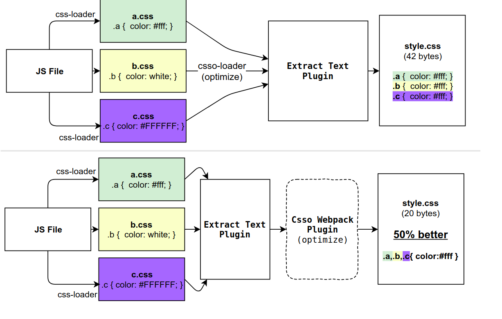

下面是个人列出的一些前端面试方面的问题（没有先后顺序，也没有优先级之分）

## 重点关注

- 原型链
- 复习一下 koa koa-router 源码
- sso
- Redux、Connect
- 虚拟 DOM，[如何理解虚拟 DOM 1](https://github.com/livoras/blog/issues/13)
- Fiber
- websocket 握手过程
- 各种排序算法 和 常用算法、复杂度计算，深度优先算法，字符串的最小编辑距离
- [React 面试题大全](https://github.com/semlinker/reactjs-interview-questions)

## 手动实现的轮子

- `call`、`apply`、`bind`
- 符合 Promise/A+规范的 `Promise`、 `asyncawait`、`co`
- `EventEmitter`
- `new`
- 双向绑定
- `JSON.stringify`、 `JSON.parse`
- 简易模版引擎

## 浏览器工作原理系列

- [关键渲染路径](https://mp.weixin.qq.com/s?__biz=MzA5NzkwNDk3MQ==&mid=2650588806&idx=1&sn=408a54e7c8102fd6944c9a40b119015a&chksm=8891d6a2bfe65fb42f493fe9a4dab672dd7e440f31e753196cee0cfbc6696e4f8dd3a669e040&mpshare=1&scene=1&srcid=1228ZrXsmbZKcgCSu7zTVDwy#)
- [浏览器的工作原理：新式网络浏览器幕后揭秘](https://www.html5rocks.com/zh/tutorials/internals/howbrowserswork/)
- [Inside look at modern web browser (part 1)](https://developers.google.com/web/updates/2018/09/inside-browser-part1)
- [中字 Inside look at modern web browser](https://github.com/xitu/gold-miner/blob/master/TODO1/inside-look-at-modern-web-browser-part1.md)
- [浅析浏览器渲染原理](https://segmentfault.com/a/1190000012960187)
- [浏览器渲染全过程以及常遇到的问题](https://blog.chenhaotaishuaile.com/2019/01/31/how-browser-rendering-works/)
- [life of pixel](bit.ly/lifeofapixel)
- [【中字】像素的一生 Life of a Pixel - Steve Kobes(Chrome Team)](https://www.bilibili.com/video/av35265997/)

## JavaScript

- [ES6 class 与 ES5 function 区别及联系](https://blog.csdn.net/u012657197/article/details/77542404)
- [JavaScript 执行（四）：try 里面放 return，finally 还会执行吗？](https://jdsheng.cn/2019/03/25/JavaScript%E6%89%A7%E8%A1%8C%EF%BC%88%E5%9B%9B%EF%BC%89%EF%BC%9Atry%E9%87%8C%E9%9D%A2%E6%94%BEreturn%EF%BC%8Cfinally%E8%BF%98%E4%BC%9A%E6%89%A7%E8%A1%8C%E5%90%97%EF%BC%9F/)
- [最详尽的 JS 原型与原型链终极详解，没有「可能是」](https://www.jianshu.com/p/dee9f8b14771)
- `new` 的实现
- [Babel Class Extend 的实现](https://babeljs.io/repl#?browsers=&build=&builtIns=false&spec=false&loose=false&code_lz=MYGwhgzhAECCDeAoAvoxpIwELQKYA8AXXAOwBMYFkg&debug=false&forceAllTransforms=false&shippedProposals=false&circleciRepo=&evaluate=false&fileSize=true&timeTravel=false&sourceType=module&lineWrap=true&presets=env%2Ces2015%2Creact%2Cstage-2%2Cenv&prettier=true&targets=Node-9.1&version=7.8.4&externalPlugins=)
- 我的博客 [谈谈 Node.js 的单线程](https://hasaki.xyz/blog/2018-02-08-%E8%B0%88%E8%B0%88node.js%E7%9A%84%E5%8D%95%E7%BA%BF%E7%A8%8B/)
- [How to pass the Node.js interview of ElemeFE](https://github.com/ElemeFE/node-interview)

## 前端性能监控系列

- [蚂蚁金服如何把前端性能监控做到极致?](https://mp.weixin.qq.com/s?__biz=MzUxMzcxMzE5Ng==&mid=2247490527&idx=1&sn=cc2549683b3ff69c042483d78ced766a&chksm=f951ae9cce26278a263ecf2937b5c4957c9b37f35b7efe4c1a8c6ab69c74ebcb43c54e62abda&xtrack=1&scene=0&subscene=131&clicktime=1550933323&ascene=7&devic)

## webpack

- [Webpack HMR 原理解析](https://zhuanlan.zhihu.com/p/30669007)

loader && webpack plugins 一些简单的区别：

`loader` 在生成包期间或之前在单个文件级别工作。

`plugins` 在 bundle 或 chunk 级别工作，通常在 bundle 生成过程结束时工作。`plugins` 还可以修改捆绑包本身的创建方式。插件比 `loader` 具有更强大的控制能力。



- [Webpack loaders vs plugins; what's the difference?](https://stackoverflow.com/questions/37452402/webpack-loaders-vs-plugins-whats-the-difference)
- [Webpack 原理-编写 Plugin](https://juejin.im/post/5a5c18f2518825734f52ad65)
- [深入 Webpack-编写 Loader](https://segmentfault.com/a/1190000012718374)

## webp 图片的浏览器兼容检测

- canvas 检测：

```javascript
return /^data:image\/webp/.test(
  document.createElement('canvas').toDataURL('image/webp', 0.5),
)
```

- HTTP header：浏览器在图片请求发出的时候，Request Headers 里有 Accept，服务端可以根据 Accept 里面是否有 image/webp 进行判断。
- new Image：先加载一个 WebP 图片，如果能获取到图片的宽度和高度，就说明是支持 WebP 的，反之则不支持

## DSL

- [谈谈 DSL 以及 DSL 的应用](https://draveness.me/dsl)
- [用 25 行 JavaScript 语句实现一个简单的编译器](https://juejin.im/entry/59cdbe11f265da06633d4ac2)
- [前端 DSL 实践指南](https://juejin.im/post/5e4ddf38e51d4526f23a19e1)

## docker 和 K8S

- [小女孩也能看懂的插画版 Kubernetes 指南](https://linux.cn/article-7531-1.html)
- [漫画 | Kubernetes 带你一帆风顺去远航](https://blog.csdn.net/M2l0ZgSsVc7r69eFdTj/article/details/78890222)

## React

- [单页面应用路由实现原理：以 React-Router 为例](https://github.com/youngwind/blog/issues/109)
- [谈谈 React 事件机制和未来(react-events)](https://zhuanlan.zhihu.com/p/78669634)
- [完全理解 React Fiber](http://www.ayqy.net/blog/dive-into-react-fiber/)
- [React 面试题 & 回答（内容非常多，强烈推荐）](https://github.com/semlinker/reactjs-interview-questions)

## RN

- [深入理解 JSCore](https://tech.meituan.com/2018/08/23/deep-understanding-of-jscore.html)
- [React Native 之原理浅析](http://blog.poetries.top/2019/10/02/rn-yuanli/)
- [React Native — 桥接 Bridge 到 Fabric 项目](https://juejin.im/post/5de5e5de51882560a23239b5)
- [React Native 架构一览](http://www.ayqy.net/blog/react-native-architecture-overview/)
- [JSBridge 的原理](https://juejin.im/post/5abca877f265da238155b6bc)

## Event Loop

- [浏览器与 Node 的事件循环(Event Loop)有何区别?](https://juejin.im/post/5c337ae06fb9a049bc4cd218)

## 堆内存与栈内存

- [前端知识点总结——堆内存与栈内存](https://zhuanlan.zhihu.com/p/27534451)
- [什么是堆？什么是栈？他们之间有什么区别和联系？](https://www.zhihu.com/question/19729973)

## koa

- [Koa2 中间件原理解析](https://juejin.im/post/5ba7868e6fb9a05cdf309292)
- pm2 && cluster

## HTTPS

HTTPS 采用共享密钥加密和公开密钥加密两者并用的混合加密机制。在交换密钥使用环节使用公开密钥加密方式，之后建立的通信交换报文阶段则使用共享密钥加密方式。

- [本文主要是对 HTTPS 做一个总结，主要讲解 HTTPS 的实质、HTTPS 加密原理、HTTPS 的通信过程等。](https://segmentfault.com/a/1190000012196642)
- [一次安全可靠的通信——HTTPS 原理](https://developers.weixin.qq.com/community/develop/article/doc/000046a5fdc7802a15f7508b556413)

## 垃圾回收策略

- [JS 专题之垃圾回收](https://zhuanlan.zhihu.com/p/56386337)
- [垃圾回收时栈和堆的区别](https://zhuanlan.zhihu.com/p/27534451)

栈使用的是一级缓存， 他们通常都是被调用时处于存储空间中，调用完毕立即释放，由编译器自动分配释放 。存放函数的参数值，局部变量的值等。其操作方式类似于数据结构中的栈

堆则是存放在二级缓存中，生命周期由虚拟机的垃圾回收算法来决定。所以调用这些对象的速度要相对来得低一些。其操作方式类似于数据结构中的树

- [标记-清除（Mark-Sweep） 可以参照 Rust 所有权](https://kaisery.github.io/trpl-zh-cn/ch04-01-what-is-ownership.html)
