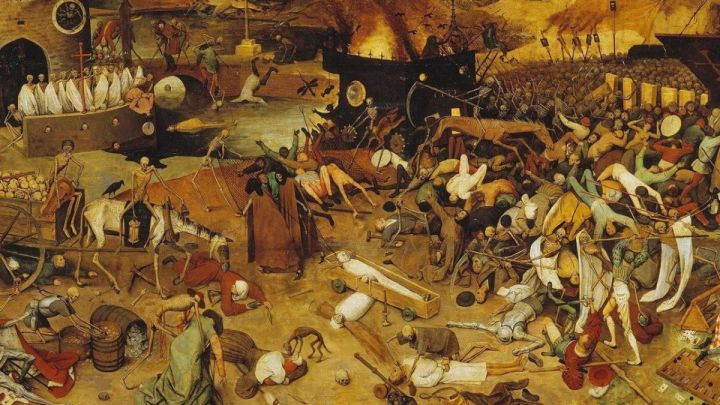

[《瘟疫传说：无罪》（英语：A Plague Tale: Innocence)](https://zh.wikipedia.org/wiki/%E7%98%9F%E7%96%AB%E5%82%B3%E8%AA%AA%EF%BC%9A%E7%84%A1%E7%BD%AA)

> 这是是一部非常惊艳的作品，是今年的黑马，提前提醒，密集恐惧症者慎入

首先这是一款中世纪**动作冒险角色扮演**游戏，剧情故事便发生在公元 1349 年

其次这是一款**潜行**游戏（虽然里面的 AI 很傻

## 背景

这部游戏讲的是欧洲黑死病期间在瘟疫肆虐的法兰西王国土地上，女主角和她年幼的弟弟受到宗教审判所的追捕，被迫在被疾病摧毁的村落间颠沛流离

逃难的路途中，不仅要躲避敌人的袭击，还要想办法驱散成山的鼠群

历史上的**中世纪**稍显黑暗，充斥着矛盾、战争以及宗教的压迫。而其中，最为可怕的，是那场人类历史上最严重的瘟疫——黑死病，又被后世称为鼠疫。

## 游戏内容

玩家将扮演一户贵族的长女 Amicia de Rune。宗教审判所以「审判罪人」为理由，血洗了 Amicia 全家，最后只有她和弟弟 Hugo 逃了出来。

然而出于邪门的原因，宗教审判所的目标就是 Hugo，所以姐弟一路不仅要对抗凶残的耗子，还有疯狂的教徒。

7 岁的 Hugo 从小就得了怪病，常年被妈妈关在屋子里接受治疗，所以 Amicia 和 Hugo 在灾难来临前，几乎没有见过彼此。

姐弟两起初很难理解彼此，姐姐觉得弟弟不懂事，弟弟也时常对姐姐的行为感到失望。

玩家在陪伴姐弟俩冒险的过程中，也将见证两人关系的成长。

## 内容点评

- 画面和配音

开局第一章在果园那一章确实比较惊艳，而且基本上每一个章节的气氛渲染配音和配音都非常到位

- 关卡

这个游戏关卡设计并不难，但是在叙事上玩法完美迎合了剧情节奏，并且很多内置自动保存点，对潜行新手来说不会太难，相反 AI 还有些傻乎乎的，但是阿米西亚被发现后反抗无能直接 GG（除非你有游戏里面的）

- 剧情

游戏中有无数这样反差鲜明的时刻 —— 几位活力的少年，却被迫在死气沉沉的乱世中求生；他们相依为命，但又不总能相互理解；主角杀人后，心境混沌，时而向上帝忏悔，时而又觉得泄了愤。

## Reference

- [如何评价动作冒险游戏《瘟疫传说：无罪》](https://www.zhihu.com/question/324281853/answer/685768334)
