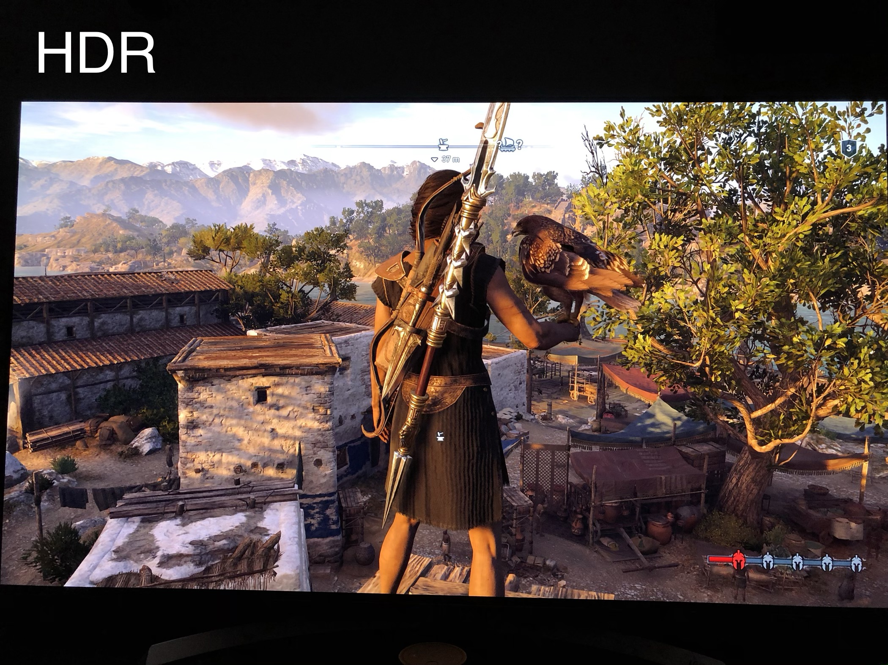

最近沉迷[刺客信条-奥德赛](https://store.ubi.com/cn/%E5%88%BA%E5%AE%A2%E4%BF%A1%E6%9D%A1--%E5%A5%A5%E5%BE%B7%E8%B5%9B/5afda5f788a7e34d25b5012f.html)

## why Odyssey

奥德赛这个名字，它是古希腊最重要的两部长篇史诗之一。承接《特洛伊》的剧情。

讲述了奥德修斯归乡 10 年间惊心动魄的传奇旅程。设定在 2400 多年前的伯罗奔尼撒战争时期——雅典和斯巴达为争夺希腊世界的主导权打了 10 多年的仗。

虽然育碧的游戏是典型的套公式类游戏，核心受众明显是轻度历史爱好者+喜欢刷任务的强迫症爱好者。比较明显的是 幽灵行动：荒野，大型玻利维亚观光游戏，虽然任务重复但是质量很高。

但是我还是强烈推荐奥德赛：

- 美术 这次的美术是真棒，古希腊、斯巴达欢原度很好，尤其是 亚特兰蒂斯
- BGM 推荐[原声带](https://www.xiami.com/album/bC7oe72717a5)
- 育碧模式

本来是 cpy 版本的，后来第一个大型 DLC 亚特兰蒂斯 促使我入正了，官方是这样推荐的：

> 探索源自希腊神话的三个新世界——极乐世界，冥界以及亚特兰提斯！

朋友赞助 40 大洋，然后淘宝 5 大洋买了个育碧八折券，最后 326 大洋买了黄金版的奥德赛（带有一年季票，一年内的 DLC 可以任意畅玩）

## 更换显示器

我之前的显示器是很便宜的 **AOC 12490PXH5 1080p** 的显示器，只要 998 就买得到了，之前一直感觉大颗粒比较明显，前天剁手买了一个 **DELL U2518DR 2k HDR** 显示器，花了 1999 大洋，简直是最大的提升了。

没有选择 144HZ 第一个是我不常玩 FPS 游戏，显卡 1070TI 也带不动，4K 更不用说了

而且 1080P 到 2k 的提升比较明显，还有 HDR 10 ，所以选择了这款稍微便宜的显示器

这款显示器令人欣喜的是考虑到主机位置偏远，背置的 USB3.0 插拔不便，Dell U2518DR 在左侧还预留了两个 USB3.0

显示器可以上下、左右、旋转。

## HDR

[HDR](https://en.wikipedia.org/wiki/High-dynamic-range_video) 技术最大的特点就是拥有很高的亮度动态范围。

一般来说，人眼所能观察的亮度范围是 10^5 cd/㎡，若显示设备的峰值亮度越接近这一标准，效果也会越明显。HDR 也定义了显示设备所需的“亮度能力”——至少要有 1000nit 的峰值能力，才能真正显示 HDR 的内容细节。

HDR 是显示器硬件实现的，目前，常见有六个不同的 HDR 标准：`hdr10`，`Dolby Vision`，`hdr10 +`，`HLG`，`Advanced HDR by Technicolor`, `DisplayHDR` 。我买的这款显示器是基础的 HDR 10。

> 首先注意需要 HDMI 2.0 或者 DP 1.4 以上的线，其次操作系统为最新，而且主动打开显示器上的 HDR 功能，就可以在 windows 屏幕设置里面打开

在摄像里，HDR 要先后拍摄三种曝光版本的多张照片，再将这些照片合为一张输出。利用每个曝光时间相对应最佳细节的 LDR 图像来合成最终 HDR 图像，能够更好的反映出真实环境中的视觉效果。

## HDR 的好处

HDR 技术能够有效地展现不同曝光下的画面细节，令画面更真实。

打开后整体屏幕发白，在游戏当中是正常

比如阳光从窗户透过的时候，HDR 效果下颜色将更丰富、更逼真，画面会有更微妙的层次和色调的转变。素材较好地保存了对比度细节，所以通常会产生非常锐利的图像

尤其是奥德赛里面的月光、沿海、日出特别明显，简直是两个游戏了。下面是一个玩家拍摄的 奥德赛 里面的区别:

可以明显的看到 HDR 看起来更加真实

> 支持 HDR 的游戏列表可以在这里查到[List of games that support high dynamic range display (HDR)](<https://pcgamingwiki.com/wiki/List_of_games_that_support_high_dynamic_range_display_(HDR)>)

## reference

- [HDR wikipedia](https://en.wikipedia.org/wiki/High-dynamic-range_video)
